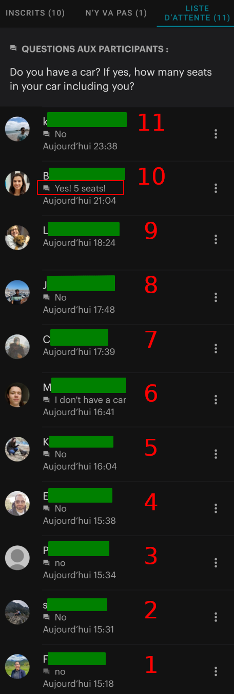
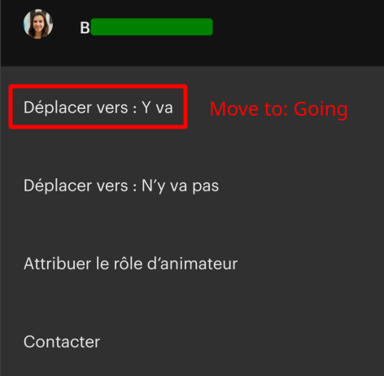
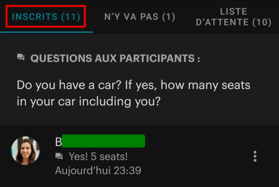
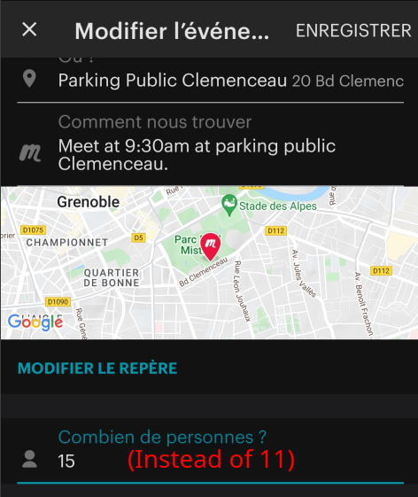
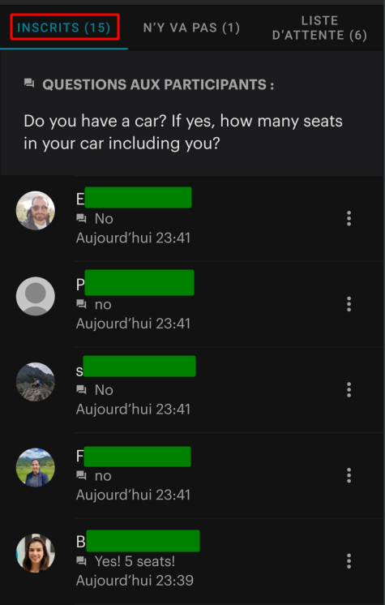

# How does the waiting list work?

__✴️ Disclaimer:__
- First in the waiting list is the first to get a seat in a car.
- So __NO__, I/we don't pick the people I/we like on the waiting list!

## Here is a simple example

Given the following waiting list of 11 "waiting for a seat in a car" people.

Note that:
- Meetup sort the list by date and time of subscription. On top k subscribed at 23:38 and on bottom F subscribed on 15:18.
- We already have 10 people attending the event (on the "Going list"). 

You can see that there are 11 people on the waiting list and they all answered "no" (or empty) to the question "Do you have a car?" except participant named "B". Even if "B" is 10th on the waiting list, she comes first because we need more cars to allow more people to attend the hike.

So, I just move "B" to the "Going list":

And "B" becomes our 11th hikers to attend the event:

So now, I edit the event and I change the number of max participants from 11 to 15 because B have 5 seats in her car, so she can take 4 hikers with her (4 hikers + 1 driver = 5 seats).

Then Meetup __automatically__ take the 4 "first on the waiting list people" and set them as "Going":

So we now have 15 people Going list: B, F, s, P and E.

You can see that Meetup change automatically their time to the time they were added to the participant list.

This is it 😇 Thank you for reading this. Feel free to share this article to people wondering how the waiting list works.
