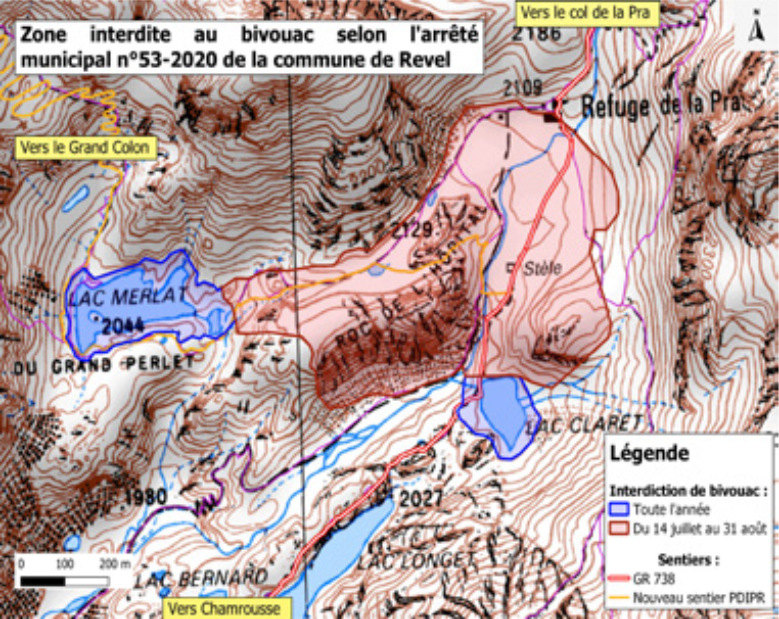
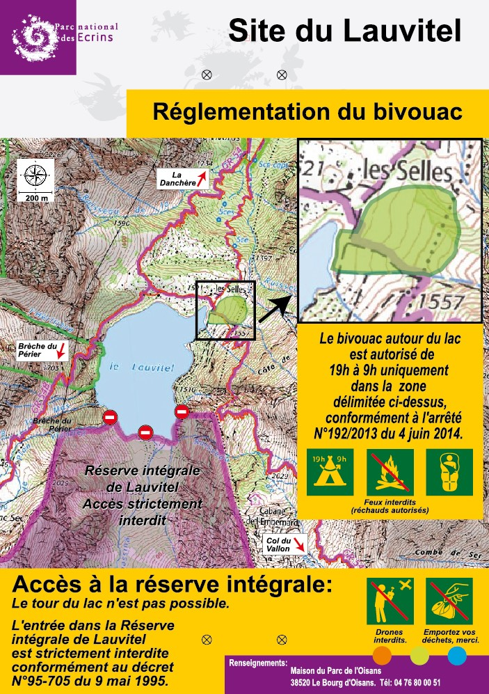
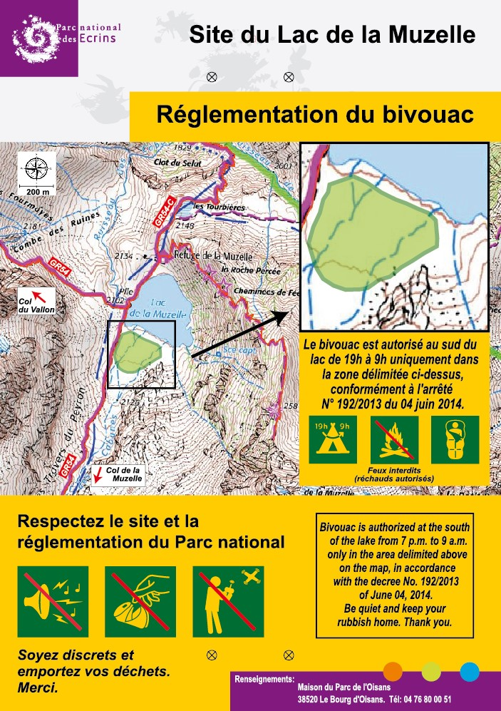

# ⛺ Bivouac

What is bivouac:

- Sleeping in tent ⛺
- Only 1 nigth 🌙
- Planting the tent after 7pm
- Removing the tent before 9am
- Not on public roads
- Not in classified natural sites
- Not in heritages sites
- Not near historical monuments
- Not on the shores of the sea
- Not within 200m of a water point intended for consumption

# Bivouac in Belledonne

> ✅ Bivouac with tent is allowed in Belledonne from 7pm to 9am.

> 🔥 Fire is forbidden within 200m around forests. ⚠ See local restrictions.

|Place|Allowed|Links|
|-----|-------|-----|
|Lac Merlat; Lac Claret|❌|[📄 Belledone p21](2023-07_Bivouac_Belledonne.pdf#page=11)|
|Plaine de la Pra|✅ From September to July 13|[📄 Belledone p21](2023-07_Bivouac_Belledonne.pdf#page=11)|
|Plaine de la Pra|❌ From July 14 to August 31|[📄 Belledone p21](2023-07_Bivouac_Belledonne.pdf#page=11)|
|Chamrousse: Tourbière de l'Arselle; Lac Achard; Infernet|❌ From May 1 to October 30|[📄 Belledone p21](2023-07_Bivouac_Belledonne.pdf#page=11)|
|Haut Bréda: Chalet du Bout; Espace Naturel Sensible du Praillet|❌|[📄 Belledone p21](2023-07_Bivouac_Belledonne.pdf#page=11)|
|Réserve Naturelle du Luitel|❌|[📄 Belledone p21](2023-07_Bivouac_Belledonne.pdf#page=11)|

## Bivouac La Pra

- 🟦 Blue area: forbidden during the whole year
- 🟥 Red area: forbidden from July 14 to August 31

Source: [📄 Belledone p21](2023-07_Bivouac_Belledonne.pdf#page=11)

# Bivouac in Chartreuse

> ✅ Bivouac with tent is allowed in Chartreuse from 7pm to 9am.

> ⚠ Some restrictions applies in the RNHC (Réserve Naturelle nationale des Hauts de Chartreuse), materialized in green in the following map.

Restrictions in RNHC:
- July-August: bivouac with tent is forbidden, but bivouac without tent is allowed.
- September-June: bivouac with tent is allowed

Source: [📄 2023 Memento RNHC](2023_Bivouac_Chartreuse_memento_RNHC.pdf)

# Bivouac in Vercors

> ✅ Bivouac with tent is allowed in Vercors from 7pm to 9am.

> ❌ Bivouac is forbidden on top of Mont Aiguille.

Source: [📄 2023-06 Bivouac Isere p24](2023-06_Bivouac_Isere.pdf#page=26)

# Bivouac Ecrins

> ✅ Bivouac with tent is allowed in Ecrins from 7pm to 9am.

> ✅ Bivouac with tent is allowed in "Cœur du Parc national des Écrins" from 7pm to 9am.
> - Allowed after 1h of walking from road/parking or the limit of the "Cœur"
> - Allowed before 1h but near refuges (list below)

> 🔥 Fire is forbidden in "Cœur du Parc national des Écrins".

|Refuge|Allowed|Links|
|------|-------|-----|
|Champoléon: Pré de la Chaumette|✅ Free of charge|[📄 2014-06-01 Arrêté Cœur Ecrins](2014-06-01_Bivouac_Arr%C3%AAt%C3%A9_Coeur_Ecrins.pdf)|

|Place|Allowed|Links|
|-----|-------|-----|
|Plateau d'Emparis|✅|[📄 2023-01-13 Arrêté Emparis La Grave](2023-04-13_Bivouac_Arr%C3%AAt%C3%A9_Emparis_La_Grave.pdf)|
|Lac de la Muzelle|✅|See below section|
|Lac Lauvitel|✅|See below section|

Source:
- [🌐 2023-06-21 Ecrins règles été](https://www.ecrins-parcnational.fr/breve/plateaux-emparis-taillefer-nouvelles-regles-ete)
- [🌐 2023-06-21 Belles nuits en Ecrins](https://www.ecrins-parcnational.fr/dossier/belles-nuits-pleine-nature)

## Lac Lauvitel

> ✅ Bivouac with tent is allowed only in 1 location from 7pm to 9am.

Location:

<iframe width="425" height="350" src="https://www.openstreetmap.org/export/embed.html?bbox=6.0562992095947275%2C44.96784938840356%2C6.083893775939941%2C44.97823251040234&amp;layer=mapnik&amp;marker=44.97304118438496%2C6.070096492767334" style="border: 1px solid black"></iframe> <small><a href="https://www.openstreetmap.org/?mlat=44.9730&amp;mlon=6.0701#map=16/44.9730/6.0701">View Larger Map</a></small>

Sources: [🌐 2023-08-11 Le Bivouac en Isère](https://www.isere-tourisme.com/informations-pratiques/le-bivouac-en-isere)

## Lac de la Muzelle

> ✅ Bivouac with tent is allowed only in 1 location from 7pm to 9am.

Location:

<iframe width="425" height="350" src="https://www.openstreetmap.org/export/embed.html?bbox=6.081919670104981%2C44.94379858700239%2C6.109514236450196%2C44.95418606207096&amp;layer=mapnik&amp;marker=44.94899255951841%2C6.095716953277588" style="border: 1px solid black"></iframe> <small><a href="https://www.openstreetmap.org/?mlat=44.9490&amp;mlon=6.0957#map=16/44.9490/6.0957">View Larger Map</a></small>

Sources: [🌐 2023-08-11 Le Bivouac en Isère](https://www.isere-tourisme.com/informations-pratiques/le-bivouac-en-isere)

## Taillefer: Plateau des Lacs

> ✅ Bivouac with tent is allowed only in 2 locations from 7pm to 9am.

Locations:

<iframe width="425" height="350" src="https://www.openstreetmap.org/export/embed.html?bbox=5.932456254959107%2C45.05365860523198%2C5.946253538131715%2C45.058842628252876&amp;layer=mapnik&amp;marker=45.05625067548783%2C5.93935489654541" style="border: 1px solid black"></iframe> <small><a href="https://www.openstreetmap.org/?mlat=45.05625&amp;mlon=5.93935#map=17/45.05625/5.93935">View Larger Map</a></small>

Source: [📄 2023-04-13 Arrêté Emparis La Grave](2023-04-13_Bivouac_Arr%C3%AAt%C3%A9_Emparis_La_Grave.pdf)

## Taillefer: Around Poursollet

> ✅ Bivouac with tent is allowed near Le Poursollet from 7pm to 9am.

Location:

<iframe width="425" height="350" src="https://www.openstreetmap.org/export/embed.html?bbox=5.897287130355835%2C45.048967143259546%2C5.911084413528443%2C45.05415159155345&amp;layer=mapnik&amp;marker=45.05155942615194%2C5.904185771942139" style="border: 1px solid black"></iframe> <small><a href="https://www.openstreetmap.org/?mlat=45.05156&amp;mlon=5.90419#map=17/45.05156/5.90419">View Larger Map</a></small>

Source: [📄 2023-05-23 Arrêté Taillefer Livet Gavet](2023-05-23_Bivouac_Arr%C3%AAt%C3%A9_Taillefer_Livet_Gavet.pdf)

# Vanoise

> ❌ "Free" bivouac is forbidden

> ✅ Only paid bivouac with reservation near the refuge is allowed (from June 1 to September 30).

Source: [📄 2023-06 Bivouac Vanoise p4](2023-06_Bivouac_Vanoise.pdf#page=4)

# Queyras

> 🔥 Fire is forbidden from Mars 15 to September 15 in Hautes-Alpes department

Todo:
- https://www.ecrins-parcnational.fr/dossier/belles-nuits-pleine-nature
- https://www.pnr-queyras.fr/bivouac-rnn/

Sources:
- [🌐 2023-08-09 Bivouac Queyras](https://www.pnr-queyras.fr/bivouac/)

# Todo 

- Beaufortain
- Mercantour
- Verdon
- https://www.pnr-queyras.fr/ecmedias/2023/06/AP_bivouac_15-05-2023.pdf
- https://www.savoie.gouv.fr/contenu/telechargement/25002/192642/file/Arr%C3%AAt%C3%A9+interd%C3%A9partemental+reconduction+RNCFS+-+Version_juillet2018.pdf
- https://www.lecampingsauvage.fr/legislation-et-reglementation/camping-sauvage-bivouac
- https://www.ecrins-parcnational.fr/sites/ecrins-parcnational.com/files/fiche_doc/16338/gte-cartepratique2017web.pdf
