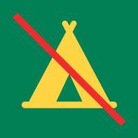
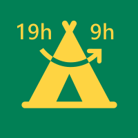
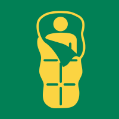
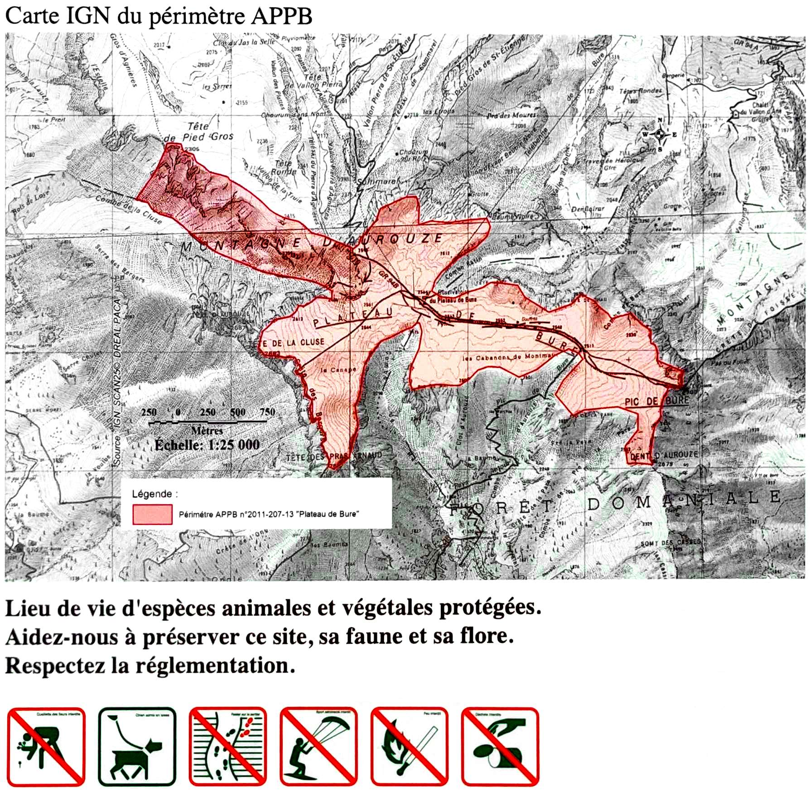
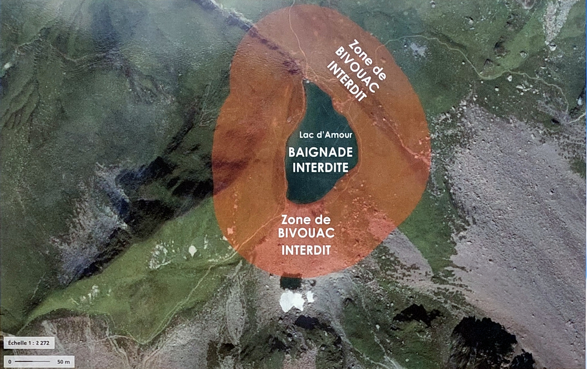
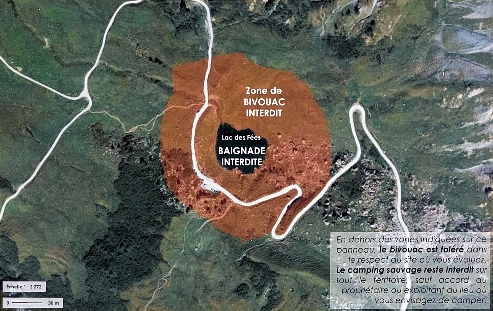
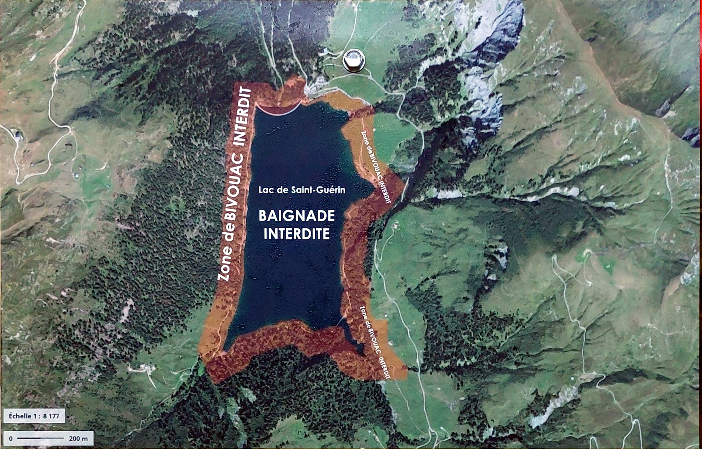
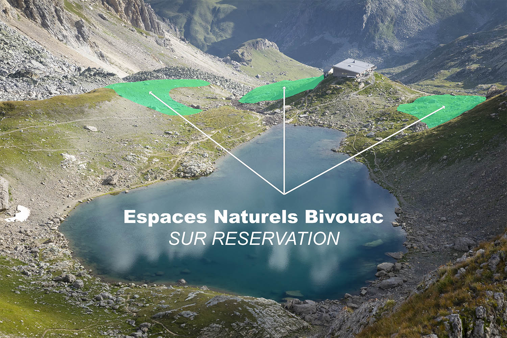

# ⛺ Bivouac

What is bivouac:

- Sleeping in tent ⛺
- Only 1 night 🌙
- Planting the tent after 7pm
- Removing the tent before 9am
- Not on public roads
- Not in classified natural sites
- Not in heritages sites
- Not near historical monuments
- Not on the shores of the sea
- Not within 200m of a water point intended for consumption

What bivouac is not:
- Bivouac is not camping. You can not leave your tent for more than 1 day at the same place

## Logos

Here are the logo as shown on some parc signs.

|Camping prohibited|Bivouac 19h-9h|Bivouac|
|:-----:|:------------:|:-----:|
||||

# Belledonne

> ✅ Bivouac is allowed in Belledonne from 7pm to 9am.

> 🔥 Fire is forbidden within 200m around forests. ⚠ See local restrictions.

|Place|Allowed|Links|
|-----|-------|-----|
|Lac Merlat; Lac Claret|❌|[📄 Belledone p21](2023-07_Bivouac_Belledonne.pdf#page=11)|
|Plaine de la Pra|✅ From September to July 13|[📄 Belledone p21](2023-07_Bivouac_Belledonne.pdf#page=11)|
|Plaine de la Pra|❌ From July 14 to August 31|[📄 Belledone p21](2023-07_Bivouac_Belledonne.pdf#page=11)|
|Chamrousse: Tourbière de l'Arselle; Lac Achard; Infernet|❌ From May 1 to October 30|[📄 Belledone p21](2023-07_Bivouac_Belledonne.pdf#page=11)|
|Haut Bréda: Chalet du Bout; Espace Naturel Sensible du Praillet|❌|[📄 Belledone p21](2023-07_Bivouac_Belledonne.pdf#page=11)|
|Réserve Naturelle du Luitel|❌|[📄 Belledone p21](2023-07_Bivouac_Belledonne.pdf#page=11)|

## La Pra

- 🟦 Blue area: forbidden during the whole year
- 🟥 Red area: forbidden from July 14 to August 31

Source: [📄 Belledone p21](2023-07_Bivouac_Belledonne.pdf#page=11)

# Chartreuse

> ✅ Bivouac is allowed in Chartreuse from 7pm to 9am.

> ⚠ Some restrictions applies in the RNHC (Réserve Naturelle nationale des Hauts de Chartreuse), materialized in green in the following map.

Restrictions in RNHC:
- July-August: bivouac with tent is forbidden, but bivouac without tent is allowed.
- September-June: bivouac with tent is allowed

Source: [📄 2023 Memento RNHC](2023_Bivouac_Chartreuse_memento_RNHC.pdf)

# Vercors

> ✅ Bivouac is allowed in Vercors from 7pm to 9am.

> ❌ Bivouac is forbidden on top of Mont Aiguille.

Source: [📄 2023-06 Bivouac Isère p24](2023-06_Bivouac_Isere.pdf#page=26)

# Écrins

> ✅ Bivouac is allowed in Écrins from 7pm to 9am.

> ✅ Bivouac is allowed in "Cœur du Parc national des Écrins" from 7pm to 9am.
> - Allowed after 1h of walking from road/parking or the limit of the "Cœur"
> - Allowed before 1h but near refuges (list below)

> ❌🔥 Fire is forbidden in "Cœur du Parc national des Écrins".

|Refuge|Allowed|Links|
|------|-------|-----|
|Champoléon: Pré de la Chaumette|✅ Free of charge|[📄 2014-06-01 Arrêté Cœur Écrins](2014-06-01_Bivouac_Arr%C3%AAt%C3%A9_Coeur_Ecrins.pdf)|

|Place|Allowed|Links|
|-----|-------|-----|
|Plateau d'Emparis|✅|[📄 2023-01-13 Arrêté Emparis La Grave](2023-04-13_Bivouac_Arr%C3%AAt%C3%A9_Emparis_La_Grave.pdf)|
|Lac de la Muzelle|✅❕|See below section|
|Lac Lauvitel|✅❕|See below section|

Source:
- [🌐 2023-06-21 Écrins règles été](https://www.ecrins-parcnational.fr/breve/plateaux-emparis-taillefer-nouvelles-regles-ete)
- [🌐 2023-06-21 Belles nuits en Écrins](https://www.ecrins-parcnational.fr/dossier/belles-nuits-pleine-nature)

## Plateau d'Emparis

> ✅ Bivouac is allowed from 7pm to 9am.

> ❌🔥 Fire is forbidden.

<iframe width="100%" height="300px" frameborder="0" allowfullscreen allow="geolocation" src="//umap.openstreetmap.fr/en/map/massifs-et-plateaux_969457?scaleControl=false&miniMap=false&scrollWheelZoom=false&zoomControl=true&editMode=disabled&moreControl=true&searchControl=null&tilelayersControl=null&embedControl=null&datalayersControl=true&onLoadPanel=undefined&captionBar=false&captionMenus=true"></iframe>
<a href="//umap.openstreetmap.fr/en/map/massifs-et-plateaux_969457?scaleControl=false&miniMap=false&scrollWheelZoom=true&zoomControl=true&editMode=disabled&moreControl=true&searchControl=null&tilelayersControl=null&embedControl=null&datalayersControl=true&onLoadPanel=undefined&captionBar=false&captionMenus=true">See full screen</a>

Source: [📄 2023-04-13 Arrêté Emparis La Grave](2023-04-13_Bivouac_Arr%C3%AAt%C3%A9_Emparis_La_Grave.pdf)

## Lac Lauvitel

> ✅ Bivouac is allowed only in 1 location from 7pm to 9am.

Location:

<iframe width="425" height="350" src="https://www.openstreetmap.org/export/embed.html?bbox=6.0562992095947275%2C44.96784938840356%2C6.083893775939941%2C44.97823251040234&amp;layer=mapnik&amp;marker=44.97304118438496%2C6.070096492767334" style="border: 1px solid black"></iframe><small><a href="https://www.openstreetmap.org/?mlat=44.9730&amp;mlon=6.0701#map=16/44.9730/6.0701">View Larger Map</a></small>

Sources: [🌐 2023-08-11 Le Bivouac en Isère](https://www.isere-tourisme.com/informations-pratiques/le-bivouac-en-isere)

## Lac de la Muzelle

> ✅ Bivouac is allowed only in 1 location from 7pm to 9am.

Location:

<iframe width="425" height="350" src="https://www.openstreetmap.org/export/embed.html?bbox=6.081919670104981%2C44.94379858700239%2C6.109514236450196%2C44.95418606207096&amp;layer=mapnik&amp;marker=44.94899255951841%2C6.095716953277588" style="border: 1px solid black"></iframe><small><a href="https://www.openstreetmap.org/?mlat=44.9490&amp;mlon=6.0957#map=16/44.9490/6.0957">View Larger Map</a></small>

Sources: [🌐 2023-08-11 Le Bivouac en Isère](https://www.isere-tourisme.com/informations-pratiques/le-bivouac-en-isere)

## Taillefer: Plateau des Lacs

> ✅ Bivouac is allowed only in 2 locations from 7pm to 9am.

Locations:

<iframe width="425" height="350" src="https://www.openstreetmap.org/export/embed.html?bbox=5.932456254959107%2C45.05365860523198%2C5.946253538131715%2C45.058842628252876&amp;layer=mapnik&amp;marker=45.05625067548783%2C5.93935489654541" style="border: 1px solid black"></iframe><small><a href="https://www.openstreetmap.org/?mlat=45.05625&amp;mlon=5.93935#map=17/45.05625/5.93935">View Larger Map</a></small>

Source: [📄 2023 Bivouac Arrêté Taillefer Ornon](2023_Bivouac_Arr%C3%AAt%C3%A9_Taillefer_Ornon.pdf)

## Taillefer: Around Poursollet

> ✅ Bivouac is allowed near Le Poursollet from 7pm to 9am.

Location:

<iframe width="425" height="350" src="https://www.openstreetmap.org/export/embed.html?bbox=5.897287130355835%2C45.048967143259546%2C5.911084413528443%2C45.05415159155345&amp;layer=mapnik&amp;marker=45.05155942615194%2C5.904185771942139" style="border: 1px solid black"></iframe><small><a href="https://www.openstreetmap.org/?mlat=45.05156&amp;mlon=5.90419#map=17/45.05156/5.90419">View Larger Map</a></small>

Source: [📄 2023-05-23 Arrêté Taillefer Livet Gavet](2023-05-23_Bivouac_Arr%C3%AAt%C3%A9_Taillefer_Livet_Gavet.pdf)

# Dévoluy

> ✅ Bivouac is allowed but some restrictions applies.

Bivouac restrictions:
- Bivouac is forbidden on "Plateau de Bure" (see below).

## Plateau de Bure

> ❌ Bivouac is forbidden on "Plateau de Bure".

> ❌🔥 Fire is forbidden.

The area "Plateau de Bure" in 🟥 below:

Sources:
- [🌐 2023-08-28 Le Dévoluy - Espaces partagés et protégés](https://www.ledevoluy.com/ete/espaces-partages-et-proteges/)
- [📄 2011-07-26 Arrêté Plateau de Bure](2011-07-26_Arr%C3%AAt%C3%A9_Plateau_de_Bure.pdf)
- [📄 2022-10 Arrêté Plateau de Bure](2022-10_Arr%C3%AAt%C3%A9_Plateau_de_Bure.pdf)
- [📷️ Sign on Plateau de Bure](20231001_Panneau_Plateau_de_Bure.jpg)

# Beaufortain

> ✅ Bivouac is allowed but some restrictions applies.

> ❌🔥 Fire is forbidden.

> ❌🏊‍♀️ Swimming in lakes and natural bodies of water is prohibited. Ok in stream/river.

Restrictions for bivouac:

- Bivouac is forbidden within 100m around any lake, reservoir, water bodies.

| Lac d'Amour | Lac des Fées | Lac de Saint-Guérin |
|:-----------:|:------------:|:-------------------:|
||||

Sources:
- [🌐 Office de Tourisme d'Arêches Beaufort](https://www.areches-beaufort.com/la-montagne-respect/)
- [📄 2023-04-31 Arrêté Beaufort](2023-04-31_Bivouac_Beaufortain.pdf)
- [📷️ Sign Lac d'Amour](20230907-Bivouac-Lac-Saint-Guerin.jpg)
- [📷️ Sign Lac des Fées](20230906-Panneau-Lac-des-Fees.jpg)
- [📷️ Sign Lac de Saint-Guérin](20230907-Panneau-Lac-Saint-Guerin.jpg)

## Lac de Presset

> ✅ Bivouac is allowed but only on 3 areas for free but need reservation

> ❌🏊‍♀️ Swimming is forbidden (like the others lakes in Beaufortain).

Locations:

<iframe width="425" height="350" src="https://www.openstreetmap.org/export/embed.html?bbox=6.66046142578125%2C45.647363358858414%2C6.668132543563844%2C45.65062586567171&amp;layer=mapnik" style="border: 1px solid black"></iframe><small><a href="https://www.openstreetmap.org/#map=18/45.64899/6.66430">View Larger Map</a></small>

Source: [🌐 Bivouac au lac de Presset](https://www.refugedepresset.fr/fr/bivouac-au-lac-de-presset-beaufortain-savoie)

# Vanoise

> ❌ "Free" bivouac is forbidden

> ✅ Only paid bivouac with reservation near the refuge is allowed (from June 1 to September 30).

Source: [📄 2023-06 Bivouac Vanoise p4](2023-06_Bivouac_Vanoise.pdf#page=4)

# Queyras

> ✅ Bivouac is allowed but some restrictions applies.

> 🔥 Fire is forbidden from Mars 15 to September 15 in Hautes-Alpes department

Bivouac restrictions:
- Bivouac is allowed after 1h of walk from villages/hamlets
- Tents must be set up after 6pm and taken down before 9am
- The discharge of dishwater and toilet water must be done more than 20 meters from lakes, streams, and wetlands
- Vallon de Bouchouse: see below section
- Ristolas-Mont-Viso: see below section

Source: [🌐 2023-08-09 Bivouac Queyras](https://www.pnr-queyras.fr/bivouac/)

## Vallon de Bouchouse

> ✅ Bivouac is allowed except around the lakes

Below image shows:
- ■ lakes
- ■ areas where access is forbidden

Source:
- [🌐 Le Vallon des Lacs et le Col Agnel](https://www.pnr-queyras.fr/le-vallon-des-lacs-et-le-col-agnel/)
- [📄 2017-10 Brochure Bouchouse](2017-10_Brochure_Bouchouse.pdf)

## Ristolas-Mont-Viso

> ✅ Bivouac is allowed but some restrictions applies.

Bivouac restrictions:
- Bivouac is allowed between 6pm and 9am
- Bivouac is allowed within less than 20m from the authorized marked trails
- Bivouac is allowed after 1h of walk from the hamlet of l’Echalp
- Bivouac is forbidden inside the prohibited areas marked on the ground
- Bivouac is forbidden within a radius of 20m around the shores of lakes
- Bivouac is forbidden within a radius of 500m around the Refuge du Viso
- Bivouac is forbidden in areas used by livestock

Source:
- [🌐 2023 Réglementation du bivouac dans la réserve naturelle](https://www.pnr-queyras.fr/bivouac-rnn/)
- [📄 2023-05-15 Arrêté préfectoral Ristolas-Mont-Viso](2023-05-15_Bivouac_Ristolas-Mont-Viso.pdf)
- [📄 2023-06 Panneau Bivouac Ristolas-Mont-Viso](2023-06_Panneau_bivouac_Ristolas-Mont-Viso.jpg)

# Mercantour

> ✅ Bivouac is allowed after 1h of walk after area "Cœur du parc" and after 1h of walk from any road

TODO:
- Read https://www.mercantour-parcnational.fr/fr/le-parc-national-du-mercantour/la-reglementation

Source: [🌐 2023 Réglementation du bivouac dans la réserve naturelle](https://www.mercantour-parcnational.fr/fr/le-parc-national-du-mercantour/la-reglementation)

# Todo 

Read: https://www.randonner-malin.com/bivouacs-et-camping-sauvage-en-france/
- Parc national des Pyrénées http://www.pyrenees-parcnational.fr/fr/le-parc-national-des-pyrenees/la-reglementation
- Parc national de Port-Cros http://www.portcros-parcnational.fr/fr/le-parc-national-de-port-cros/la-reglementation/reglementation-terre
- Parc national des Cévennes http://www.cevennes-parcnational.fr/fr/les-regles-pour-tous
- Parc national des Calanques
- Parc national de forêts

Other articles to read/find:
- Verdon ?
- https://www.savoie.gouv.fr/contenu/telechargement/25002/192642/file/Arr%C3%AAt%C3%A9+interd%C3%A9partemental+reconduction+RNCFS+-+Version_juillet2018.pdf
- https://www.lecampingsauvage.fr/legislation-et-reglementation/camping-sauvage-bivouac
- https://www.ecrins-parcnational.fr/sites/ecrins-parcnational.com/files/fiche_doc/16338/gte-cartepratique2017web.pdf
