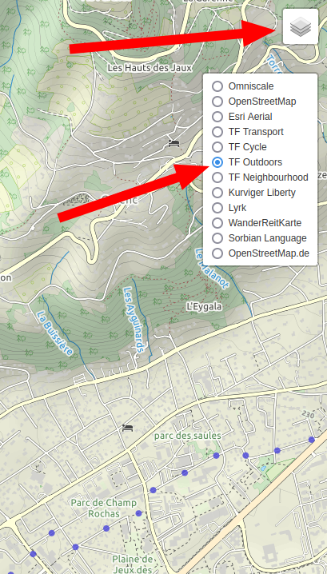
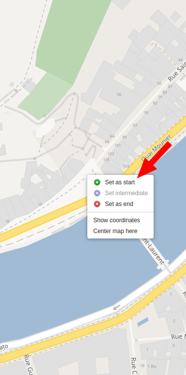
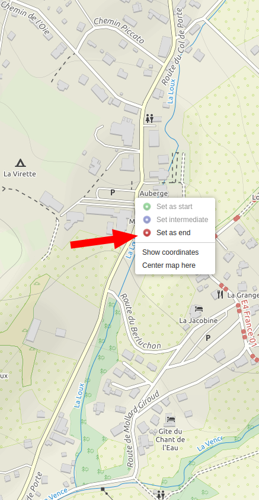
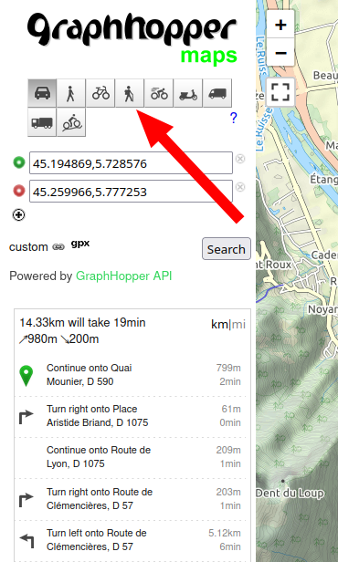
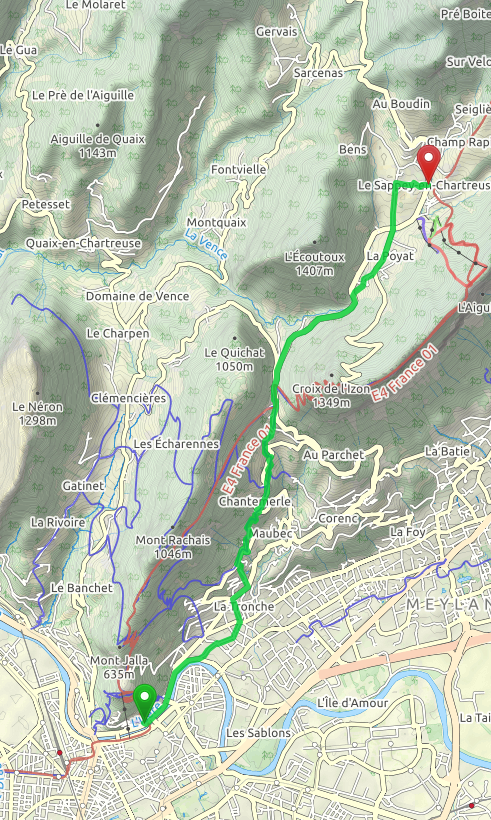
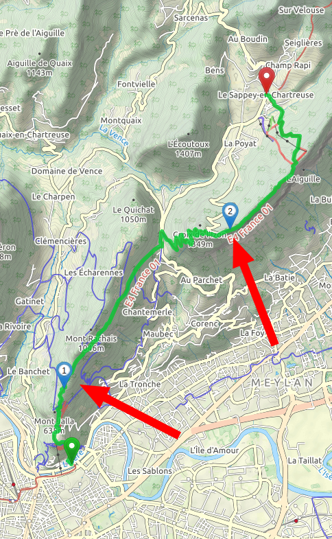
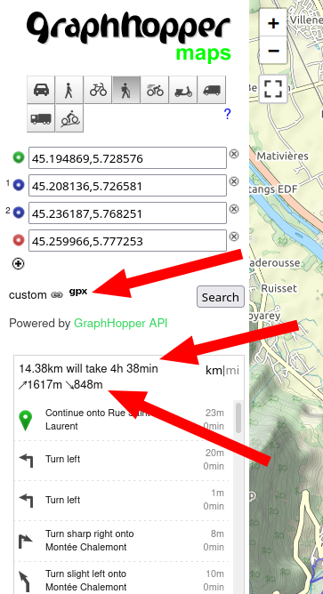

# Create or find GPX track

## Find a GPX on internet
Many websites will provide GPX track to download:

| Website                     | Email/Account required | Comment                         |
|-----------------------------|------------------------|---------------------------------|
| https://www.visugpx.com     | No 👍                  | Many hikes                      |
| https://www.gr-infos.com    | No 👍                  | Best website to download GR GPX |
| https://www.openrunner.com  | No 👍                  | Some hikes                      |
| https://www.randogps.net    | No 👍                  | Some hikes                      |
| https://www.camptocamp.org  | No 👍                  | You can find some hiking route  |
| https://www.visorando.com   | Yes 😤                 | Many hikes but Email required   |
| https://www.komoot.fr       | Yes 😤                 | Many hikes but Account required |

Other websites:

| Website                                                                     | Email/Account required | Comment                         |
|-----------------------------------------------------------------------------|------------------------|---------------------------------|
| https://www.grenoblealpesmetropole.fr/860-parcours-de-trail.htm             | No 👍                  | Trail GPX                       |
| https://www.data.gouv.fr/fr/datasets/r/6404a8f4-e61f-4b79-93d1-e4bd71dedc26 | No 👍                  | 269 GPX                         |
| https://fr-fr.gps-viewer.com                                                | No 👍                  | Can not sort by sport           |

## Create your own GPX track on a computer with GraphHopper

1. Open https://graphhopper.com/maps/
1. On the top right angle, select the radio "TF Outdoors"
1. 
1. Zoom the map until you see the start position of your new hike
1. Right click on the map and select "Set as start"
1. 
1. Zoom the map until you see the end position of yout hike
1. Right click until you see the end position of your hike
1. 
1. Now click on the "hiker profile" on the left
1. 
1. GraphHopper will make a route for you:
1. 
1. You can customize your route by adding steps
1. To do so, right click on the map and select "Set intermediate"
1. Now you have a "more friendly" hike
1. 
1. You can see your hike detail (elevation, km) on the left
1. And you can download the GPX track as well
1. 
1. Done!
