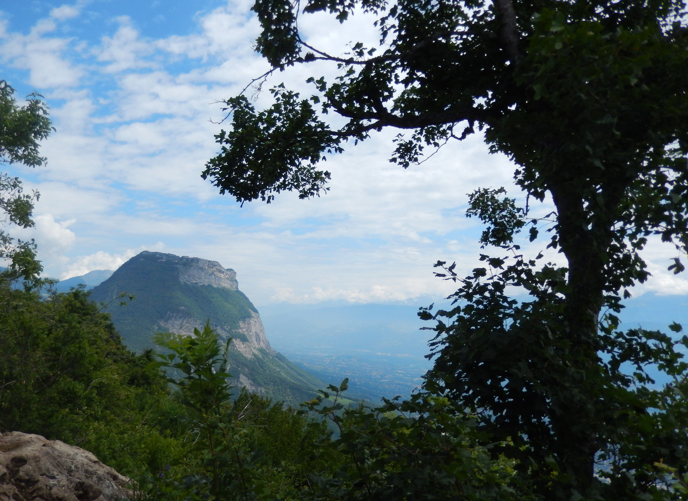

# Circuit Mont Jalla – Mont Rachais

Very Short notice! So we will keep planning simple. I propose to you the following for tomorrow.

What: Hike Circuit Mont Jalla – Mont Rachais

Where: We will meet at the Fontaine du Lion et du Serpent (105 Rue Saint-Laurent) we can start with a coffee and croissant + introduction before starting to ascend (We will begin this hike from the Bastille directly)

When: Sunday June 28 @ 9am – 5pm (?) I will be at the café that adjoins the fountain at 9am with my coffee waiting for others (wearing a blue shirt and I have blond hair - send me a message if you do not see me).

We will then plan to leave the cafe and begin the hike around 9:30am. Normally this route including the Bastille (ascend & descend) is planned @ 5.5 hours but I prefer to take several breaks along the way to make the hike as comfortable as possible for everyone and to enjoy the scenery. We should also plan a good amount of time to stop and have snack breaks plus a longer lunch break.

I also suggest returning to our point of the departure after the hike to have a soft drink or beer for those who would like (and discuss planning the next hike together!)

Description: Circuit Mont Jalla - Mont Rachais is a 9.7 km moderately used loop trail located near Grenoble, Auvergne-Rhône-Alpes in France. The trail will introduce you to wild flowers and is rated as difficult. The trail offers many activities and is best used from March to November. Dogs are welcome on this trail.

* Distance:
9.7 km

Dénivelé:
507 m (starting from top of Bastille)

What you will absolutely need to bring:
A backpack for food and water
A comfortable pair of shoes
2 or 3 liters of water
Snacks (chips, sausage etc...)
Lunch (sandwich)

What you may want to bring but is not needed:
Bâtons de randonnée
A well charged camera/phone if you would like to take pictures
Sun screen
Bug spray

If there are any questions or if someone would like to add additional information please do not hesitate!

Hope to see you tomorrow!

## Stats

- Start time: 2020-06-28 09:00
- End time: 2020-06-28 17:00
- Duration: 8:00:00
- Time to event: 17:27:54
- Attendees: 3
- KM: 8.4
- D+: 813
- Top: 1046
- Type: Hike
- Comment: 

## Links

- [Trail short link](https://s.42l.fr/5k1GoOd4)
- [Trail full link]()
- [Album](https://binnette.github.io/GacImg2020/2020-06-28-Circuit-Mont-Jalla-Mont-Rachais.html)
- [Meetup event](https://www.meetup.com/grenoble-adventure-club-english-french/events/271562817/)
