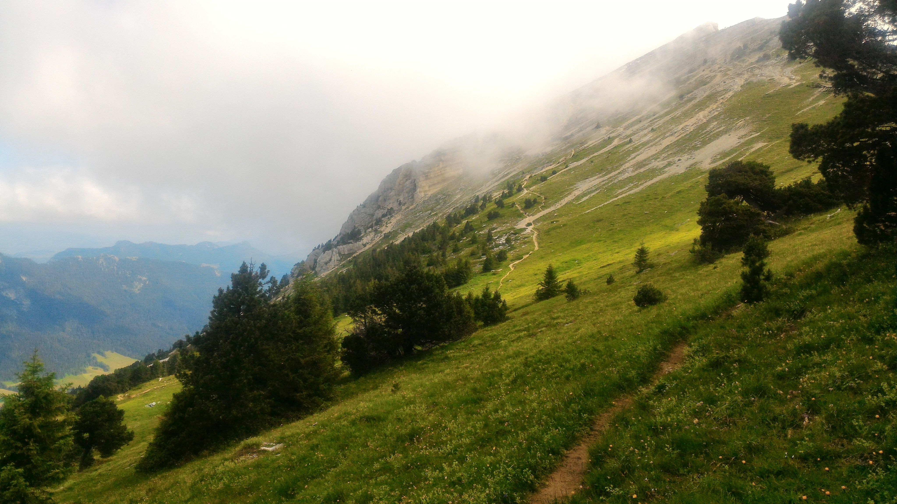

# Chamechaude 4th of July! 

Ok, so this is going to be an À la carte hike where you are free to choose how much you want to do! And there is a lot of information!

It will last between 4 and 9 hours depending on your comfortability (+ after hike pizza, beer, ice cream). Let me explain.

There are 2 required steps, and 3 optional choices.

You can find them below. We do it like this because many people have different objectives when hiking, skill levels, and time schedules. With a plan like this we hope that everyone can participate!

!!Required Step # 1
Be to Col de Porte at 9am.

For many of us we will plan to be at Place Notre Dame – Musée bus stop at 7:50am for the 8:10 bus. This will get us to Col de Porte at 8:45am. If you choose to drive you are welcome to do that.

!!Required Step # 2
Hike to Chamchaud

This is a 3.6KM hike with a 786 meter incline (Dénivelé) this should take 2-2.5 hours. Here we will eat lunch and enjoy the view (2,082 meters!)

--------------------------------------
*Optional Choice # 1
Descend and return to Col de Porte for bus back to Grenoble

This should take 1-1.5 hours. This is a 786 meter decline (dénivelé négatif) and is 3.6KM (same path we took to arrive at the summit).

Buses from Col de Porte to Grenoble on Saturday are at 15h45/17h10/18h30.

**Optional Choice # 2
Continue on to le Sappy en Chartreuse.

This should take 2 – 2.5 hours. This is a 1066 meter decline (dénivelé négatif) from Chamchaud and is 7.5KM. From here you can choose to take the bus back to Grenoble if you would like.

Buses from le Sappy en Chartreuse to Grenoble on Saturday are at 15h54/17h19/18h39.

***Optional Choice # 3
Continue on to Col de Vence while visiting Fort du St-Eynard

This should take 1 – 1.5 hours. This is a 365 meter incline (Dénivelé) from le Sappy en Chartreuse and is 4.5KM. From here you can take the bus back to Grenoble.

Buses from Col de Vence to Grenoble on Saturday are 15h59/17h24/18h44.

So, if you plan to take option # 3, this option could take 6.5 hours (+ lunch and breaks = 8-9 hours). If it takes us the full 9 hours (from 9am) we will have 44 minutes (+/-) in Col de Vence waiting for the 18h44 bus.

I and at least 2 other people have commited to option # 3

We will take all necessary adjustments with time and ensure that anyone who wants to stop at options #1 or #2 or go on to option #3 will not be stranded and will be placed at the bus stop without worry. This is not a race, don't worry about that! The most important thing is that you come! We want to meet you so don't be shy!

This is a big schedule!

The point is not to see how fast we can go, but how much we can appreciate the views :)

For those returning to Grenoble city center after option # 3 and for those who are interested, we will continue on for a beer, pizza, or ice cream. Or maybe all three!

Things to remember:
What you will absolutely need to bring:
A backpack for food and water
A comfortable pair of shoes
2 or 3 liters of water
Snacks (chips, sausage, fruit etc...)
Lunch (sandwich)

What you may want to bring but is not needed:
Bâtons de randonnée
A well charged camera/phone if you would like to take pictures
Sun screen
Bug spray

This will be an experience and challenge for all of us. No time estimates are 100% accurate as we will need to adjust to the needs of others. But one thing that is certain is we will all have fun and stay safe together!

If there are any questions or if someone would like to add additional information please do not hesitate!

If you prefer clarification in the French language you can post your comment in French and we will try to respond as soon as possible with a native speaker.

- The Grenoble Hiking Club

## Stats

- Start time: 2020-07-04 07:50
- End time: 2020-07-04 18:00
- Duration: 10:10:00
- Time to event: 1 day, 7:39:04
- Attendees: 6
- KM: 3.6
- D+: 786
- Top: 2082
- Type: Hike
- Comment: 

## Links

- [Trail short link](https://s.42l.fr/iTny7FHv)
- [Trail full link]()
- [Album](https://binnette.github.io/GacImg2020/2020-07-04-Chamechaude-4th-of-July.html)
- [Meetup event](https://www.meetup.com/grenoble-adventure-club-english-french/events/271679624/)
