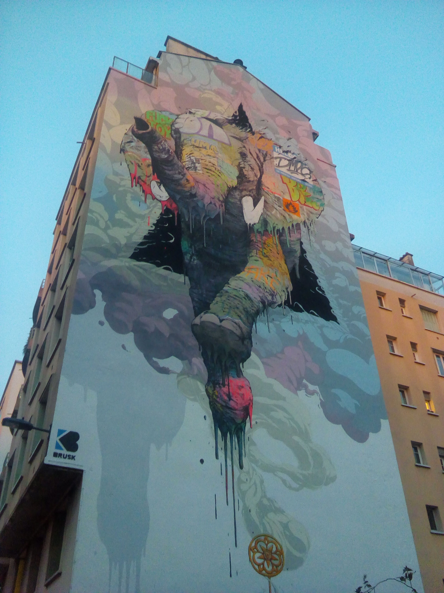

# City Hike #2 with Geocaching

Our official weekend hike is sure to be on Sunday (details coming very soon), so let’s plan on something Saturday afternoon/evening.

We are sure to do a lot of things in addition to hiking so a name change for the group may be happening soon, so don't be suprised by this.

This will be a follow-up event on Saturday after Brian’s Musée Stendhal event. If you have not already joined his event be sure to do so here:

https://www.meetup.com/Social-Meetup-English-French-redux/events/vfxsmrybcfbdc/

After Musée Stendhal we will start our 2nd “city hike” with Geocaching (thanks to Julien M for all his good ideas!)

What is Geocaching?

Geocaching is a real-world, outdoor adventure that is happening all the time, all around the world. To play, participants use the Geocaching app and/or a GPS device to navigate to cleverly hidden containers called geocaches. There are millions of geocaches in 190 countries waiting to be discovered—there are probably even some near you right now.

More info here: https://www.geocaching.com/blog/2018/03/what-is-geocaching/

I have never done this type of activity before so it will be something new for me! I added an app though to my phone and there are a lot of caches in Grenoble and in the city center. There are even a lot in the mountains too which could make for some interesting hikes in the future!

The organization I imagine will need to be developed based on the number of people participating, so let’s wait and see. But as always, the more people the better so be sure to join!

The basic planning so far is to meet at 3:30pm after Musée Stendhal, do a few hours of Geocaching, then finish with getting something to eat or drink.

This will also serve as another opportunity to get in-person details about Sundays hike if you have any questions.

We cannot be out too late though as Sunday’s hike is sure to start early :)

See you soon!

## Stats

- Start time: 2020-07-11 15:30
- End time: 2020-07-11 18:30
- Duration: 3:00:00
- Time to event: 4 days, 0:27:47
- Attendees: 4
- KM: 4.3
- D+: 60
- Top: 220
- Type: Hike
- Comment: 

## Links

- [Trail short link](https://frama.link/XsStAy4E)
- [Trail full link]()
- [Album](https://binnette.github.io/GacImg2020/)
- [Meetup event](https://www.meetup.com/grenoble-adventure-club-english-french/events/271771141/)
