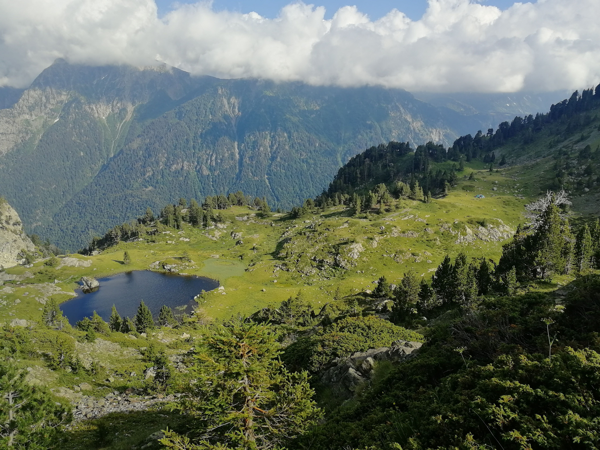

# Chamrousse and the lakes, 12th of July! 

As the 1st edition worked quite well, we try again an "À la carte" hike where you are free to choose how much you want to do! It can last between 4 and 9 hours depending on your comfortability. Let me introduce you the plan:

There are 2 required steps, and 3 optional choices.

You can find them below. We do it like this because many people have different objectives when hiking, skill levels, and time schedules. With a plan like this everyone can participate!

!!Required Step # 1
Be to Chamrousse at 9am. For many of us we plan to take the bus 707 in direction of Chamrousse. Let's meet at Place de Verdun at 7:20am, the bus leaves at 7:40am (I know it's early but the hike worth it ;) ). This will get us to the station at 8:55am. If you choose to drive you are welcome to do that.

!!Required Step # 2
We will all hike together to Lacs Robert after Lac Achard. This is a 4.5KM hike with a 530 meter incline (Dénivelé) this should take 2-2.5h. Here we plan to eat lunch and enjoy the view (2100 meters!). And if you dare you may want to have a swim in the Lac Robert (I can't garanty the water in warm though ;) ).

--------------------------------------
*Optional Choice # 1
Descend and return to Chamrousse for bus back to Grenoble.

This should take around 2 hours. This is a 530 meter decline (dénivelé négatif) and is 4.5KM (a loop around la croix de Chamrousse).

Buses from Chamrousse to Grenoble on Sunday are at 14h15/17h20 (for line 707) and 13h45/18h35 for line 6010.

**Optional Choice # 2
Continue to see cascade de l'Oursière and end the hike in St Martin d'Uriage.

This should take 3 hours. This is a 1200 meter decline (dénivelé négatif) from Lac Robert and is 8KM. From here you can take the bus back to Grenoble if you like.

Buses from St Martin d'Uriage - les Seiglières to Grenoble on Sunday are 707: 14h50/17h50 or 6010: 14h10/19h00.

***Optional Choice # 3
If you want to enjoy as much as possible (and be as tired as possible), option 3 is for you ;) It goes around 1 more lake up to Refuge de la Pra and the Cascade de l'Oursière to end up in St Martin d'Uriage.

This should take 6 hours. This is adds 300 meter incline (Dénivelé) and 1500m meter decline from lacs Robert and is 13KM. From here you can take the bus back to Grenoble.

Buses from St Martin d'Uriage - les Seiglières to Grenoble on Sunday are 707: 17h50 or 6010: 19h00.

So, for option # 3, it could take 8 hours (+ breaks = 8-8.5 hours). Depending on how fast we go, we might be able to catch the 17h50 bus with a 20 minutes window. If we can't make it, we can still take the 6010 bus but you should prepare some change as the tickets are sold only on the bus for 4.6€.

We did not plan this as a race, so you will be able to catch a bus. We will do at least the 1st part of the hike together up to Lacs Robert! So the most important thing is that you come! We want to meet you, don't be shy!

For those returning to Grenoble city center after option # 3 and for those who are interested, we will continue on for a beer, pizza, or ice cream. Or maybe all three!

###################
What you will absolutely need to bring:
A backpack for food and water
A comfortable pair of sport shoes (preferably hiking shoes if you are going to option 2 or 3).
2 or 3 liters of water (no water point on the tracks, so bring enough)
Snacks (chips, sausage, fruit...)
Lunch (sandwich)
Hat/Cap

What you may want to bring but is not needed:
Bâtons de randonnée (strongly recommended if you aim for option 2/3 because there is a lot of decline)
A well charged camera/phone if you would like to take pictures
Sun screen, Sun glasses
Bug spray
Swim suit and towel if you plan to swim
Change for the bus 6010

This will be an experience and challenge for all of us. No time estimates are 100% accurate as we will need to adjust to the needs of others. But one thing that is certain is we will all have fun and stay safe together!

Don't hesitate if you have question (in french or english).

The Grenoble Hiking Club

## Stats

- Start time: 2020-07-12 07:20
- End time: 2020-07-12 19:00
- Duration: 11:40:00
- Time to event: 4 days, 9:57:22
- Attendees: 15
- KM: 14.6
- D+: 1190
- Top: 2448
- Type: Hike
- Comment: 

## Links

- [Trail short link](https://frama.link/5RJcyZ8w)
- [Trail full link]()
- [Album](https://binnette.github.io/GacImg2020/2020-07-12-Chamrousse-and-the-lakes,-12th-of-July.html)
- [Meetup event](https://www.meetup.com/grenoble-adventure-club-english-french/events/271778570/)
