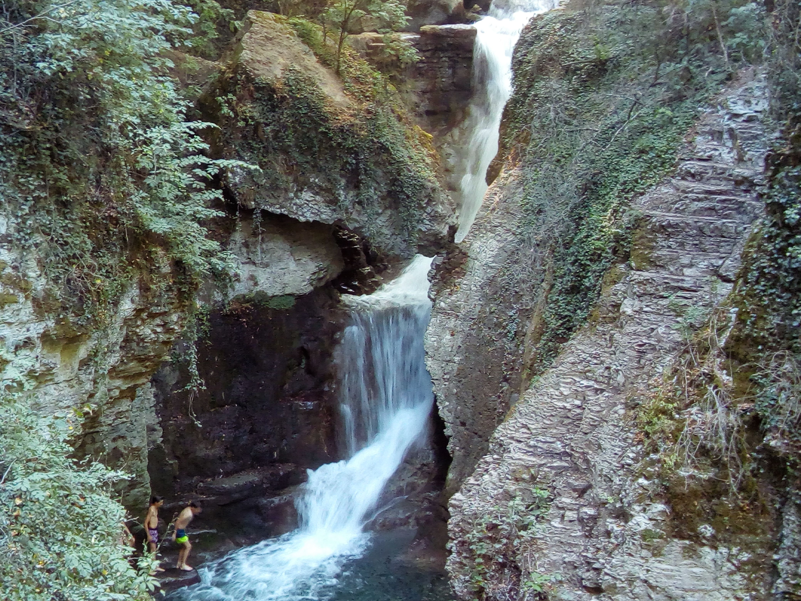

# Refreshing hiking Cuves de Sassenage & Ferme Durand

---FR/EN. All our event are in both english & french. Tous nos évènements sont en français et en anglais, ne soyez pas inquiets si votre niveau d'anglais est faible.---

Hi everyone, bring your swimsuit & hiking shoes! We will meet at the end of line A tramway station "La Poya" at 14:00. Then we will walk to "Cuves de Sassenages" and enjoy some "refreshing" swimming there. If people are interested we can also visit the "Cuves de Sassenage" for 8€ per person (no equipment needed, just good shoes to walk into the cave).

Next we will climb up to Vercors and pass through "Ferme Durand". And finally get back to the tram station "La Poya". As always after the hiking we can go to a pub and have some food together.

What do you need
---------------
- Hiking shoes (or good shoes) and some snack for the hike
- Swimsuit+Towel if you plan to swim
- 8€ money if you plan to visit the cave
- Yourself including happiness and desire to meet other people ^^

More details
---------------
Hiking duration: ~3h but we will stay at "Cuves de Sassenage" to chill and maybe swim for the brave among us... :D
* D+: 870m
Distance : ~12km
Hiking topo: https://frama.link/Z1dSsMd1
Start & end point: https://www.osm.org/node/792681747

Note: we can of course "customize" our hike depending on attendees motivation.

## Stats

- Start time: 2020-07-19 14:00
- End time: 2020-07-19 19:00
- Duration: 5:00:00
- Time to event: 1 day, 19:11:39
- Attendees: 8
- KM: 12.2
- D+: 869
- Top: 847
- Type: Hike
- Comment: 

## Links

- [Trail short link](https://frama.link/Z1dSsMd1)
- [Trail full link]()
- [Album](https://binnette.github.io/GacImg2020/2020-07-19-Refreshing-hiking-Cuves-de-Sassenage-and-Ferme-Durand.html)
- [Meetup event](https://www.meetup.com/grenoble-adventure-club-english-french/events/271987148/)
