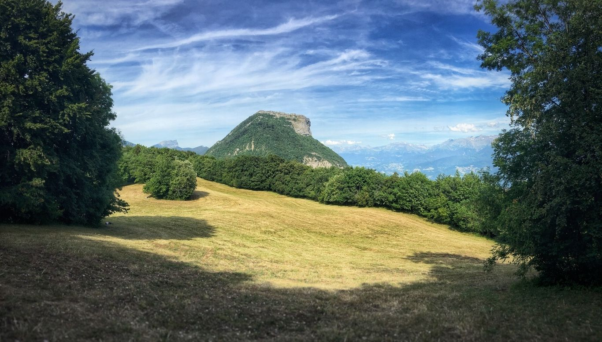

# [PLAN B] GR9: from Grenoble to Mont Rachais

SORRY GUYS, WE CHANGED EVERYTHING !
(No need of cars, start & return at Grenoble)

RDV at 8h30 near "La fontaine du Lyon": https://www.osm.org/node/1572935122

We will take the "GR9" up to the Mont Rachais. Here is the topo: https://frama.link/fp-P9n9c

* Distance: 9.61km
* D+: ↗982m
(Given the calculator, It will take 3h 40min)

What do you need ?
---------------
- FOOD for lunch
- Hiking shoes
- Water (The only water point is at the top of Bastille, no other water point after)
- Solar cream, hat, etc.

## Stats

- Start time: 2020-07-25 08:30
- End time: 2020-07-25 19:00
- Duration: 10:30:00
- Time to event: 2 days, 22:13:43
- Attendees: 7
- KM: 9.6
- D+: 982
- Top: 1006
- Type: Hike
- Comment: 

## Links

- [Trail short link](https://frama.link/fp-P9n9c)
- [Trail full link]()
- [Album](https://binnette.github.io/GacImg2020/2020-07-25-[PLAN-B]-GR9-from-Grenoble-to-Mont-Rachais.html)
- [Meetup event](https://www.meetup.com/grenoble-adventure-club-english-french/events/272076374/)
