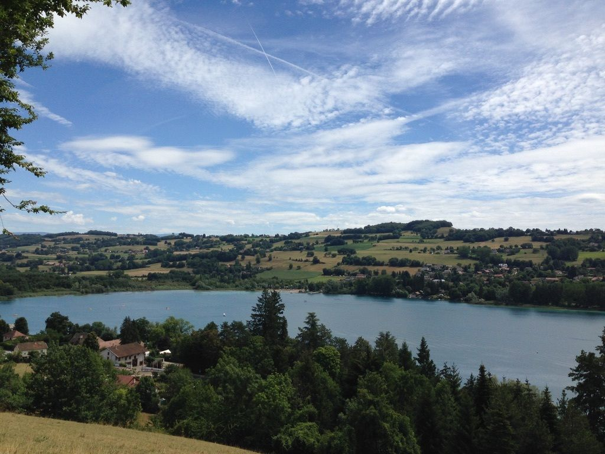

# Sunday Funday!

-- Update July 22 2020 --

Ok, we have put together the final planning.

We will do a 6 hour tour du Lac de Paladru with some swimming at Plage de Palandru.

The hike will begin (and end) at l'Office de Tourisme de Charavines (but remember we will all meet at Gare de Grenoble at 9am for car sharing).

Or for others who are interested in meeting us directly at the tourism office we will see you there (around 10am). There is a lot of free parking next to the tourist office.

About halfway through the hike (+/-) we will arrive at Plage de Paladru. Here we will take our time to eat lunch (pack a lunch or buy something at the beach) and do some swimming until we are ready to finish the hike.

Entrance to the beach is 3 euro per person. So passengers of vehicles will need 10 euro for the transportation + 3 euro for the beach.

Reservations to the beach will be made for everyone before Sunday.

A description of the hike can be found here:

https://www.paysvoironnais.info/itineraire/le-tour-du-lac-de-paladru-1-1.html

A description of the beach can be found here:

https://www.paysvoironnais.info/villages-du-lac-de-paladru/plage-municipale-de-paladru/autres-loisirs.html

As always, be sure to bring a sufficient amount of water and comfortable shoes (and proper swimsuit if you plan to get in the water). No birthday suits here!

And bring a mask if you wish to buy something at the beach (food or drink).

Don’t hesitate if you have any questions or comments.

A dimanche !

--Initial Posting July 20 2020--

Ok, so there are going to be a lot more details to come so be sure to stay updated by visiting (and reading!) the details of this event :)

We will plan a hiking and swimming extravaganza at and around Le lac de Paladru this Sunday.

It will require some coordination as we will plan to take cars. So far we have three cars with some available seats. We are interested to know if there are any other available cars/drivers for this event.

Comme d'hab we will meet at la Gare de Grenoble for the meeting place when we take cars. Drivers will also be reimbursed 10 euro per each passenger (to take the train is 15 euro for a passenger + a lot of walking so we all win when we take cars).

So at this moment we are only trying to organize how many cars/places are available for the event. Once we know this we will create further details. Donc, if you are willing to drive and have available seats please contact me, or make a comment in the event as soon as possible!

You are also free to drive directly to the lake without joining us at the train station and we will meet you there. It's up to you.

We will open the event with 8 places with the current car situation and add more as potential drivers may join as well. We will also define the details of the hike and swimming in the next day or two, but plan on a full day of hiking and swimming (environ huit heures).

- TEAM GAC (Grenoble Adventure Club)

## Stats

- Start time: 2020-07-26 09:00
- End time: 2020-07-26 17:00
- Duration: 8:00:00
- Time to event: 4 days, 17:45:56
- Attendees: 20
- KM: 20.8
- D+: 570
- Top: 720
- Type: Hike
- Comment: 

## Links

- [Trail short link](https://s.42l.fr/OVHHa0Md)
- [Trail full link]()
- [Album](https://binnette.github.io/GacImg2020/2020-07-26-Sunday-Funday.html)
- [Meetup event](https://www.meetup.com/grenoble-adventure-club-english-french/events/272059645/)
