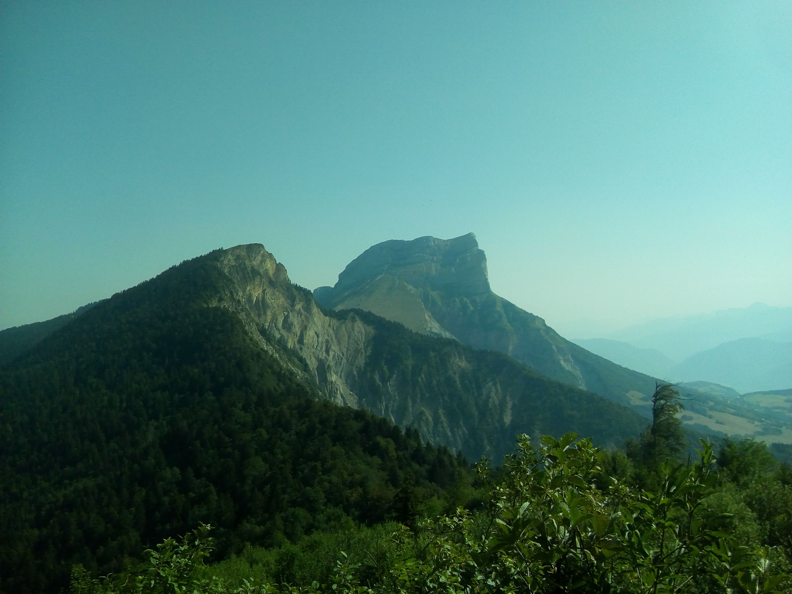

# La dent de Crolles and more (or not)...

Update on 30/07/20:
Date is confirmed on the saturday! It will be hot so bring water, hat etc... Rain jacket is advised as we might encounter some rain after 5pm (it should worry mostly people doing Itinerary 1 ;) ). For people who registered but didn't say which itinerary they were doing, please indicate it in the comment section. We have 1 or 2 people that are happy to drive to Itinerary 2, so if you are looking for a lift contact them directly through the App to set the details between you. ;) Additional things to bring: some cash + face mask for the bus and carpooling.

Original message
---////////---
Hi everyone, Salut à tous,
After the "passerelles de Monteynard", the Mont Jala and Rachais and Chamechaude, let's continue the Grenoble classics with : "La dent de Crolles" (the Crolles teeth)! :)

/!\ The date (saturday or sunday) is not definitive yet because I wait for the weather forecast to be a bit more precise to fix it. But for now, let's assume this will take place on saturday. It will be fixed by Thursday evening.

Again, I am trying to do a 2 level hikes to adapt to the different levels.

*
Itinerary 1 - The most difficult and tiring ;)
Meet 7h50 at the bus stop "Notre-Dame Musée" to take the bus 62 at 8h08. Stop at le Sappey en Chartreuse for the 1st part of the hike up to Col du Coq. We should arrive around 12h30 and join the other part of the group (look for itinerary 2). Then we climb la dent de Croles and come back to col du coq (additional details in itinerary 2). The itinerary 2 stops there. We continue to go down until the location "Les Meunières" where we should be able to take the 6550 bus at 17h25 to come back to Grenoble. Timing is a bit tight but it should be doable.
Slope (Denivelé) : + and - 1300m
Length: 18km
Duration: 9h
Link: https://www.visorando.com/randonnee-/3694674

*
Itinerary 2 (car or carpooling needed):
Join the 1st part of the group at 12h30 at Col du Coq. It's 50min drive from grenoble (meeting point and time to be agreed between carpoolers). The all group does together the climb of Dent de Crolles. I plan we eat around le col de Ayes after 1h of hiking, but this we can adapt of course. This part is rated as a moderate with some easy climbing steps. The view at the top is quite nice. We go in a loop so the return is not the same but we come back to the departure point where you can go back to grenoble by car.
Slope (Denivelé): + and - 650 m (Chamechaude level for those who did this hike)
Length: 6.5km
Duration: 4h30
Link: https://www.altituderando.com/Dent-de-Crolles-2062m-par-le-Trou-du-Glaz

When back in Grenoble we can have food and drinks to regain some of the calories we lost during the hike ;)

I personnaly will do itinerary 1, but I am quite sure some people with cars will be willing to do the 2nd itinerary so don't hesitate to mention it in the comment section. ;) Please indicate in the comment section what you plan to do (and if you have a car for Itinerary 2) so we can anticipate. If you wish to carpool with someone please respond to the comment posted by the driver so we keep track on the number of people in the cars. :)

What you will absolutely need to bring:
- A backpack for food and water
- A comfortable pair of sport shoes (hiking shoes preferably if you do Itinerary 1)
- 2 or 3 liters of water (it will be hot so make sure to bring enough :) )
- Snacks (chips, sausage, fruit etc...)
- Lunch (sandwich)
- Sun screen + hat as it will be certainly very hot and sunny.

What you may want to bring but is not needed:
- Hiking poles/Bâtons de randonnée
- A well charged camera/phone for pictures
- Bug spray

This will be an experience and challenge for all of us. No time estimates are 100% accurate as we will need to adjust to the needs of others. But one thing that is certain is we will all have fun and stay safe together!

Don't hesitate if you have question (in french or english).
N'hésitez pas si vous avez des questions.
--
Julien for the GAC

## Stats

- Start time: 2020-08-01 07:50
- End time: 2020-08-01 19:00
- Duration: 11:10:00
- Time to event: 3 days, 10:34:15
- Attendees: 6
- KM: 21
- D+: 1628
- Top: 2020
- Type: Hike
- Comment: 

## Links

- [Trail short link](https://s.42l.fr/DqIv6LwB)
- [Trail full link]()
- [Album](https://binnette.github.io/GacImg2020/2020-08-01-La-dent-de-Crolles-and-more-or-not.html)
- [Meetup event](https://www.meetup.com/grenoble-adventure-club-english-french/events/272212113/)
