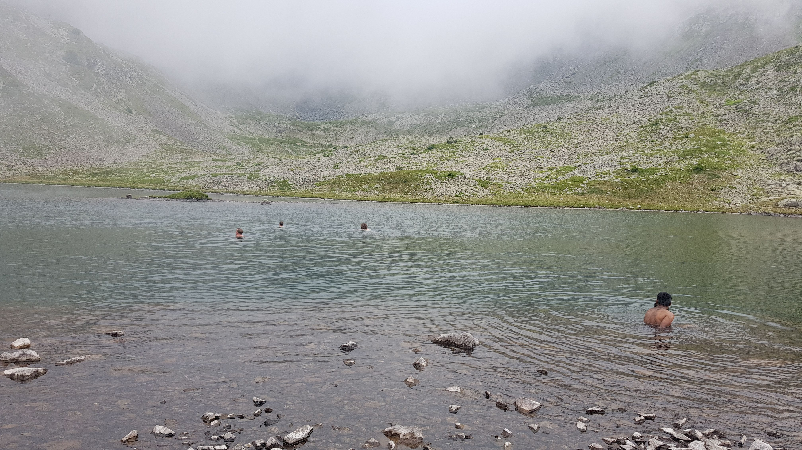

# Too hot on Sunday, let's go to Brouffier

It's really too hot on Sunday !

So let's hike around the "Lac de Brouffier".
Pictures: https://frama.link/ZpwFqaSZ

## Car sharing ##
There is 1h of car to go there. If you have a car, please add a comment with the total number of seats in your car.

Car sharing fee is fixed to 10€ by person.

## Hike topo ##
Have a look: https://frama.link/myvV6DZ3
* Distance: 9.08km (swimming not included)
Duration: 3h 39min (chilling at lake not included ^^)
Elevation: ↗837m ↘837m
Start & end point: https://www.osm.org/node/817688180

## Plan of the day ##
1. Meet at 8:30 (Please do NOT be late) at "Clémenceau/Anneau de vitesse" parking: https://www.osm.org/way/69486256
2. 1h car to destination. We will park between "La Morte" & "Poursollet" at "Parking Combe Oursière": https://www.osm.org/node/817688180
3. Hike and then go back to Grenoble

## Plan of the hike ##
1. Start from "Parking Combe Oursière": https://www.osm.org/node/817688180
2. Hike to the "Pas de la Mine" : https://www.osm.org/node/817614503
3. Walk down to the "Lac de Brouffier" and enjoy some "coldy" swim: https://www.osm.org/node/817614503
4. Then hike back to the parking

Of course, we will take time to eat & share some food. And also take some time to enjoy the lake.

As always, the group will stick together to enjoy some chatting & help each other if needed. If you want to be alone, do not join the group ^^

## What to bring ##
- Food for lunch & if you want something to share
- Snacks to chill near the lake & feed the fish...
- Water 2/3 litters cause there no water point during the hike
- Hiking shoes
- Swimsuit+towel
- Sun-cream+hat
- Rain-clothes if needed?
- Some money for car cost share
- Your jokes, happiness and pleasure to meet and chat will new people ^^

## Questions? ##
Feel free to ask questions in the comment section

Note: there are a total of 10 places cause we have 2 cars right now. Also feel free to register on the waiting list.

## Stats

- Start time: 2020-08-02 08:30
- End time: 2020-08-02 20:30
- Duration: 12:00:00
- Time to event: 2 days, 22:30:13
- Attendees: 10
- KM: 9.1
- D+: 837
- Top: 2414
- Type: Hike
- Comment: 

## Links

- [Trail short link](https://frama.link/myvV6DZ3)
- [Trail full link]()
- [Album](https://binnette.github.io/GacImg2020/2020-08-02-Too-hot-on-Sunday,-lets-go-to-Brouffier.html)
- [Meetup event](https://www.meetup.com/grenoble-adventure-club-english-french/events/272245836/)
