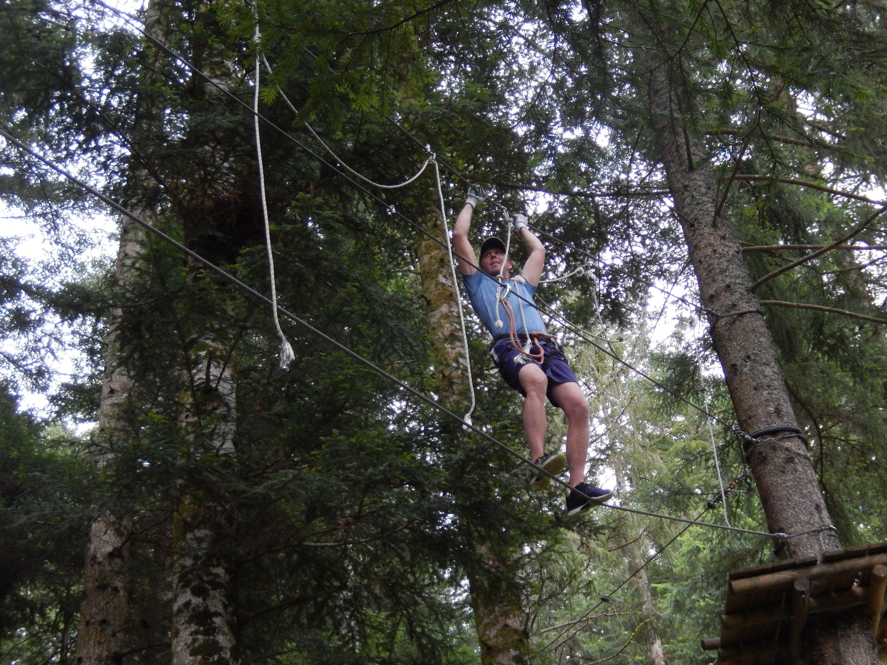

# Accrobrwimmiking: Accrobranche 🌳  + Swimming 🏊‍♀️ + Hiking 🥾 !!!

Update on the 19/08/2020 - 2pm: As indicated by Fiflo38100 (thanks for the tip), we cannot take the bus from notre dame musée. The meeting point is thus shifted to "l'ile verte" stop. It's at the school bus next to the school Paul Bert on the avenue Maréchal Rondon.

_________________________________________________________________________________
The GAC tries to keep the rythm and post an activity every weekend. Next Saturday is no exception with a combo of 3 activities. Don't let this opportunity pass you by!

##  🗨️ EN/FR 🗨️ 
🦅/🐓 : we speak English/French in all our events. Don't be worry if your english/french is not that good. Nos events sont en Anglais et Français. Ne soyez pas inquiets si votre niveau d'anglais n'est pas "suffisant".

---------------
Are you ready for some Amazing Accrobranching, Sweet Swimming and Hiking?? Don't worry if the title of this event frightened you, this event should be accessible to everyone 😉.

Here's the rough plan of the day:
10h00: Departure from notre dame musée by bus 62
10h30: Arrival at le sappey
11h00: Start of the accrobranche activity 🌳
14h00: End of accrobranche + lunch
14h30: Departure for the hike 🥾
18h42: Arrival at Le Hameau de Vence to take the (last) bus 62 back to Grenoble
19h00: Back in Grenoble for drinks and food ;) 🍔/🍺

##  Details 
🌳: For those who don't know what Accrobranch is, it can be summarized as playing to Tarzan (but in a totally safe manner because you are attached by cables to the trees). It's a lot of fun and adventure. The cost is 22 euro cash on-site. No credit card. Gloves and equipment provided on-site.

🥾: We will go around the Ecoutoux mount for an easy hike. If we are good with the timing, there should be a swimming opportuniy at pont de Vence (water might be cold though 😉).
- Duration: 3h
- Distance: 7km
- Slope (Denivelé): + 340m/-530m
more details here: https://www.visorando.com/randonnee-/3802497

##  ❔ What do you need ❔ 
- sport shoes + backpack
- water (2/3liters)
- sunglasses, hat, sunscreen
- lunch
- swimsuit + towel if you plan to swim

## ⚠️
Once you register, you engage to come because a reservation has been made. In case of late cancelation (and if no one could replace you), you will be asked to pay your share of the costs. Event limited to 12 people due to covid measure at the Accrobranche.

---------------
Because le sappey is accessible by bus you can leave also after the accrobranche if you are on a tight schedule.

This will be an experience and challenge for all of us. No time estimates are 100% accurate as we will need to adjust to the needs of others. But one thing that is certain is we will all have fun and stay safe together!

Don't hesitate if you have questions (in french or english).
N'hésitez pas si vous avez des questions.
--
Leila and Julien for the GAC

## Stats

- Start time: 2020-08-22 09:45
- End time: 2020-08-22 19:00
- Duration: 9:15:00
- Time to event: 9 days, 16:43:54
- Attendees: 15
- KM: 3.8
- D+: 28
- Top: 1015
- Type: Hike
- Comment: 

## Links

- [Trail short link](https://s.42l.fr/dCxFZnOt)
- [Trail full link]()
- [Album](https://binnette.github.io/GacImg2020/2020-08-22-Accrobrwimmiking-Accrobranche-🌳-Swimming-🏊‍♀️-Hiking-🥾.html)
- [Meetup event](https://www.meetup.com/grenoble-adventure-club-english-french/events/272527871/)
