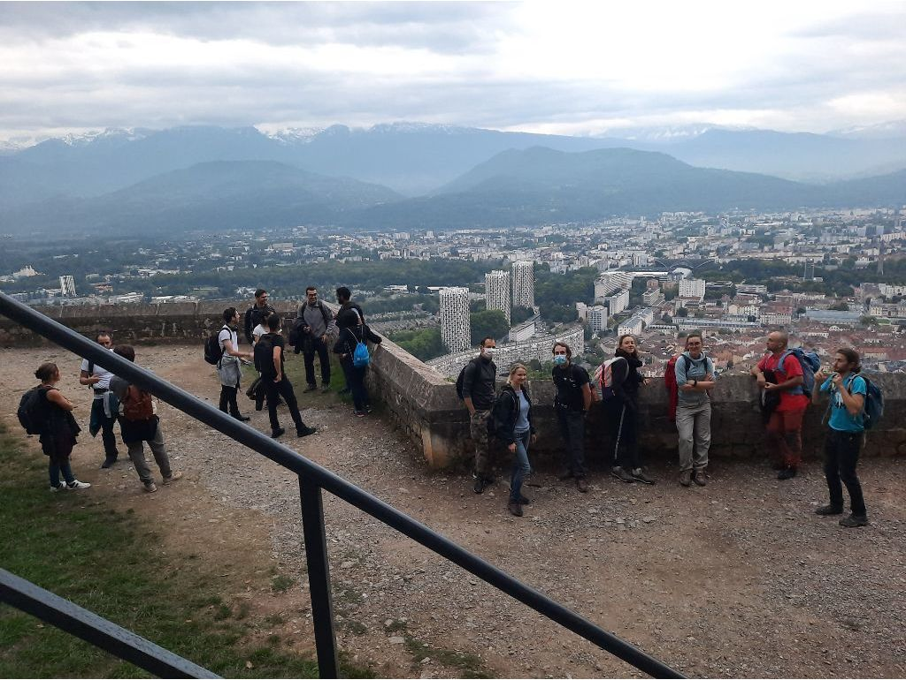

# Harvest Moon (La pleine lune de moisson) Night Hike/Rando

NOTE: This event is on!! Please remember to mind your social distance rules and bring your masks when you’re not hiking.

An urban night hike above the city to catch the Harvest Moon in all of its celestial magnificence from a spot high above the city.

As you can observe, it is getting darker earlier. By 1st October, we will have safety from the local dragons by 18:00. Shadows = Safety.

Sunset tonight is at 20:13, but, by 1st October, Sunset it at 19:16!

This will be a hike at on a Thursday night; so you'll probably want to WFH on Friday, or tell your boss about with a soft-start time. I will try make sure we are on a return tram by 23:30

THE PATH IS SET!

There are 3 well known paths from Grenoble to the Bastile.
There is one less well known, and that's the one for us!
- https://www.alltrails.com/explore/map/map-da0b566--45
- https://www.mapmyrun.com/routes/view/3413049679

For now, know That you will need a headlamp to navigate the trail, and a thermos of something warm to drink at the top 🍵 ☕️

If you do not have a head-light:

- https://www.amazon.fr/Petzl-Tikka-Lampe-Frontale-Adulte/dp/B01KYTQKBE
- https://www.amazon.fr/Petzl-Lampe-frontale-Reactik-Orange/dp/B01FIDI4UQ
- https://www.amazon.fr/Petzl-E099GA01-Lampe-Frontale-Unique/dp/B07T5RLZTX

(Do not waste your money on a non-Petzl light!)

NOTE: MASKS ARE MANDATORY! MASKS ARE MANDATORY!
Have a mask with you ready to dawn when the group is not moving!
If you're hiking up the Bastille? You're exercising. If you've stopped
to admire the moon, you're not exercising :) The police may
be wanting to give you a hard time.

##  General Plan 
- 17:45-18:00 Meet at the Fountain (Water, Beer, Cafe available at the local pub)
- 18:00 Walk to Port de France
- 18:15 Hike up the mountain to the memorial (1.5 hours)
- 19:45-20:20 Warn Drinks Small Snacks and enjoy the moon, as well as any other astronomical elements that can be observed.
- 20:20 Hike back to Grenoble city center
(1 primary exit option, 3 possible exit options)
- NOTE: Leave the memorial absolutely no later than 20:20 to assure you are through the gates at the Bastille by 20:45)
(This is France, some person could just arbitrarily decide to lock the gate early, like its a mom & pop boutique that sells petite hand-painted statuettes of Dragons)

## Stats

- Start time: 2020-10-01 17:45
- End time: 2020-10-01 20:45
- Duration: 3:00:00
- Time to event: 30 days, 22:17:23
- Attendees: 18
- KM: 9
- D+: 500
- Top: 640
- Type: Hike
- Comment: 

## Links

- [Trail short link](https://frama.link/KGnwLpuQ)
- [Trail full link]()
- [Album](https://binnette.github.io/GacImg2020/2020-10-01-Harvest-Moon-La-pleine-lune-de-moisson-Night-Hike_Rando.html)
- [Meetup event](https://www.meetup.com/grenoble-adventure-club-english-french/events/272937963/)
