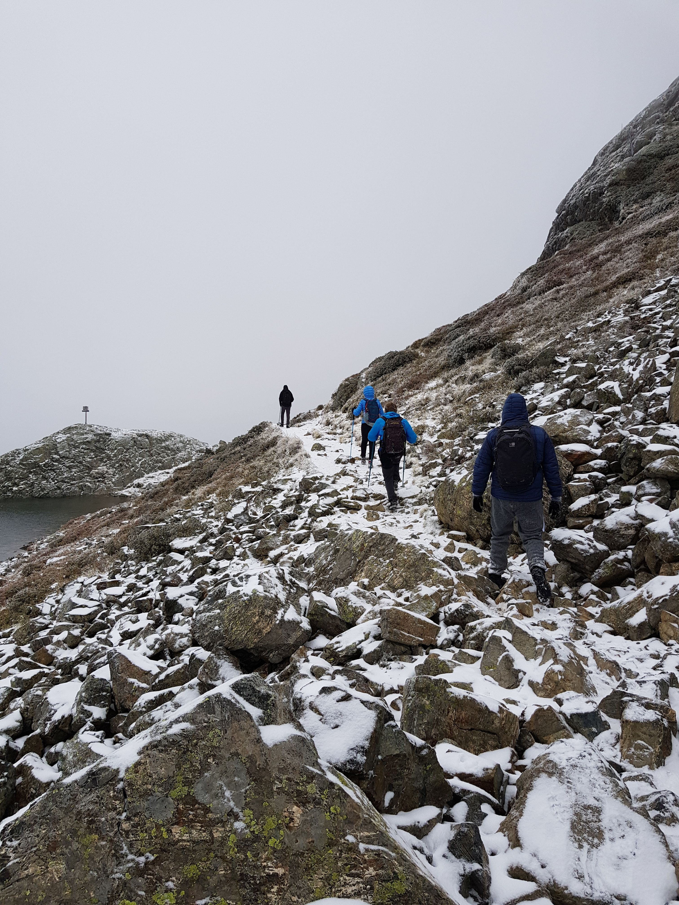

# 🥾 Hike to 'Lacs du Domènon' 2400m 🌦️ (D+ 1350m 🤩)

We are all FED UP with this rain! 😑

Let's go hike no matter what! 😅🤷☔🌨️

##  ⭐⭐ Updates ⭐⭐ 
> 📅 October 10 - 2pm: Hi! Thanks to Benoît we have 5 more seats 🤩. So a total of 13 people can come!! Awesome!
> 📅 October 8 - 11pm: Hi! Thanks to Lucie we have 3 more seats 😎. So a total of 8 people can come!
> 📅 October 6 - 11pm: we only have 1 car with 5 places. We are looking for other cars+drivers.

##  🗨️ EN/FR 🗨️ 
🦅/🐓 : we speak English/French in all our events. Don't be worry if your english/french is not that good. Nos events sont en Anglais et Français. Ne soyez pas inquiets si votre niveau d'anglais n'est pas "suffisant".

##  🥾 Hike from 'Freydières' to 'Lacs de Doménon' 🥾 
Topo: https://frama.link/0MwaJb99
* Distance: 18.5km
* Time: the whole day (1 hour of car, 6/7h of hike)
* D+: 1350m

1. Park our cars in 'Freydières'. Here: https://goo.gl/maps/8QyDEnfDMHpvuW6o6 / https://www.osm.org/way/161604074
2. Climb up to the lakes
3. Swim... no i'm just kidding ❄️🏊‍♀️❄️🏊‍♀️❄️
5. Go back to the car
6. Put on some dry clothes/shoes

##  ⚠️ WARNING ⚠️ 

👀 : Hiking shoes are ⚠️mandatory⚠️ ! We will probably walk on snow/ice and it will rain... so be ready for it. 🗻🧊🌧️

##  🚘 Logistic 🚘 
1. Meet at 8:30am on the parking of "Anneau de Vitesse" https://goo.gl/maps/Cfjh69m9eejXmW6XA / https://www.osm.org/node/5246260409
2. 30mn drive to 'Freydières'
3. Park our car here: https://goo.gl/maps/8QyDEnfDMHpvuW6o6 / https://www.osm.org/way/161604074
4. HIKE
5. Drive back to Grenoble

##  ❔ What do you need ❔ 
- Hiking shoes 🥾 (⚠️mandatory⚠️)
- Hiking pole (if you want)
- Food for lunch + Water + Some snack
- Rain clothes & Cold ready clothes
- Dry clothes/shoes to let in the car trunk (for after hike)
- 3€ for the car share

##  🍔 After 🍔 
If you feel like it, we can have a drink/some food after the hike. So you can put dry clothes in the car trunk.

-----------------------
If you have any questions, please ask!

See you! Albin from GAC.

## Stats

- Start time: 2020-10-11 08:30
- End time: 2020-10-11 18:30
- Duration: 10:00:00
- Time to event: 4 days, 21:33:52
- Attendees: 11
- KM: 18.5
- D+: 1350
- Top: 2425
- Type: Hike
- Comment: 

## Links

- [Trail short link](https://frama.link/0MwaJb99)
- [Trail full link]()
- [Album](https://binnette.github.io/GacImg2020/2020-10-11-🥾-Hike-to-Lacs-du-Domenon-2400m-🌦️-D-1350m-🤩.html)
- [Meetup event](https://www.meetup.com/grenoble-adventure-club-english-french/events/273744783/)
