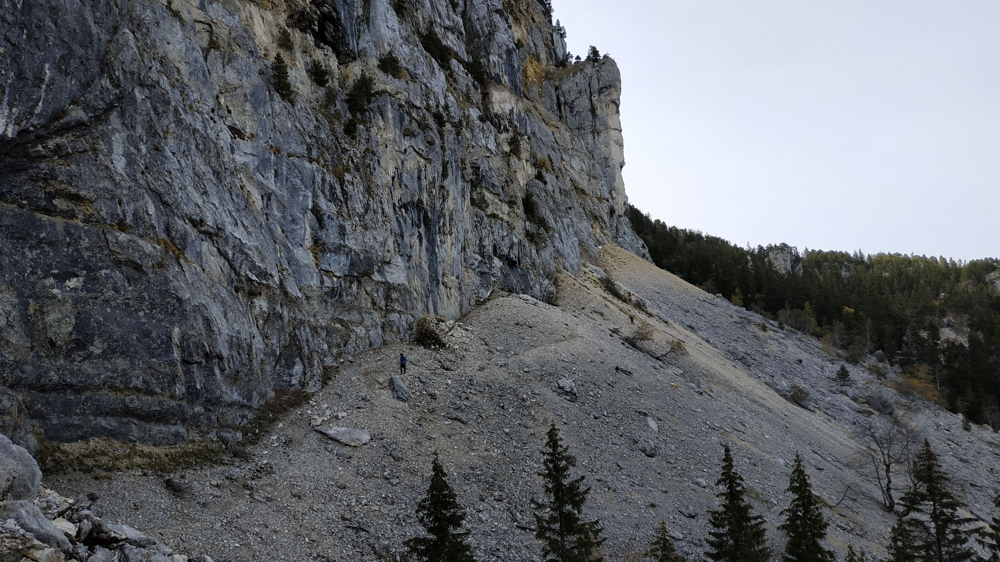

# Saint-Nizier du Moucherotte and Three Virgins (Hike) + Mölkky

##  General Plan 

We will all take the Trans Isère bus 5110 to the trailhead .

WE HAVE PURCHASED BUS TICKETS. €4/person per direction.

Come early to ensure a place in the queue for a seat on the bus

##  Schedule 
* 09:10 Meet at the Gare Grenoble, coffee, snacks, sobriety test, etc.

Note: since there a huge crowd, we must get in line / queue to have first dibs on the available seats on bus !!

* [ 09:45 ] Board / Ride bus [5110] to stop [Saint-Nizier-du-Moucherotte ; to stop "LE VILLAGE SAINT NIZIER DU MOUCHEROTTE"]
* [ 10:16 ] Hike to the Plateau at Moucherotte (lots of space to spread out)! Should take about 2.5 hours.
* Enjoy the View / Nap / Eat / Play Mölkky

* Hike some more:
-- If time permits, make a stop at the Three Virgins (Trois Vierges!)
-- Everyone must make a choice:
Option #1) Hike back entire to Grenoble (downhill 100%, end up near Grenoble Metro Tram C near to Le Prisme De Seyssins)
Option #2) Hike back to Saint Nizier and take the last Trans-Isere return bus [5110] at [6:23 PM / 18:23 ] to Gare Grenoble
NOTE: If you choose Option #2 -- you should leave the top of the mountain no later than [ 16:00 ] to give you sufficient time to reach town in time to reach last bus.
NOTE #2: Three is an earlier return bus at [ 16:00 ] but you should leave by [13:45/14:00] to ensure arrival on time.
* Drink all the beers in a COVID-19 safe way?
* Home by 21h / 9pm Curfew

##  Suggested Supplies to Bring 

- 2-3 L of Water plus a small emergency bottle
- Rain jacket
- Hiking 🥾shoes and socks
- Whistle
- Sunscreen/bug spray
- Layers of clothes as Temperatures will change at different altitudes and Sunlight and physical activity level. Remember that Cotton will hold in moisture and sweat, so polyester and wool are the favorites
- Lunch for 1-2 meals and lots small snacks. (À partager!). A picnic up top!
- Hat
- Gloves
- Sunglasses
- PowerBank battery for mobile phone (ensures to charge it overnight !)
- Small lights / flashlight
- Any medicines or allergy treatments you may have pre-existing

“Better to have and not need , then need a not Have.”

This is one of the easiest hike to do because we can take a bus to the western trail-head, take our time on the hike, and then decide to either:

1) Take the last bus home from the start
2) Just hike back to Grenoble (it is 7-8 km mostly downhill, but it is beautiful hike!
-----
Draft proposal for trail:
https://www.alltrails.com/explore/map/map-b9a8f4a--31
-----

Background: "The three virgins" (Les Trois Pucelles), a rock-face on the north-east corner of the Vercors, are named in honor of the three virgins from Grenoble that were sacrificed to appease the Dragon that lives in a cave on Saint-Nizier / Moucherotte.

Back-story: Early Grenoblers, who had for centuries had lived in peace with the Dragon, had experienced a terrible famine (The "eggplants" wouldn't grow, so no Eggs for anyone). The situation was growing desperate. The famine made them "hangry", and so they had then tried to kill the Dragon 🐉 to eat.

(I know ! Don't ask me! French cuisine evolved significantly after the Romans withdrew).

Anyway, The Dragon was resentful, and was holding a grudge. He would fire bomb the town occasionally. Eventually, after many "negotiations", it was agreed to that three virgins from the town would be sacrificed from the edge of Moucherotte. As a result, the three rock fixtures were named in their honor.

To this day, the dragon still lives in Moucherotte, but he mostly leaves the Grenoblers alone. Occasionally he takes out a drone. Or a para-sailor. Stick close to the group! He only comes out at dawn and dusk.

## Stats

- Start time: 2020-10-24 09:10
- End time: 2020-10-24 11:10
- Duration: 2:00:00
- Time to event: 67 days, 23:43:44
- Attendees: 32
- KM: 9.4
- D+: 803
- Top: 1901
- Type: Hike
- Comment: 

## Links

- [Trail short link](https://s.42l.fr/le-moucherotte)
- [Trail full link]()
- [Album](https://binnette.github.io/GacImg2020/2020-10-24-Saint-Nizier-du-Moucherotte-and-Three-Virgins-Hike-Molkky.html)
- [Meetup event](https://www.meetup.com/grenoble-adventure-club-english-french/events/272628657/)
