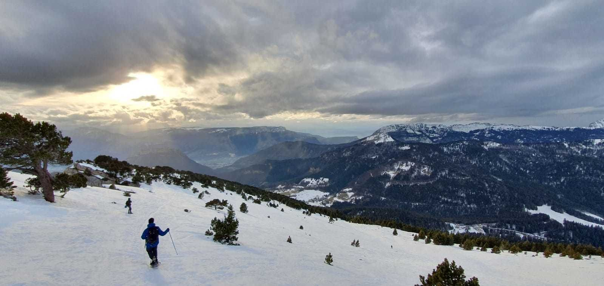

# We are going, snowshoeing!🏔️

Hey Folks!
GAC is back, so pack your bag. We are going, snowshoeing.🏔️

##  🗨️ About us 🗨️ 
🦅/🐓 : we speak English/French in all our events. Don't be worry if your english/french is not that good. Nos events sont en Anglais et Français. Ne soyez pas inquiets si votre niveau d'anglais n'est pas "suffisant".

The white mountains are shaking our hearts, lets shake back 😉💖
We will start from "Station de ski du Sappey en Chartreuse", wear the snowshoes, and hike untill we reach the amazing view at the top. The hike is just suitable to warm up the body after the confinement.

Rough plan:
- gather at Notre-Dame Musée station at 9:15 am and socialize😉 (it is important to be at the station sooner because it will probably be crowded; we may not be able to get into the bus if we are the last people to join the queue).
- take the bus 62 at 10:00 am .
- take off the bus at le Sappey station
- start the hike
- have lunch + conversation + photos
- walk a bit among the snowy tress, hunt some dragons!
- walk and/or slide down
- At 16:30 take the bus back to Grenoble (it's pitty we can't have a drink/snack/ice cream after the hike like before!)

What to bring:
- your smile
- two balls and a carrot for our snowman (for the nose and the eyes, just to clear your dirty minds 😉😜 ) ☃️
- waterproof gloves and hiking shoes
- warm clothes
- snowshoes
- snow ploes (it is recommended to keep your balance)
- lunch/snacks/hot drinks
- luge, if you like to slide down a bit (you can find cheap showel luge, the slope is mild and safe, it is worth the try 😉 )
- water
- sunscreen cream

You are not equiped? No problem! we can rent the snowshoes and the poles from shops such as Adrenaline pro shop. We can get them on Friday evening and return them back afer the hike (just remember to have you ID and bank cards when renting the equipments).

Don't hesitate to contact us if you have any questions.

## Stats

- Start time: 2020-12-19 09:15
- End time: 2020-12-19 18:00
- Duration: 8:45:00
- Time to event: 3 days, 11:28:14
- Attendees: 10
- KM: 3.3
- D+: 338
- Top: 1320
- Type: Hike
- Comment: 

## Links

- [Trail short link](https://s.42l.fr/A9LrZ9hf)
- [Trail full link]()
- [Album](https://binnette.github.io/GacImg2020/2020-12-19-We-are-going,-snowshoeing🏔️.html)
- [Meetup event](https://www.meetup.com/grenoble-adventure-club-english-french/events/275198024/)
