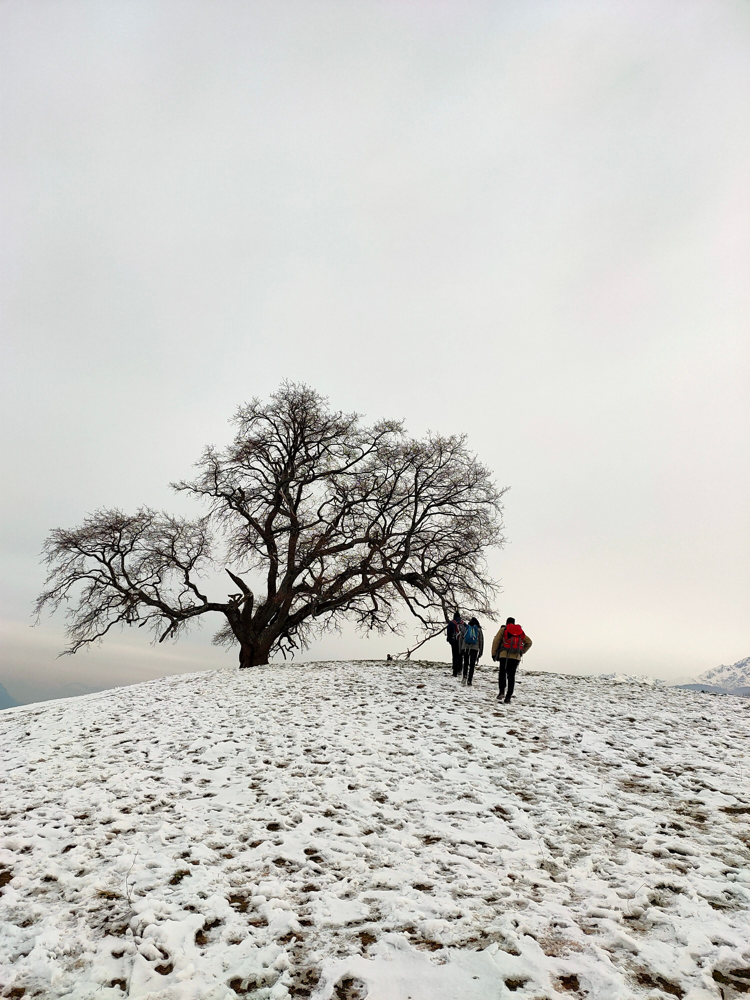

# 🥾 Hike 🥾 - 🌳 "Le chêne remarquable de Venon" 🌳

The weather is not that great. So let's up to "Le chêne remarquable de Venon", have lunch there and get back to tramway ^^

##  🗨️ EN/FR 🗨️ 
🦅/🐓 : we speak English/French in all our events. Don't be worry if your english/french is not that good. Nos évènements sont en Anglais et Français. Ne soyez pas inquiets si votre niveau d'anglais n'est pas "suffisant".

##  🥾 Hike to "Le chêne remarquable de Venon" 🥾 
* Topo & GPX track: https://frama.link/yD_bbRhw
* Distance: 11.5km
* Time: 3/4h of hike + 1h for lunch
* D+: 480m

Just meet at 10am at the tramway stop "Gières - Gare - Universités":
- https://www.osm.org/node/280981537
- https://goo.gl/maps/nVuzbX3b98VUKU2i6

##  ❔ What do you need ❔ 
- Hiking shoes 🥾 (or any 'good' shoes)
- Food for lunch 🥕 + Water 🧃 + Some snack 🍫
- Rain clothes / Cold ready clothes 👚
- Your smile 😁 / Hapiness 😊

-----------------------
If you have any questions, please ask!

See you! Albin from GAC.

## Stats

- Start time: 2021-01-09 10:00
- End time: 2021-01-09 17:00
- Duration: 7:00:00
- Time to event: 1 day, 15:37:37
- Attendees: 6
- KM: 11.5
- D+: 480
- Top: 595
- Type: Hike
- Comment: 

## Links

- [Trail short link](https://frama.link/yD_bbRhw)
- [Trail full link]()
- [Album](https://binnette.github.io/GacImg2021/2021-01-09-🥾-Hike-🥾-🌳-Le-chene-remarquable-de-Venon-🌳.html)
- [Meetup event](https://www.meetup.com/grenoble-adventure-club-english-french/events/275607055/)
