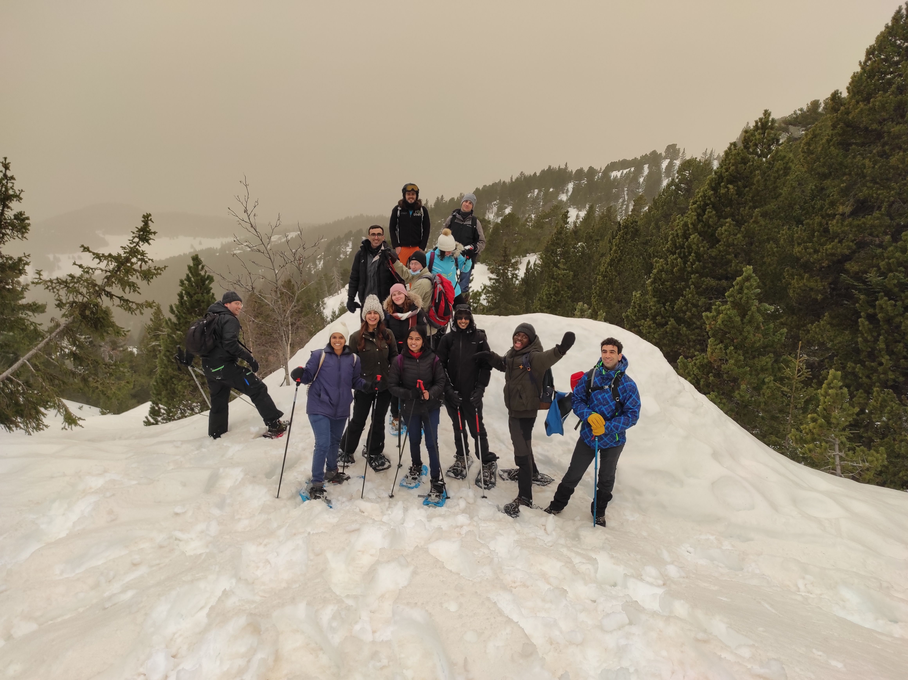

# snowtubing/sledging + snowshoeing + snowcializing + snowfunning = great memories

Lets make this Saturday awesome together🏔️😍
Maybe recharge ourselves before the third confinement, and hope it would not be our last kiss to the Mouth of the Mountains in a Month🤕☹️

📜📜📜 Here is the rough plan:📜📜📜
06:45 : meet at the train station and buy the bus tickets
07:25 : take the bus 6010
09:00 : take off the bus at Chamrousse 1750 station and start
snowshoeing towards lac Achard
12:00 : by this time we should have returned, so we would have time to
do snowtubing and/or sledging
13:00 : eat lunch
13:45 : take the bus 6010 back to Grenoble
15:00 : take off the bus at the train station in Grenoble

🥾🥾🥾About the trail:🥾🥾🥾
It is around 7 km with 300 elevation difference, so it is considered as a moderate hike.

🍩🍩🍩About the snowtubing:🍩🍩🍩
It is completely safe and easy to do. You can find more information here:
https://www.chamrousse.com/tube-park-snowtubing.html

🎒🎒🎒What to bring:🎒🎒🎒
- your smile!
- waterproof gloves and hiking shoes
- warm clothes
- snowshoes
- snow ploes (it is recommended to keep your balance)
- lunch/snacks/hot drinks
- luge, if you like to do sledging also
- water
- sunscreen cream

Just like the previous times, if you don't have your own snowshoes, you can rent the snowshoes and the poles from shops such as Adrenaline pro shop, skitruck, etc. We can get them on Friday evening and return them back after the hike (just remember to have you ID and bank cards when renting the equipments).

Don't hesitate to contact us if you have any questions.

## Stats

- Start time: 2021-02-06 06:45
- End time: 2021-02-06 15:00
- Duration: 8:15:00
- Time to event: 11 days, 23:38:54
- Attendees: 12
- KM: 7.4
- D+: 300
- Top: 1940
- Type: Hike
- Comment: 

## Links

- [Trail short link](https://s.42l.fr/wA-rQRtZ)
- [Trail full link]()
- [Album](https://binnette.github.io/GacImg2021/2021-02-06-snowtubing-sledging-snowshoeing-snowcializing-snowfunning-=-great-memories.html)
- [Meetup event](https://www.meetup.com/grenoble-adventure-club-english-french/events/275959229/)
