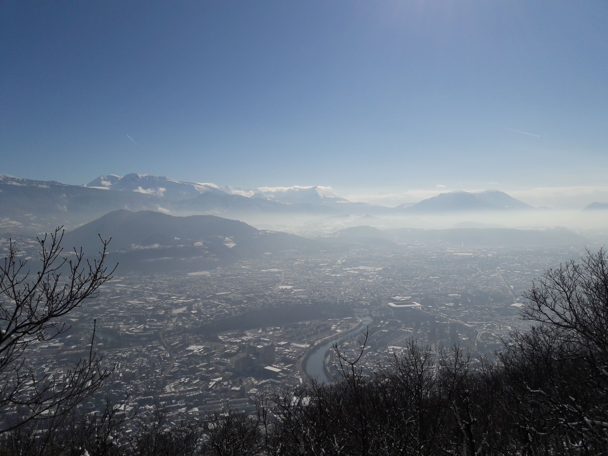

# 💗 Le Bastille by Another Way (via La Tronche) ❤️

❤️ 💕 💗 NOTE: St. Valentine's Day event! ❤️ 💕 💗
Do you love your significant other? Or want to test how deep that love goes? Make them take you on a petite randonnée !

##  Summary 

I scouted a new way to the Bastille via neighborhood La Tronche. It is a relatively affluent area with its own private entrance into The Bastille, and makes for a interesting area to explore the back streets of a cool and quirky new neighborhood.

##  Details 

It is an easy-to-difficult grade hike, mixed urban and trail, with a relatively steep incline, and it promises to help you break a sweat.

Draft Route at:
https://www.alltrails.com/explore/map/mon-18-jan-2021-07-22-14553ee

Color Reference:

-- Purple/Violet: Start
-- Red: Difficult Path (For Heros! Very steep and slippery. Poles Required)
-- Blue: Easy Path (For everyone else ! Poles recommended)
-- Yellow: Finish (I've never been! It will be an adventure!)

* Distance:
4.22 mi (6.791432 km)

Elevation Gain:
1,644 ft (524m)

Duration:
3 hours!

Meteo / Weather:
https://www.wunderground.com/forecast/fr/grenoble/45.19,5.73

##  Inventory / What to Bring 

- Good Hiking Boots (Winter/Waterproof, Big Treads)
- Hiking Poles
- Rain/Snow/Waterproof Clothing
- Water (1-to-2L)
- Lunch!
- Hot Beverages!
- Gloves and Hand Warmers

## Stats

- Start time: 2021-02-14 10:00
- End time: 2021-02-14 13:45
- Duration: 3:45:00
- Time to event: 70 days, 15:35:51
- Attendees: 16
- KM: 7
- D+: 524
- Top: 635
- Type: Hike
- Comment: 

## Links

- [Trail short link](https://s.42l.fr/TqWwBB03)
- [Trail full link]()
- [Album](https://binnette.github.io/GacImg2021/2021-02-14-Le-Bastille-by-Another-Way-via-La-Tronche.html)
- [Meetup event](https://www.meetup.com/grenoble-adventure-club-english-french/events/275008068/)
