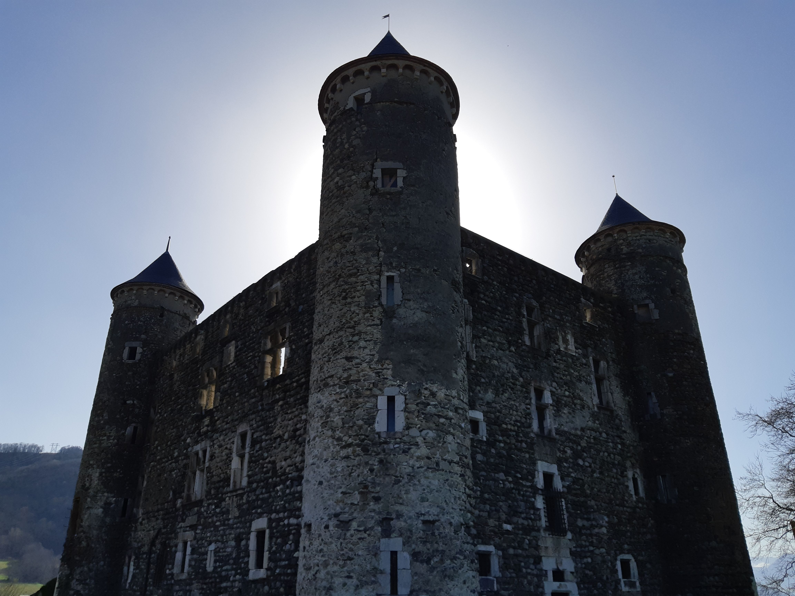

# 🥾 Hike - 🏰 "Bon Repos" Castle

Exploration : let's have a look to this old & nice castle. This hike is long ~16km, be sure to bring hiking shoes 🥾

BTW, please subscribe to the event & create a meetup account, if not done yet.

##  🗨️ EN/FR 🗨️ 
🦅/🐓 : we speak English/French in all our events. Don't be worry if your English/French is not that good. Nos évènements sont en Anglais et Français. Ne soyez pas inquiets si votre niveau d'anglais n'est pas "suffisant".

##  🥾 Hike to "Le Château de Bon Repos" 🥾 
Wikipedia article: https://fr.wikipedia.org/wiki/Ch%C3%A2teau_de_Bon_Repos
* Topo & GPX track: https://s.42l.fr/jmJvISz_
* Distance: 15.8km
* Time: 4h/5h of hike + 1h for lunch
* D+: 436m

Just meet at 9am at the tramway stop "Échirolles - Denis Papin":
- https://www.osm.org/node/280970364
- https://goo.gl/maps/EZx2MEejLQDbG11eA

##  ❔ What do you need ❔ 
- Hiking shoes 🥾 (or any 'non flat/slippery' shoes)
- Food for lunch 🥕 + Water 🧃 + Some snack 🍫
- Your smile 😁 / Happiness 😊

-----------------------
If you have any questions, please ask!

See you! Albin from GAC.

## Stats

- Start time: 2021-02-21 09:00
- End time: 2021-02-21 17:00
- Duration: 8:00:00
- Time to event: 4 days, 23:46:20
- Attendees: 17
- KM: 15.8
- D+: 436
- Top: 455
- Type: Hike
- Comment: 

## Links

- [Trail short link](https://s.42l.fr/jmJvISz_)
- [Trail full link]()
- [Album](https://binnette.github.io/GacImg2021/2021-02-21-🥾-Hike-🏰-Bon-Repos-Castle.html)
- [Meetup event](https://www.meetup.com/grenoble-adventure-club-english-french/events/276395387/)
