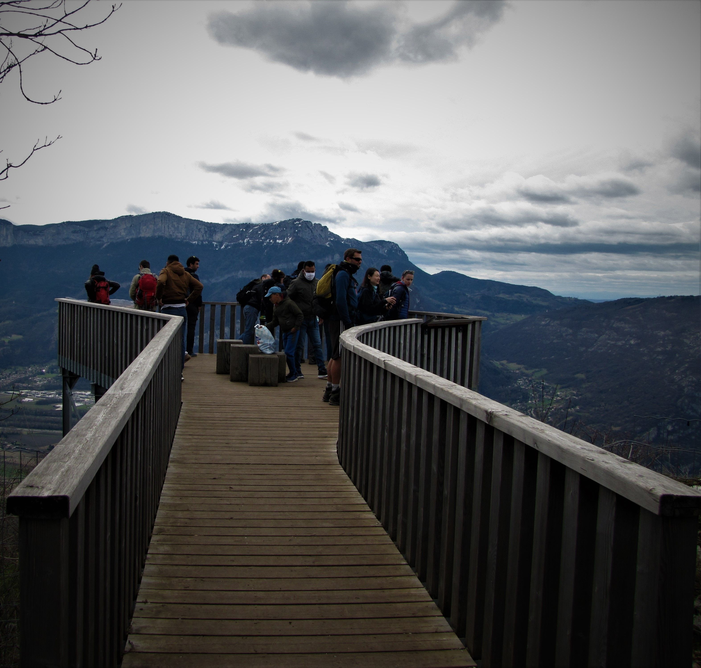

# 🥾 Hike - "L'Aiguille de Chalais" 😍

🚗 Car share or bus to go to hike start.
🚌 Hike starting from a bus station / car park.
⏲️ Feel free to register on the waiting list.
⛔ Inscriptions are closed.

##  ⭐⭐ Updates ⭐⭐ 
> 📅 March 10: I changed meeting hour to 8:20am in order to get bus cause we don't have enough cars.
> 📅 March 11 7pm: inscriptions are closed 😎

##  🗨️ EN/FR 🗨️ 
🦅/🐓 : we speak English/French in all our events. Don't be worry if your English/French is not that good. Nos évènements sont en Anglais et Français. Ne soyez pas inquiets si votre niveau d'anglais n'est pas "suffisant".

##  🥾 Hike "L'Aiguille de Chalais" 😍 
* Topo & GPX track: https://s.42l.fr/I71ZHdYN
(💡 Download GPX on your phone)
* Distance: 15.6km
* Time: 5/6h of hike + lunch
* D+: 1350m

Meet at 8:20am at "Place de la Gare" for car share/bus:
- https://www.osm.org/node/1645508599
- https://goo.gl/maps/GZG8y8rmspqMNj659

Don't be late 😇

##  🚗/🚌 Car share or bus 
⚠️We don't have enough seats in cars. The firsts subscribed to the event will have seat in cars, others will take the bus ⚠️

##  🚗 share 
If you have a seat, it will cost about 2€ per person (fuel + "compensation" to get more drivers). GPX for drivers: https://s.42l.fr/ijLP1I7m

##  🚌 ride 
It will cost you 6.80€ (3.40x2). Join everyone at 8:20am.

Don't be late, the buses won't wait 😇

Buy your ticket by phone or a the bus station vending machine (no ticket sold in bus)
- with phone, send text with content " 1z " to phone number 93038
- with vending machine, select bus TransIsère, then "zone 1" (area 1), then 2 tickets (1 to go & 1 to come back)

Instructions to go:
1. Take bus 7000 at 8:40am at the main bus station (near the rail station, we will show you the way). This bus heads to "St-Pierre de Chartreuse"
2. Get off bus at station "Le Chevalon - Voreppe" (it arrives near 8:59am)

👀 Look to the bus trip map I added in events pictures down here, to see every bus stops.

Instructions to get back:
1. Take bus EXP2 at 4:41pm at the same bus station (Le Chevalon)
2. Get off bus at Grenoble main bus station near (5:04pm)

##  ❔ What do you need ❔ 
- Hiking shoes 🥾 (or any good/non slippery shoes)
- 🧃 Water + 🥕 food for lunch + 🍫 Some snack
- Clothes for wind/rain ☔ (if any)
- Your smile 😁 / Happiness 😊
- Your mask as always 😷 (avoid contact and so on)
- 💵 Money for car share / bus

-----------------------
If you have any questions, please ask!

See you! Albin from GAC.

## Stats

- Start time: 2021-03-13 08:20
- End time: 2021-03-13 17:10
- Duration: 8:50:00
- Time to event: 5 days, 8:31:51
- Attendees: 17
- KM: 15.6
- D+: 1362
- Top: 1089
- Type: Hike
- Comment: 

## Links

- [Trail short link](https://s.42l.fr/I71ZHdYN)
- [Trail full link]()
- [Album](https://binnette.github.io/GacImg2021/2021-03-13-🥾-Hike-LAiguille-de-Chalais-😍.html)
- [Meetup event](https://www.meetup.com/grenoble-adventure-club-english-french/events/276803120/)
