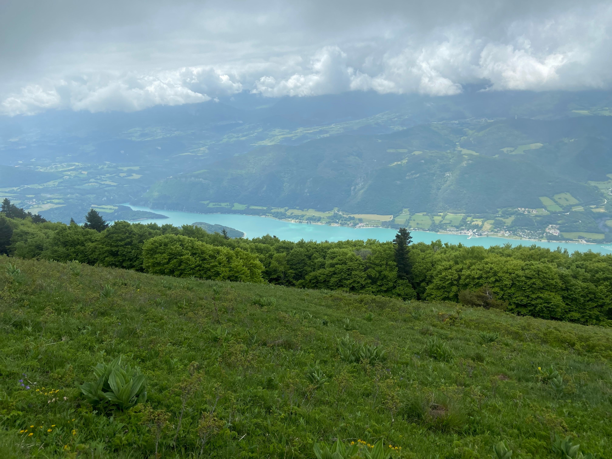

# 🥾 Hike: Le Sénépy not so easy? 😅☔

💡 Please read the full page 💜

##  ⭐⭐ Updates ⭐⭐ 
> 📅 june 4 - 11pm: more cars = more seats. Seats: Albin (5), JP (4), Cindy (5), Sylvain (4), Mélanie (4), Rachid (5), Tim (5), Áine (5), Aymen (5) & Guillaume (4). 46 seats = 46 hikers MAX 🤩😇 🚶‍♀️🚶‍♂️

##  🗨️ EN/FR 🗨️ 
🦅/🐓 : we speak English/French in all our events. Don't be worry if your English/French is not that good. Nos évènements sont en Anglais et Français. Ne soyez pas inquiets si votre niveau d'anglais n'est pas "suffisant".

##  🥾 Hike: Le Sénépy not so easy? 😅☔ 
* Topo & GPX track: https://s.42l.fr/NVg9oEHR
* ▶💡 Download GPX track on your phone.
* Distance: 16.6km
* Time: ~6/7h of hike + 1h lunch + 1h40 🚗
* D+: 660m

Meet at 8:30am at parking "Esplanade du Souvenir Français" near Parc Paul Mistral:
- https://www.osm.org/way/69486256
- https://goo.gl/maps/BAbHQ153PcNgunPd6

##  🚗 share 
Car share will cost 4€ per person (fuel + "compensation" to get more drivers).
We will park our car(s) near "Les Signaraux" village:
- https://www.osm.org/way/123934301
- https://goo.gl/maps/iR5WBYkvwPbKoMNZ8

##  💡 Rules 💡 
- Don't be (too) late 😇 We won't wait for you at morning, especially if you don't send any message.
- Since seats in car(s) are "rare", please do not subscribe if you are not sure to join the event
- If you finally can't join us, please unsubscribe from the event or at least write a message here to announce your cancellation. 💜 That way, we won't wait for you 💜
- If you are a driver and can't join, please send me a message through meetup ASAP, that way I can remove available seats 🚗
- Don't throw any dump in nature even egg shell, fruit pelt, ... 🌳 ❤️ You

##  ❔ What do you need ❔ 
- Hiking shoes 🥾 (or any good/non slippery shoes)
- Hiking pole (if you want)
- 🧃 Water + 🥕 food for lunch + 🍫 Some snack
- Clothes for wind/cold/rain ☔ (if any)
- Your smile 😁 / Happiness 😊
- Your mask as always 😷 (avoid contact and so on)
- 💵 Money for car share

##  😷 Covid rules 😷 
- Don't come if you feel sick, have fever, are contact case,...
- If we are more than 10 hikers, we will split in groups of maxi 10 people to respect current French Covid laws
- As always, wear your mask
- You are responsible to your own health, so respect barrier gestures, social distancing, ...
- All rules: https://www.gouvernement.fr/en/coronavirus-covid-19

-----------------------
If you have any questions, please ask!

See you! Albin from GAC.

## Stats

- Start time: 2021-06-06 08:30
- End time: 2021-06-06 19:30
- Duration: 11:00:00
- Time to event: 2 days, 23:04:49
- Attendees: 30
- KM: 16.6
- D+: 660
- Top: 1769
- Type: Hike
- Comment: 

## Links

- [Trail short link](https://s.42l.fr/NVg9oEHR)
- [Trail full link]()
- [Album](https://binnette.github.io/GacImg2021/2021-06-06-🥾-Hike-Le-Senepy-not-so-easy?-😅☔.html)
- [Meetup event](https://www.meetup.com/grenoble-adventure-club-english-french/events/278590932/)
