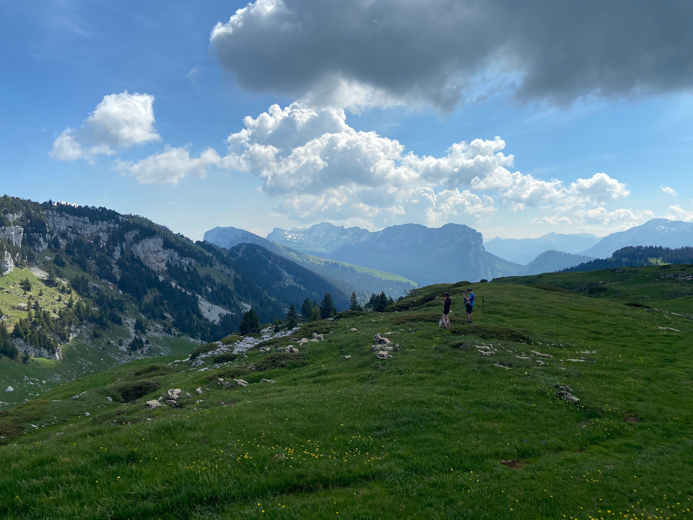

# 🥾 Hike: Around Saint-Même Circus 🎪🌲

💡 Please read the full page 💜

##  ⭐⭐ Updates ⭐⭐ 
10/06 - 10.30pm: 2 cars (Julien + Cindy) - 9 people
10/06 - 07.30pm: 1 car (Julien): 4 people

##  🗨️ EN/FR 🗨️ 
🦅/🐓 : we speak English/French in all our events. Don't be worry if your English/French is not that good. Nos évènements sont en Anglais et Français. Ne soyez pas inquiets si votre niveau d'anglais n'est pas "suffisant".

##  🥾 Hike: Around Saint-Même Circus 🎪🌲 
* Topo & GPX track: see in the comment section
* ▶💡 Download GPX track on your phone.
* Distance: 14.4km
* Time: ~6.5h of hike + 1h lunch + 2h 🚗
* D+: 1250m
Level: 💪💪💪 (Be aware that the slope is quite intense and the path can be vertiginous at some points)

Meet at 8:45am at parking near Porte de France:
- Boulevard de l'Esplanade, 38000 Grenoble

##  🚗 share 
Car share will cost 3€ per person (fuel + "compensation" to get more drivers).
We will park our car(s) at the parking of the circus (at this period of the year it should be free, otherwise the few euros will be shared amongs everyone)
- CV2R+F7 Saint-Pierre-d'Entremont (on google)

##  💡 Rules 💡 
- Don't be (too) late 😇 We won't wait for you at morning, especially if you don't send any message.
- Since seats in car(s) are "rare", please do not subscribe if you are not sure to join the event
- If you finally can't join us, please unsubscribe from the event or at least write a message here to announce your cancellation. 💜 That way, we won't wait for you 💜
- If you are a driver and can't join, please send me a message through meetup ASAP, that way I can remove available seats 🚗
- Don't throw any dump in nature even egg shell, fruit pelt, ... 🌳 ❤️

##  ❔ What do you need ❔ 
- Hiking shoes *mandatory* 🥾 (as some part of the trail are complicated)
- Hiking poles (baton) (recommended because we might hit some snow at some points)
- 🧃 Water + 🥕 food for lunch + 🍫 Some snack
- Clothes for wind/cold/rain ☔ (if any)
- Your smile 😁 / Happiness 😊
- Your mask as always 😷 (avoid contact and so on)
- 💵 Money for car share

##  😷 Covid rules 😷 
- Don't come if you feel sick, have fever, are contact case,...
- We will limit the number of participant to 10 hikers (or 3 cars max) for the sake of my brain and the organisation.
- As always, wear your mask
- You are responsible to your own health, so respect barrier gestures, social distancing, ...
- All rules: https://www.gouvernement.fr/en/coronavirus-covid-19

-----------------------
If you have any questions, please ask! En cas de question n'hésitez pas! 😁

Julien from the GAC.

## PS
If some one is motivated to organize it, it is possible to spend half a day in the circus bottom (i.e. no hike 😉) to enjoy the sun, a view of the falls and play outdoor games that you bring. In that case, both groups can join at the end of the day before hiting back to Grenoble!

## Stats

- Start time: 2021-06-12 08:45
- End time: 2021-06-12 18:00
- Duration: 9:15:00
- Time to event: 1 day, 12:47:21
- Attendees: 5
- KM: 14.6
- D+: 1360
- Top: 1800
- Type: Hike
- Comment: 

## Links

- [Trail short link](https://s.42l.fr/mGKnsVGZ)
- [Trail full link]()
- [Album](https://binnette.github.io/GacImg2021/2021-06-12-🥾-Hike-Around-Saint-Meme-Circus-🎪🌲.html)
- [Meetup event](https://www.meetup.com/grenoble-adventure-club-english-french/events/278751351/)
