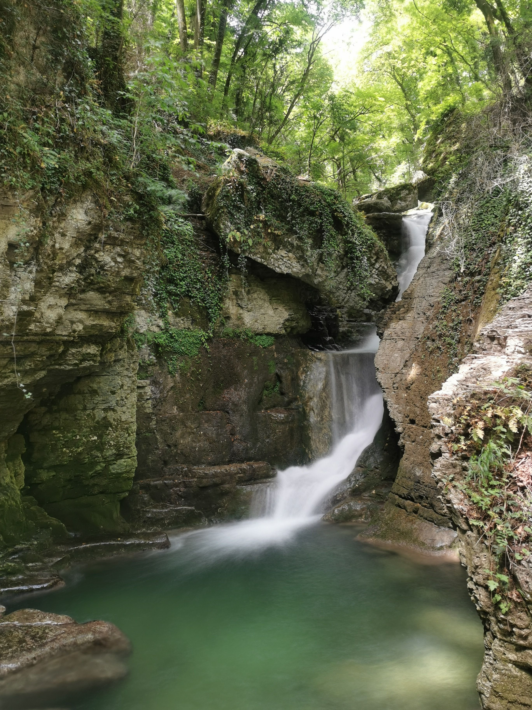

# 😎 Chill: spend the heatwave near a 🥶🧊 river

💡 Please read the full page 💜

##  🗨️ EN/FR 🗨️ 
🦅/🐓 : we speak English/French in all our events. Don't be worry if your English/French is not that good. Nos évènements sont en Anglais et Français. Ne soyez pas inquiets si votre niveau d'anglais n'est pas "suffisant".

##  😎 Chill: spend the heatwave near a 🥶🧊 river 
* Topo & GPX track: https://s.42l.fr/eS1BeHZJ
▶💡 Download GPX track on your phone.
* Distance: 6.6km
* Time: ~1h40 of hike + the whole day of chilling near river
* D+: 200m

Meet at 11:30am at tram stop "La Poya" (end of tram A):
- https://www.osm.org/node/316487927
- https://goo.gl/maps/uPN4aSomBsQCgBJc8

Then we walk ~40mn to go to the river.

##  🎲 Activities 🎲 
- Mainly chill near the river and swim a little 🥶
- Escaping the heat wave
- Chatting together
- Play some games if you want to bring some
- Have some drinks/beers (no shop/pub at the river)
- Reading books, etc.

##  After 
- We can go back in Grenoble and have pizza, beer or whatever 😊

##  💡 Rules 💡 
- Don't be (too) late 😇 We won't wait for you at morning, especially if you don't send any message.
- If you finally can't join us, please unsubscribe from the event or at least write a message here to announce your cancellation. 💜 That way, we won't wait for you 💜
- Don't throw any dump in nature even egg shell, fruit pelt, ... 🌳 ❤️ You

##  ❔ What do you need ❔ 
- Any kind of shoes 🥾
- 🧃 Water + 🥕 food for lunch + 🍫 Some snack + drinks
- Snack, biscuits or anything else to share
- Swimsuit + towel
- Board games, playing cards, ...
- Books or other occupation
- Clothes for wind/cold (we will be in shadow all day long)
- Your smile 😁 / Happiness 😊
- Your mask as always 😷 (avoid contact and so on)

##  😷 Covid rules 😷 
- Don't come if you feel sick, have fever, are contact case,...
- If we are more than 10 hikers, we will split in groups of maxi 10 people to respect current French Covid laws
- As always, wear your mask
- You are responsible to your own health, so respect barrier gestures, social distancing, ...
- All rules: https://www.gouvernement.fr/en/coronavirus-covid-19

-----------------------
If you have any questions, please ask!

See you! Albin from GAC.

## Stats

- Start time: 2021-06-19 11:30
- End time: 2021-06-19 19:00
- Duration: 7:30:00
- Time to event: 3 days, 1:15:41
- Attendees: 13
- KM: 6.6
- D+: 200
- Top: 381
- Type: Hike
- Comment: 

## Links

- [Trail short link](https://s.42l.fr/eS1BeHZJ)
- [Trail full link]()
- [Album](https://binnette.github.io/GacImg2021/2021-06-19-😎-Chill-spend-the-heatwave-near-a-🥶🧊-river.html)
- [Meetup event](https://www.meetup.com/grenoble-adventure-club-english-french/events/278870107/)
