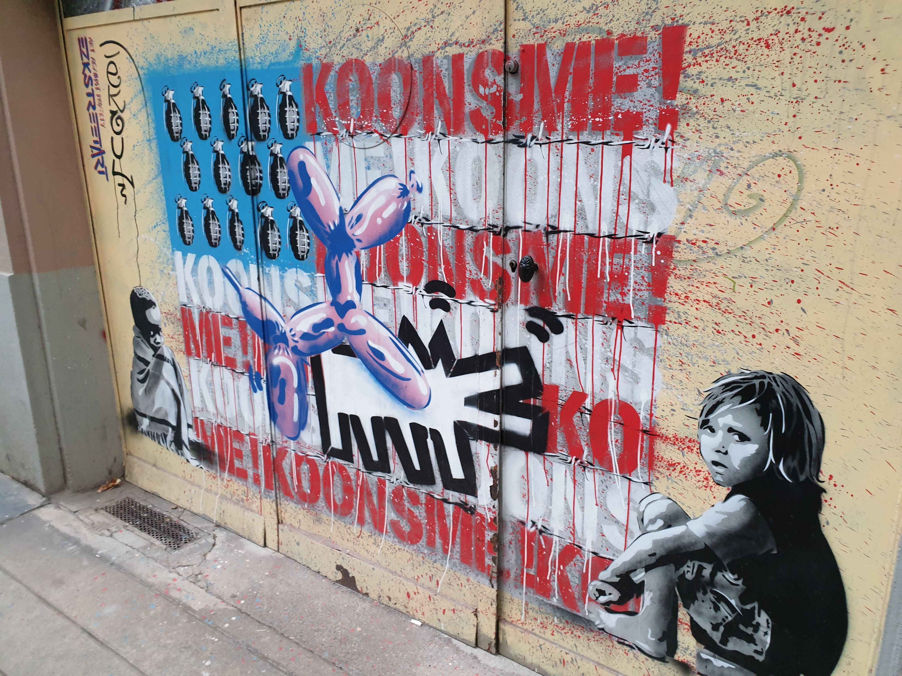

# 📷 Visit: No Music Festival tonight, then let's enjoy some street art 🎨✨

💡 Please read the full page 💜

##  🗨️ EN/FR 🗨️ 
🦅/🐓 : we speak English/French in all our events. Don't be worry if your English/French is not that good. Nos évènements sont en Anglais et Français. Ne soyez pas inquiets si votre niveau d'anglais n'est pas "suffisant".

##  📷 Visit: no Music Festival tonight... let's enjoy some street art 🎨🖼 
* Topo & GPX track: https://www.gpx-view.com/gpx.php?f=StreetArt_Visite.gpx&m=
* ▶💡 Download GPX track on your phone.
* Distance: 5.2km
* Time: 2/3h of walking/talking/taking pictures 📸
* D+: 0m 😅

Meet at 7pm at Street Art festival info kiosk:
- https://www.osm.org/way/273791704
- https://goo.gl/maps/kJCaHkbYujp9ZDvK6

You can download street artwork location:
- 2021 only: https://raw.githubusercontent.com/Binnette/StreetArtGrenoble/master/StreetArtFestival2021/StreetArt2021.gpx
- 2005-2020: https://raw.githubusercontent.com/Binnette/StreetArtGrenoble/master/StreetArtFestival2021/StreetArt2015-2020.gpx

##  After 
- We can have pizza, beer or whatever 😊

##  💡 Rules 💡 
- Don't be (too) late 😇 We won't wait for you, especially if you don't send any message.
- If you finally can't join us, please unsubscribe from the event or at least write a message here to announce your cancellation. 💜 That way, we won't wait for you 💜

##  ❔ What do you need ❔ 
- Any kind of shoes 🥾
- 🧃 Water + 🍫 Some snack
- Your smile 😁 / Happiness 😊
- Your mask as always 😷 (avoid contact and so on)

##  😷 Covid rules 😷 
- Don't come if you feel sick, have fever, are contact case,...
- If we are more than 10 hikers, we will split in groups of maxi 10 people to respect current French Covid laws
- As always, wear your mask
- You are responsible to your own health, so respect barrier gestures, social distancing, ...
- All rules: https://www.gouvernement.fr/en/coronavirus-covid-19

-----------------------
If you have any questions, please ask!

See you! Albin from GAC.

## Stats

- Start time: 2021-06-21 19:00
- End time: 2021-06-21 22:00
- Duration: 3:00:00
- Time to event: 4:46:59
- Attendees: 7
- KM: 5.2
- D+: 10
- Top: 213
- Type: Hike
- Comment: 

## Links

- [Trail short link](https://s.42l.fr/6Qt5ORwX)
- [Trail full link]()
- [Album](https://binnette.github.io/GacImg2021/2021-06-21-📷-Visit-No-Music-Festival-tonight,-then-lets-enjoy-some-street-art-🎨✨.html)
- [Meetup event](https://www.meetup.com/grenoble-adventure-club-english-french/events/278974564/)
