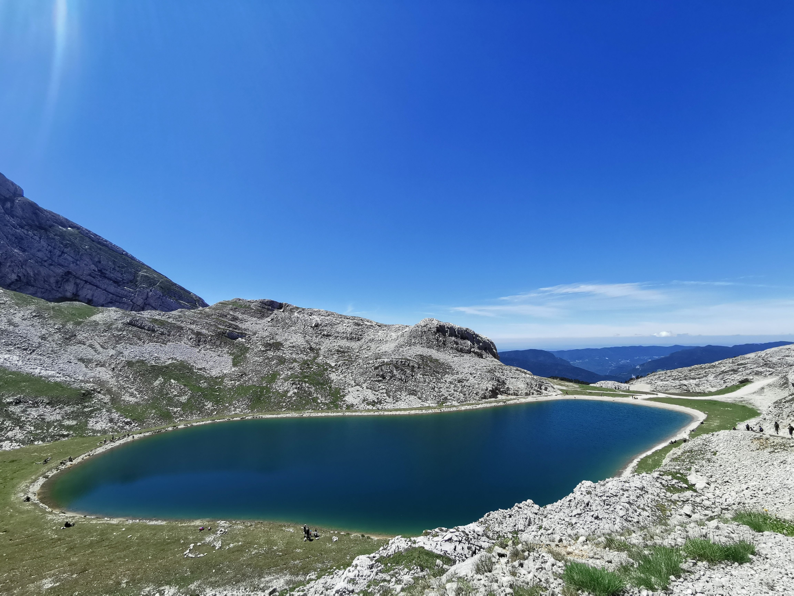

# 🥾 Hike: Lac de la Moucherolle 🏊‍♀️🥶

💡 Read the full page by clicking on "Read more"/"Lire la suite"...💜

##  ⭐⭐ Updates ⭐⭐ 
> 📅 June 24 - 3pm: meet at 9am to get more lazy drivers (JP 😘£)
> 📅 June 25 - 12pm: more cars = more seats. Seats: Albin (5), Tim (5), Aymen (5), Áine (5). 20 seats = 20 hikers MAX 🚶‍♂️+ 1 car of 2 people. So max 22

##  🗨️ EN/FR 🗨️ 
🦅/🐓 : we speak English/French in all our events. Don't be worry if your English/French is not that good. Nos évènements sont en Anglais et Français. Ne soyez pas inquiets si votre niveau d'anglais n'est pas "suffisant".

##  🥾 Hike: Lac de la Moucherolle 🏊‍♀️🥶 
* Topo & GPX track: https://s.42l.fr/CQVBzcm2
▶💡 Download GPX track on your phone.
* Distance: 14.5km
* Time: ~6h of hike + 1h lunch + 1h45 🚗
* D+: 990m

Meet at 9am at parking "Esplanade du Souvenir Français" near Parc Paul Mistral:
- https://www.osm.org/way/69486256
- https://goo.gl/maps/BAbHQ153PcNgunPd6

##  🚗 share 
Car share will cost 4€ per person (fuel + "compensation" to get more drivers).
We will park our car(s) after "Le Balcon de Villard"
- https://www.osm.org/node/3983147335
- https://goo.gl/maps/hiThveAznZNco4nt7

##  💡 Rules 💡 
- Don't be (too) late 😇 We won't wait for you at morning, especially if you don't send any message.
- Since seats in car(s) are "rare", please do not subscribe if you are not sure to join the event
-
- If you finally can't join us, please unsubscribe from the event or at least write a message here to announce your cancellation. 💜 That way, we won't wait for you 💜
- If you are a driver and can't join, please send me a message through meetup ASAP, that way I can remove available seats 🚗
- Don't throw any dump in nature even egg shell, fruit pelt, ... 🌳 ❤️ You

##  ❔ What do you need ❔ 
- Hiking shoes 🥾 (or any good/non slippery shoes)
- Hiking pole (if you want)
- 🧃 Water + 🥕 food for lunch + 🍫 Some snack
- Clothes for wind/cold/rain ☔ (if any)
- Swimsuit + towel + bravery 🥶
- Your smile 😁 / Happiness 😊
- Your mask as always 😷 (avoid contact and so on)
- 💵 Money for car share

##  😷 Covid rules 😷 
- Don't come if you feel sick, have fever, are contact case,...
- If we are more than 10 hikers, we will split in groups of maxi 10 people to respect current French Covid laws
- As always, wear your mask
- You are responsible of your own health, so respect barrier gestures, social distancing, ...
- All rules: https://www.gouvernement.fr/en/coronavirus-covid-19

-----------------------
If you have any questions, please ask!

See you! Albin from GAC.

## Stats

- Start time: 2021-06-26 09:00
- End time: 2021-06-26 20:00
- Duration: 11:00:00
- Time to event: 1 day, 21:18:42
- Attendees: 20
- KM: 14.5
- D+: 990
- Top: 1987
- Type: Hike
- Comment: 

## Links

- [Trail short link](https://s.42l.fr/CQVBzcm2)
- [Trail full link]()
- [Album](https://binnette.github.io/GacImg2021/2021-06-26-🥾-Hike-Lac-de-la-Moucherolle-🏊‍♀️🥶.html)
- [Meetup event](https://www.meetup.com/grenoble-adventure-club-english-french/events/279039579/)
