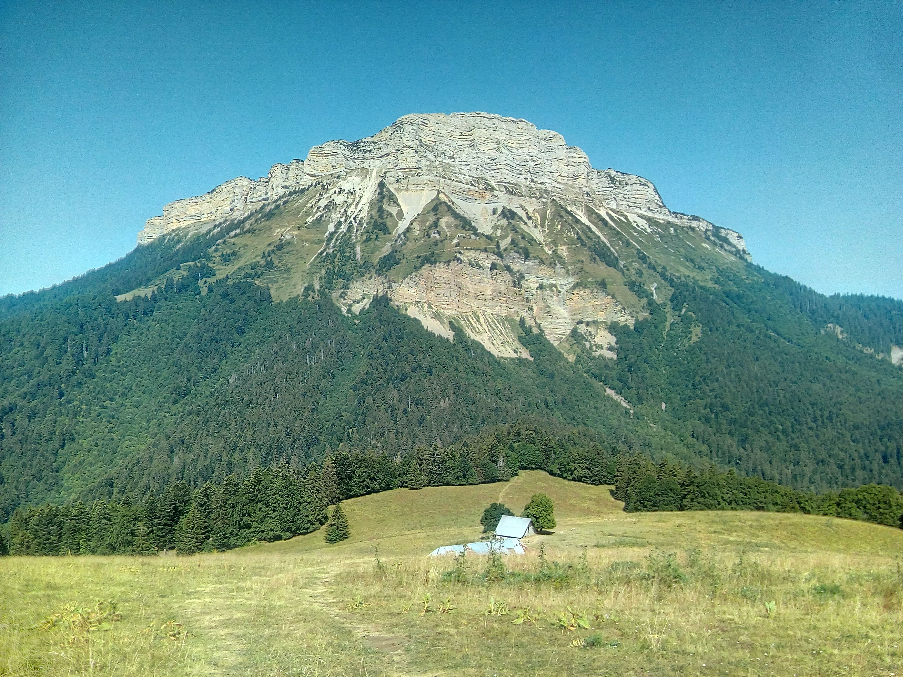

# 🛼 Roller: "Grenoble roller hike" is back

💡 Read the full page by clicking on "Read more"/"Lire la suite"...💜

##  🗨️ EN/FR 🗨️ 
🦅/🐓 : we speak English/French in all our events. Don't be worry if your English/French is not that good. Nos évènements sont en Anglais et Français. Ne soyez pas inquiets si votre niveau d'anglais n'est pas "suffisant".

##  🛼 Roller: "Grenoble roller hike" is back 
The "Grenoble roller hike" is back.
Duration ~1h
Distance ~8km

If you can not finish the "hike", usually there is a car with a few places that can grab you. Will see if it is still the case this year.

Meet at 8:45pm, near "Anneau de Vitesse" and "Esplanade du Souvenir Français":
- https://www.osm.org/way/69486256
- https://goo.gl/maps/BAbHQ153PcNgunPd6

##  🔎 Required skills🔎 
1. Be able to do roller (go forward & turn)
2. Be able to brake with your roller
3. Be able to cross tram line (I can teach you the proper way)

##  💡 Rules 💡 
- Don't be (too) late 😇 We won't wait for you, especially if you don't send any message.
- If you finally can't join us, please unsubscribe from the event or at least write a message here to announce your cancellation. 💜 That way, we won't wait for you 💜

##  ❔ What do you need ❔ 
- Roller
- Protections (wrist + knee + elbow)
- Helmet
- Some water in your bag

##  😷 Covid rules 😷 
- Don't come if you feel sick, have fever, are contact case,...
- As always, wear your mask
- You are responsible of your own health, so respect barrier gestures, social distancing, ...
- All rules: https://www.gouvernement.fr/en/coronavirus-covid-19

-----------------------
If you have any questions, please ask!

See you! Albin from GAC.

## Stats

- Start time: 2021-07-02 20:45
- End time: 2021-07-02 22:45
- Duration: 2:00:00
- Time to event: 1 day, 11:07:21
- Attendees: 3
- KM: 
- D+: 
- Top: 
- Type: Roller
- Comment: 

## Links

- [Trail short link]()
- [Trail full link]()
- [Album](https://binnette.github.io/GacImg2021/)
- [Meetup event](https://www.meetup.com/grenoble-adventure-club-english-french/events/279188833/)
