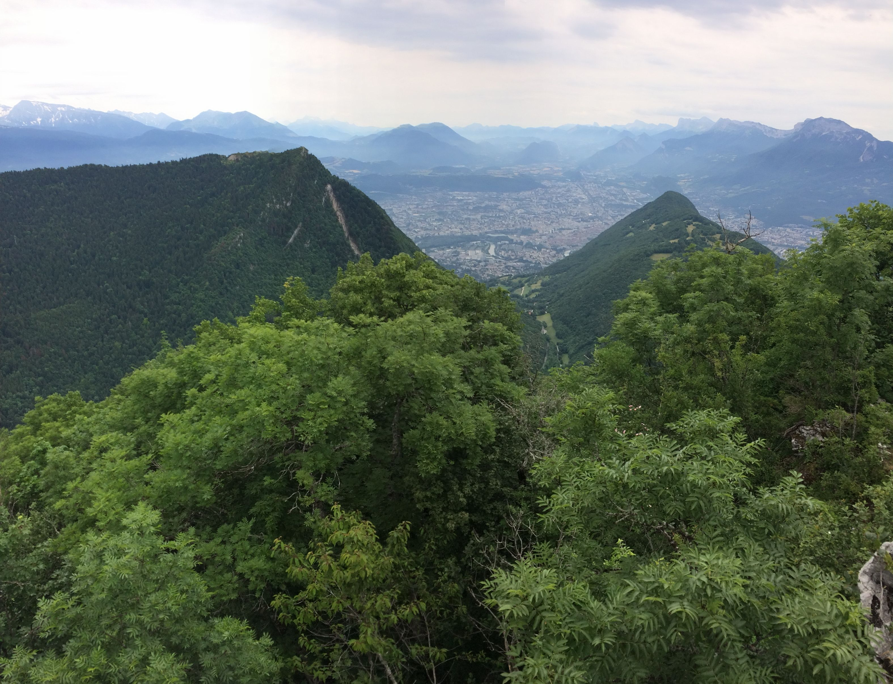

# 🥾 Hike: Easy hike around Le Sappey and L'Ecoutoux 😎

💡 Read the full page by clicking on "Read more"/"Lire la suite"...💜

##  ⭐⭐ Updates ⭐⭐ 
> 📅 Jully 02 - 11am: more cars = more seats. Seats: Albin (5), Dimitrios (4), JP (4) & Laurent Puchote (4). 17 seats = 17 hikers MAX 🚶‍♂️
> 📅 Jully 02 - 11am: we need more drivers. Feel free to register on the waiting list 🤩

##  🗨️ EN/FR 🗨️ 
🦅/🐓 : we speak English/French in all our events. Don't be worry if your English/French is not that good. Nos évènements sont en Anglais et Français. Ne soyez pas inquiets si votre niveau d'anglais n'est pas "suffisant".

##  🥾 Hike: Easy hike around Le Sappey and L'Ecoutoux 😎 
Let's hike before the afternoon rain and have lunch near l'Ecoutoux.

* Topo & GPX track: https://s.42l.fr/1r0e2-C8
* ▶💡 Download GPX track on your phone.
* Distance: 10km
* Time: ~4h of hike + 1h lunch + 1h 🚗
* D+: 630m

Meet at 9am at parking "Esplanade du Souvenir Français" near Parc Paul Mistral:
- https://www.osm.org/way/69486256
- https://goo.gl/maps/BAbHQ153PcNgunPd6

##  🚗 share 
Car share will cost ~2€ per person (fuel + "compensation" to get more drivers).
We will park our car(s) after "Le Sapey en Chartreuse"
- https://www.osm.org/way/45756719
- https://goo.gl/maps/iAr4HQ7GAij71uCU8

##  💡 Rules 💡 
- Don't be (too) late 😇 We won't wait for you, especially if you don't send any message.
- Since seats in car(s) are "rare", please do not subscribe if you are not sure to join the event
- If you finally can't join us, please unsubscribe from the event ASAP or at least write a message here to announce your cancellation. 💜 That way, we won't wait for you 💜
- If you are a driver and can't join, please send me a message through meetup ASAP, that way I can remove available seats 🚗
- Don't throw any dump in nature even egg shell, fruit pelt, ... 🌳 ❤️ You

##  ❔ What do you need ❔ 
- Hiking shoes 🥾 (or any good/non slippery shoes)
- Hiking pole (if you want)
- 🧃 Water + 🥕 food for lunch + 🍫 Some snack
- Clothes for wind/cold/rain ☔ (if any)
- Your smile 😁 / Happiness 😊
- Your mask as always 😷 (avoid contact and so on)
- 💵 Money for car share

##  😷 Covid rules 😷 
- Don't come if you feel sick, have fever, are contact case,...
- You are responsible of your own health, so respect barrier gestures, social distancing, ...
- All rules: https://www.gouvernement.fr/en/coronavirus-covid-19

-----------------------
If you have any questions, please ask!

See you! Albin from GAC.

PS : for more activities, feel free to join our WhatsApp group: https://chat.whatsapp.com/GWcKp7gtfA58CtpyxkC1rN

## Stats

- Start time: 2021-07-03 09:00
- End time: 2021-07-03 15:00
- Duration: 6:00:00
- Time to event: 22:43:57
- Attendees: 14
- KM: 10
- D+: 630
- Top: 1407
- Type: Hike
- Comment: 

## Links

- [Trail short link](https://s.42l.fr/1r0e2-C8)
- [Trail full link]()
- [Album](https://binnette.github.io/GacImg2021/2021-07-03-🥾-Hike-Easy-hike-around-Le-Sappey-and-LEcoutoux-😎.html)
- [Meetup event](https://www.meetup.com/grenoble-adventure-club-english-french/events/279213815/)
