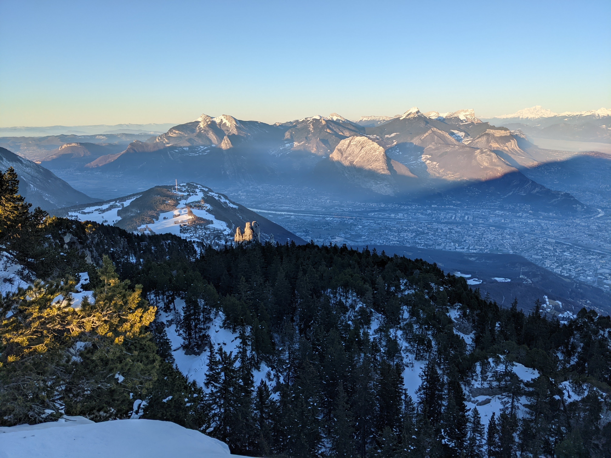

# Afterwork hike : Sunset at Moucherotte

Read the full page / Lisez jusqu’au bout

##  EN/FR 
We speak English/French in all our events. Don't be worry if your English/French is not that good. Nos évènements sont en Anglais et Français. Ne soyez pas inquiets si vous n’êtes pas bilingue.

##  Moucherotte : way up with sun, way down with headlight 
Topo : https://www.visorando.com/randonnee-le-moucherotte-en-partant-de-saint-nizie/
* Distance: 9km
* Time: 3h of hike + 45min dinner + 45min drive
Drop : 750m

##  Car share 
Meet at parking « club de sport gymnesia » (18 Avenue de la Houille Blanche, 38170 Seyssinet-Pariset)
Beginning of the hike at parking du tremplin olympique (chemin de la roche)
Car share will cost 2€ per person

##  Rules 
- Don't be late
- Do not subscribe if you are not sure to join the event
- If you finally can't join us, please unsubscribe from the event or at least write a message here to announce your cancellation. That way, we won't wait for you
- If you are a driver and can't join, please send me a message through meetup ASAP, that way I can remove available seats
- Don't throw any dump in nature

##  What do you need 
- Hiking shoes (or any good sport shoes)
- Hiking pole (if you want)
- A headligth or any flashlight
- Water + food for dinner + Some snack
- Clothes for wind/cold
- Your mask as always (avoid contact and so on)
- Money for car share

##  Covid 
- Don't come if you feel sick, have fever, are contact case
- If we are more than 10 hikers, we will split in groups of maxi 10 people to respect current French Covid laws
- Wear your mask
- You are responsible to your own health, so respect barrier gestures, social distancing
- All rules : https://www.gouvernement.fr/en/coronavirus-covid-19

If you have any questions, please ask !

Le Moucherotte : montée au soleil, descente à la frontale
Topo : https://www.visorando.com/randonnee-le-moucherotte-en-partant-de-saint-nizie/
* Distance: 9km
Durée : 3h de rando + 45min de casse-croûte + 45min de route
* D+: 750m

Covoit’ :
RDV au parking « club de sport gymnesia » (18 Avenue de la Houille Blanche, 38170 Seyssinet-Pariset)
Départ de la rando au parking du tremplin olympique (chemin de la roche)
Tarif : 2€ par personne

Règles :
- Ne soyez pas en retard.
- Ne vous inscrivez pas si vous n'êtes pas sûr de participer à l'événement.
- Si vous ne pouvez finalement pas venir, veuillez vous désinscrire de l'événement ou au moins écrire un message ici pour annoncer votre annulation. Comme ça, on ne vous attendra pas.
- Si vous êtes un chauffeur et que vous ne pouvez pas venir, veuillez m'envoyer un message via meetup dès que possible, de cette façon je pourrai supprimer les sièges disponibles.
- Ne jetez aucun déchet dans la nature.

Ce dont vous avez besoin :
- Des chaussures de rando ou des bonnes baskets.
- Des bâtons (si vous avez besoin).
- Une frontale ou une torche.
- Eau + nourriture + en cas.
- Des vêtements chauds et coupe-vent.
- Le masque.
- De l’argent pour le covoit’.

Covid :
- Ne venez pas si vous vous sentez malade ou si vous êtes cas contact.
- Si nous sommes plus de 10 randonneurs, nous nous diviserons en groupe de maxi 10 personnes pour respecter les lois françaises Covid en vigueur.
- Portez votre masque.
- Vous êtes responsable de votre propre santé, alors respectez les gestes barrières, la distanciation sociale.
- Les règles : https://www.gouvernement.fr/en/coronavirus-covid-19

N’hésitez pas si vous avez des questions !

## Stats

- Start time: 2021-07-22 18:00
- End time: 2021-07-22 23:30
- Duration: 5:30:00
- Time to event: 1 day, 17:31:20
- Attendees: 3
- KM: 9
- D+: 750
- Top: 1901
- Type: Hike
- Comment: 

## Links

- [Trail short link](https://s.42l.fr/le-moucherotte)
- [Trail full link]()
- [Album](https://binnette.github.io/GacImg2021/)
- [Meetup event](https://www.meetup.com/grenoble-adventure-club-english-french/events/279598655/)
