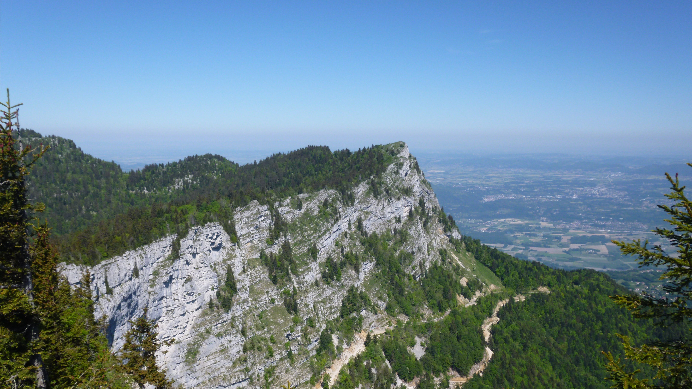

# 🥾 Hike: GR9 - La Buffe 🗻 1623m - La Sure 🗻1643m

💡 Read the full page by clicking on "Read more"/"Lire la suite"...💜

##  ⭐⭐ Updates ⭐⭐ 
> 📅 Jully 30 - 2pm: more cars = more seats. Seats: Albin (5), Tim (5), Aymen (5), Samir (5) & Monsef (5). 25 seats = 25 hikers MAX 🚶‍♂️
> 📅 Jully 30 - 11am: feel free to register on the waiting list. We just need more drivers 😇🚗🚙

##  🗨️ EN/FR 🗨️ 
🦅/🐓 : we speak English/French in all our events. Don't be worry if your English/French is not that good. Nos évènements sont en Anglais et Français. Ne soyez pas inquiets si votre niveau d'anglais n'est pas "suffisant".

##  🥾 Hike: GR9 - La Buffe 🗻 1623m - La Sure 🗻1643m 
Meet at 8am at "Parking de l'Esplanade" near Porte de France:
- https://www.osm.org/node/4614005431
- https://goo.gl/maps/wa1NXLhhdsdPGJaA9

Drive 45m to the Ski Station of Autrans/La Sure:
- https://www.osm.org/node/3381862826
- https://goo.gl/maps/NbCdnKcC7uX6U34g6

* Topo & GPX track: https://s.42l.fr/lVyODh6Y
* ▶💡 Download GPX track on your phone.
* Distance: 13.5km
* Time: ~5-6h of hike + 1h lunch + 1h30m 🚗
* D+: 900m

##  🚗 share 
Car share will cost 5€ per person (fuel + "compensation" to get more drivers).

##  💡 Rules 💡 
- Don't be (too) late 😇 We won't wait for you, especially if you don't send any message.
- Since seats in car(s) are "rare", please do not subscribe if you are not sure to join the event
- If you finally can't join us, please unsubscribe from the event ASAP or at least write a message here to announce your cancellation. 💜 That way, we won't wait for you 💜
- If you are a driver and can't join, please send me a message through meetup ASAP, that way I can remove available seats 🚗
- Don't throw any dump in nature even egg shell, fruit pelt, ... 🌳 ❤️ You

##  ❔ What do you need ❔ 
- Hiking shoes 🥾 (or any good/non slippery shoes)
- Hiking pole (if you want)
- 🧃 Water + 🥕 food for lunch + 🍫 Some snack
- Swimsuit + towel 🏊‍♀️
- Clothes for wind/cold/rain ☔ (if any)
- Your smile 😁 / Happiness 😊
- Your mask as always 😷 (avoid contact and so on)
- 💵 Money for car share

##  😷 Covid rules 😷 
- Don't come if you feel sick, have fever, are contact case,...
- You are responsible of your own health, so respect barrier gestures, social distancing, ...
- All rules: https://www.gouvernement.fr/en/coronavirus-covid-19

-----------------------
If you have any questions, please ask!

See you! Albin from GAC.

PS : for more activities (cinema, tennis table, concert, etc), you can join our WhatsApp group. Just ask me by message on meetup or IRL (in real life).

## Stats

- Start time: 2021-08-01 08:00
- End time: 2021-08-01 19:00
- Duration: 11:00:00
- Time to event: 1 day, 20:33:09
- Attendees: 19
- KM: 13.5
- D+: 700
- Top: 1643
- Type: Hike
- Comment: 

## Links

- [Trail short link](https://s.42l.fr/lVyODh6Y)
- [Trail full link]()
- [Album](https://binnette.github.io/GacImg2021/2021-08-01-🥾-Hike-GR9-La-Buffe-🗻-1623m-La-Sure-🗻1643m.html)
- [Meetup event](https://www.meetup.com/grenoble-adventure-club-english-french/events/279800883/)
