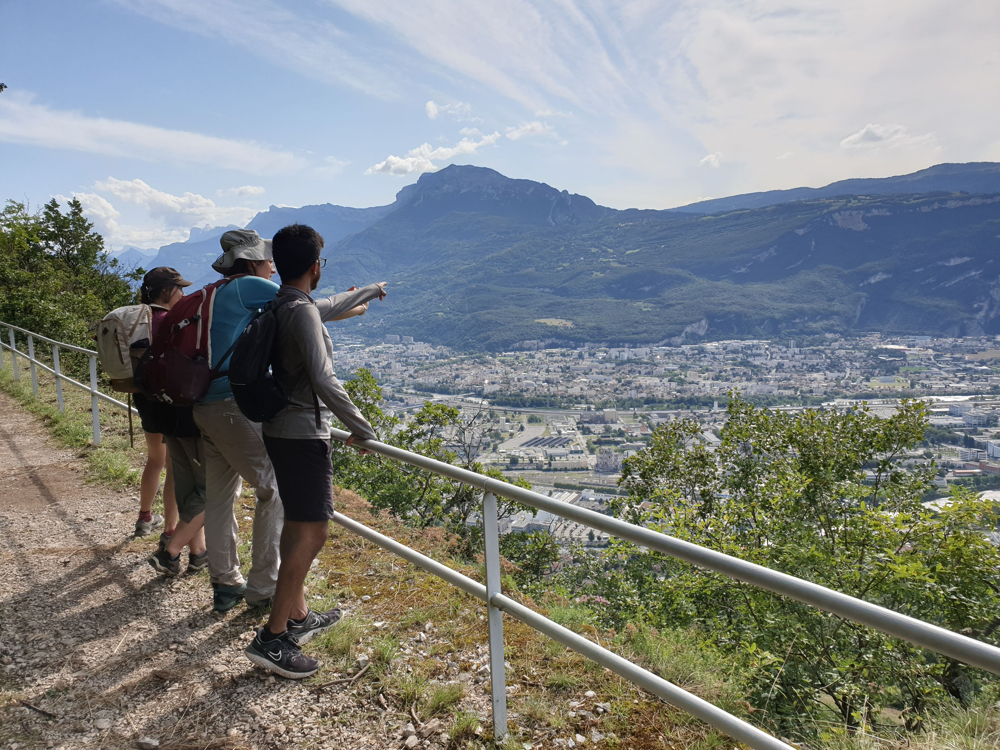

# 🥾 Hike: around Néron + up to Jalla (+maybe some cold stream 🏊‍♀️)

💡 Read the full page by clicking on "Read more"/"Lire la suite"...💜

##  ⭐⭐ Updates ⭐⭐ 
> 📅 August 6 - 6pm: this time we don't need any car, just a tram ride in the morning or a 1h hike before the real hike for warriors like me...

##  🗨️ EN/FR 🗨️ 
🦅/🐓 : we speak English/French in all our events. Don't be worry if your English/French is not that good. Nos évènements sont en Anglais et Français. Ne soyez pas inquiets si votre niveau d'anglais n'est pas "suffisant".

##  🥾 Hike: around Néron + up to Jalla (+maybe some cold stream 🏊‍♀️) 
I do this hike for eventual frustrated people of Saturday hike. So this time we do not need cars. We will hike around Néron, then try to find some river and go back in Grenoble through Mont Jalla. Then we can have a beer or grab some food 🍔

* Topo & GPX track: https://s.42l.fr/_MqyjH8A
* ▶💡 Download GPX track on your phone.
* Distance: 15km
* Time: ~5/6h of hike + 1h lunch
* D+: 950m

Meet at 10am at tram stop E "Néron" :
- https://www.osm.org/node/3399607909
- https://goo.gl/maps/zJ51FFgMrAGTu58s7

##  🚗 share 
NO CAR.

##  💡 Rules 💡 
- Don't be (too) late 😇 We won't wait for you, especially if you don't send any message.
- Since seats in car(s) are "rare", please do not subscribe if you are not sure to join the event
- If you finally can't join us, please unsubscribe from the event ASAP or at least write a message here to announce your cancellation. 💜 That way, we won't wait for you 💜
- If you are a driver and can't join, please send me a message through meetup ASAP, that way I can remove available seats 🚗
- Don't throw any dump in nature even egg shell, fruit pelt, ... 🌳 ❤️ You

##  ❔ What do you need ❔ 
- Hiking shoes 🥾 (or any good/non slippery shoes)
- Hiking pole (if you want)
- 🧃 Water + 🥕 food for lunch + 🍫 Some snack
- Swimsuit + towel 🏊‍♀️ if we manage to find a river...
- Clothes for wind/cold/rain ☔ (if any)
- Your smile 😁 / Happiness 😊
- Your mask as always 😷 (avoid contact and so on)

##  😷 Covid rules 😷 
- Don't come if you feel sick, have fever, are contact case,...
- You are responsible of your own health, so respect barrier gestures, social distancing, ...
- All rules: https://www.gouvernement.fr/en/coronavirus-covid-19

-----------------------
If you have any questions, please ask!

See you! Albin from GAC.

PS : for more activities (cinema, tennis table, concert, etc), you can join our WhatsApp group. Just ask me by message on meetup or IRL (in real life).

## Stats

- Start time: 2021-08-08 10:00
- End time: 2021-08-08 19:00
- Duration: 9:00:00
- Time to event: 1 day, 15:41:41
- Attendees: 5
- KM: 15
- D+: 950
- Top: 722
- Type: Hike
- Comment: 

## Links

- [Trail short link](https://s.42l.fr/_MqyjH8A)
- [Trail full link]()
- [Album](https://binnette.github.io/GacImg2021/2021-08-08-🥾-Hike-around-Neron-up-to-Jalla-maybe-some-cold-stream-🏊‍♀️.html)
- [Meetup event](https://www.meetup.com/grenoble-adventure-club-english-french/events/279954414/)
