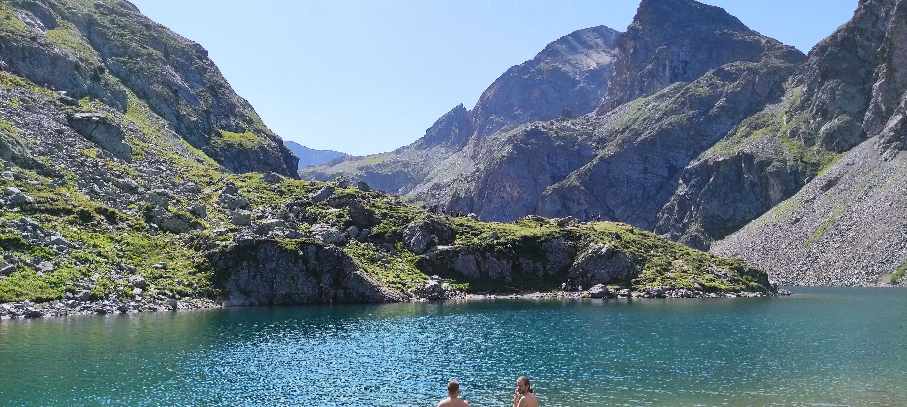

# 🥾 Hike: too hot on Saturday, let's swim in a 2400m lake 🥶😱

💡 Read the full page by clicking on "Read more"/"Lire la suite"...💜

##  ⭐⭐ Updates ⭐⭐ 
> 📅 August 13 - 9am: feel free to register on the waiting list. Some people like to cancel at last minute, so you maybe can have a seat 🤐😅. Or if we have another car you will be the first to have a seat 👍😇
> 📅 August 11 - 11pm: more cars = more seats. Seats: Albin (5), Aymen (5), Paulo (5), Monsef (5) & Tim (5). 25 seats = 25 hikers MAX 🚶‍♂️

##  🗨️ EN/FR 🗨️ 
🦅/🐓 : we speak English/French in all our events. Don't be worry if your English/French is not that good. Nos évènements sont en Anglais et Français. Ne soyez pas inquiets si votre niveau d'anglais n'est pas "suffisant".

##  🥾 Hike: too hot on Saturday, let's swim in a 2400m lake 🥶😱 
Meet at 9am at parking "Esplanade du Souvenir Français" near Parc Paul Mistral:
- https://www.osm.org/way/69486256
- https://goo.gl/maps/BAbHQ153PcNgunPd6

We take cars, ride about 40m. Then park our car(s) after "Freydières"
- https://www.osm.org/way/768097367
- https://goo.gl/maps/8XMPqSePeDeQi928A

* Topo & GPX track: https://s.42l.fr/2Mzq-xbQ
* ▶💡 Download GPX track on your phone.
* Distance: 18km
* Time: ~6/7h of hike + 1h lunch + 1h20 🚗
* D+: 1233m

##  🚗 share 
Car share will cost 3€ per person (fuel + "compensation" to get more drivers).

##  💡 Rules 💡 
- Don't throw any dump 🚮 in nature even egg shell 🥚, fruit pelt 🍌, ... 🌳 ❤️ You
- Don't be (too) late 😇 We won't wait for you at morning, especially if you don't send any message.
- Since seats in car(s) are "rare", please do not subscribe if you are not sure to join the event
- If you finally can't join us, please unsubscribe from the event or at least write a message here to announce your cancellation. 💜 That way, we won't wait for you 💜
- If you are a driver and can't join, please send me a message through meetup ASAP, that way I can remove available seats 🚗
- 💟You are responsible of your own health and security
- 😷 Covid rules: https://www.gouvernement.fr/en/coronavirus-covid-19

##  ❔ What do you need ❔ 
- Hiking shoes 🥾 (or any good/non slippery shoes)
- Hiking pole (if you want)
- 🧃 Water + 🥕 food for lunch + 🍫 Some snack
- Clothes for wind/cold/rain ☔ (if any)
- Swimsuit 🩳 + towel
- Your smile 😁 / Happiness 😊
- Your mask as always 😷 (avoid contact and so on)
- 💵 Money for car share

-----------------------
If you have any questions, please ask!

See you! Albin from GAC.

PS : for more activities (cinema, tennis table, concert, etc), you can join our WhatsApp group. Just ask me by message on meetup or IRL (in real life).

## Stats

- Start time: 2021-08-14 09:00
- End time: 2021-08-14 20:00
- Duration: 11:00:00
- Time to event: 2 days, 14:19:21
- Attendees: 21
- KM: 18
- D+: 1232
- Top: 2420
- Type: Hike
- Comment: 

## Links

- [Trail short link](https://s.42l.fr/2Mzq-xbQ)
- [Trail full link]()
- [Album](https://binnette.github.io/GacImg2021/2021-08-14-🥾-Hike-too-hot-on-Saturday,-lets-swim-in-a-2400m-lake-🥶😱.html)
- [Meetup event](https://www.meetup.com/grenoble-adventure-club-english-french/events/280053697/)
