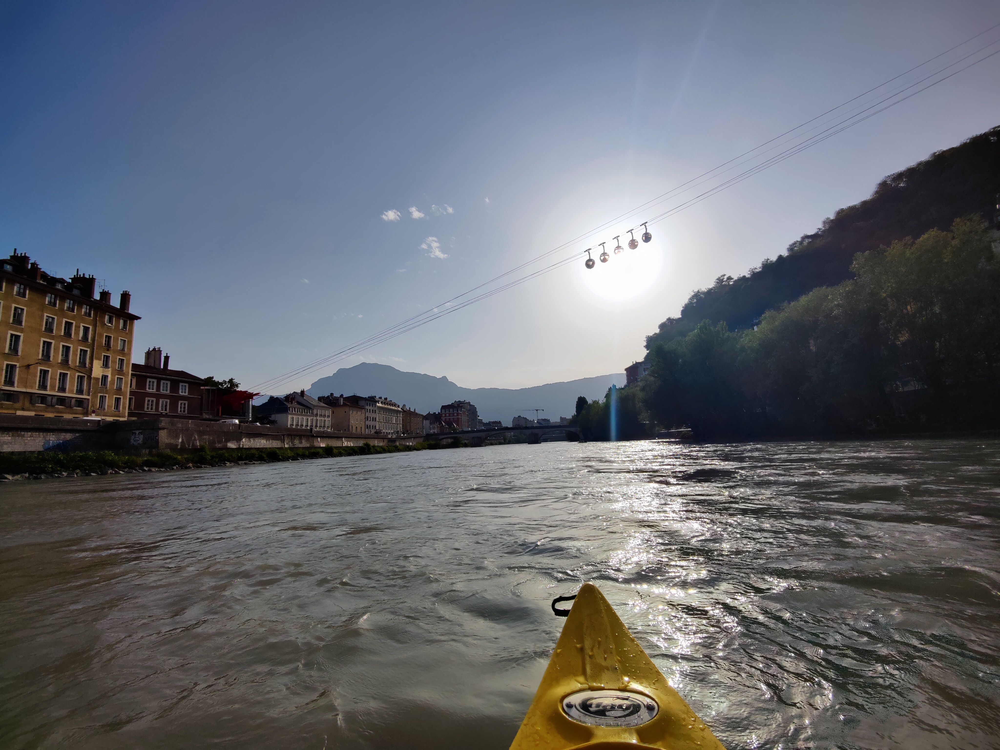

# 🥾🏊‍♀️ Hike: too hot on Sunday, enjoy the lake "Bois Français" 🏊‍♀️🌞

💡 Read the full page by clicking on "Read more"/"Lire la suite"...💜

❗❗ HEALTH PASS IS MANDATORY TO ENTER THE LAKE
💰 Lake entry will cost 3.5€. But you can buy 10 entries for less money.

##  ⭐⭐ Updates ⭐⭐ 
> 📅 August 12 - 1pm: health pass is mandatory to enter the lake

##  🗨️ EN/FR 🗨️ 
🦅/🐓 : we speak English/French in all our events. Don't be worry if your English/French is not that good. Nos évènements sont en Anglais et Français. Ne soyez pas inquiets si votre niveau d'anglais n'est pas "suffisant".

##  🥾 Hike: too hot on Sunday, go to lake "Bois Français" 🏊‍♀️🌞 
You will join the canoe team (https://www.meetup.com/Grenoble-Adventure-Club-English-French/events/280011169/) and hike with us until the lake "Bois Français". But instead of canoe, you can just chill at the lake. Then you will go back to Grenoble without me (I will canoe), but you can take the same way done during morning. Or you can maybe take a bus (you have to check) or hitch-hike.

Health pass is mandatory. Lake entrance cost 3.5€ per person.
The lake is open until 8pm.

* Topo & GPX track: https://s.42l.fr/hbxWc5uW
* ▶💡 Download GPX track on your phone.
* Distance: 23km in total
* Time: ~2/3h of hike + 1/2h lunch + ~2/3h of hike back
* D+: 132m

Meet at 9am at parking "Esplanade du Souvenir Français" near Parc Paul Mistral:
- https://www.osm.org/way/69486256
- https://goo.gl/maps/BAbHQ153PcNgunPd6

##  💡 Rules 💡 
- Don't be (too) late 😇 We won't wait for you, especially if you don't send any message.
- Don't throw any dump in nature even egg shell, fruit pelt, ... 🌳 ❤️ You
- You are responsible of your own security
- Covid rules: https://www.gouvernement.fr/en/coronavirus-covid-19

##  ❔ What do you need ❔ 
- 🧃 Water + 🥕 food for lunch + 🍫 Some snack
- Swimsuit + towel 🏊‍♀️
- A hat to get some shadow
- Sun-cream, sunglasses
- 🦟 Mosquito spray cause there are some mosquitoes there... 🦟
- 3.5€ to enter the lake
- 🛂👩‍⚕️ Your health pass / pass sanitaire (MANDATORY to enter the lake)
- Your mask as always 😷 (avoid contact and so on)

----
If you have any questions, please ask!

See you! Albin from GAC.

PS : for more activities, you can join our WhatsApp group. Just ask me by message on meetup or IRL (in real life).

## Stats

- Start time: 2021-08-15 09:00
- End time: 2021-08-15 20:00
- Duration: 11:00:00
- Time to event: 2 days, 20:09:00
- Attendees: 4
- KM: 11
- D+: 70
- Top: 226
- Type: Hike
- Comment: 

## Links

- [Trail short link](https://s.42l.fr/hbxWc5uW)
- [Trail full link]()
- [Album](https://binnette.github.io/GacImg2021/)
- [Meetup event](https://www.meetup.com/grenoble-adventure-club-english-french/events/280070147/)
