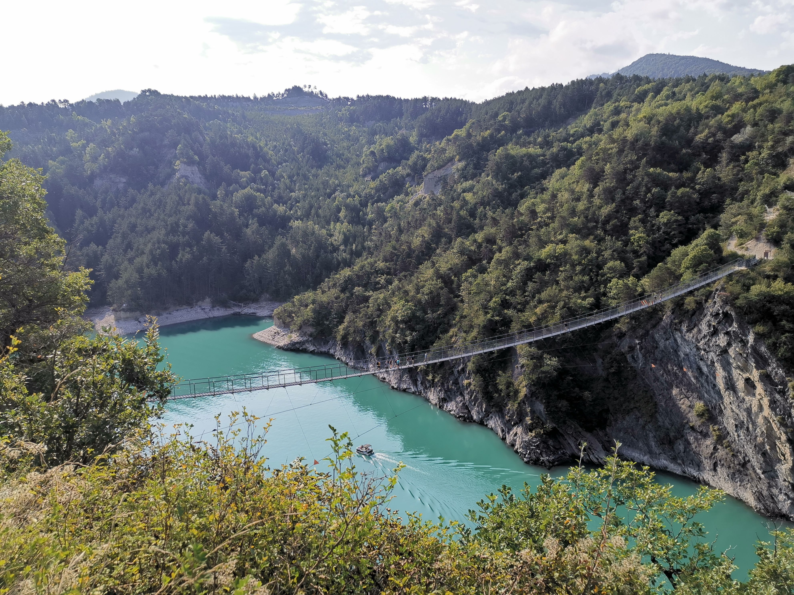

# Once more unto the bridges, dear friends, once more!

⌚Updates🎙️⏩
📌 Friday 20 August 11:00 PM:
9 cars max 44 people: Áine (5), Francois (5), Eh Va (5), Tania (5), Tim (5), Paulo (5), Albin (5), Aymen (4, leaving @ 9 AM), and Djo Rachid (5).

📌 Thursday 19 August 10:35 PM:
7 cars, max 35 people: Áine (5), Francois (5), Eh Va (5), Tania (5), Tim (5), Paulo (5), and Albin (5).

📌 Monday 16 August 01:35 PM:
6 cars, max 30 people: Áine (5), Francois (5), Eh Va (5), Tania (5), Tim (5) and Paulo (5).

📌 Saturday 14 August 07:40 PM:
5 cars, max 25 people: Áine (5), Francois (5), Eh Va (5), Tania (5), and Tim (5).

📌 Friday 13 August 02:00 PM:
3 cars, max 15 people: Áine (5), Francois (5) and Eh Va (5).
⏪

Let's redo another memorable GAC event: Lac de Monteynard-Avignonet and its two Passerelles!

💣 What to expect 💣
A moderate hike; eye-catching views; enjoyable swim; some Jack-/Rose-like photos, if you can 👀🚢🌊💥

📜 Rough plan 📜
~ 07:30 AM: Socializing

@ 08:00 AM: Drive from Parc Paul Mistral
https://goo.gl/maps/P7UXJdDuYmkEA5EB6

~ 09:00 AM: Start the hike from Treffort
https://goo.gl/maps/256TJvfKUybkzPU16

~ 10:00 AM: Pass the Passerelle de L'Ebron
https://goo.gl/maps/UUiWKXHP1crSvK9u7

~ 11:30 AM: Pass the Passerelle Himalayenne du Drac
https://goo.gl/maps/H7sYZa4NHZdEDEbf6

~ 12:30 PM: Chill, Swim (no skinny-dipping please 😜), eat on the Plage de Savel
https://goo.gl/maps/chrXZwPPPfRu2AUK7

@ 04:00 PM: Take the Bateau la Mira to return to the parking (don't forget to book your ticket online as explained later in this description)

~ 04:30 PM: Drive to Barrage de Monteynard-Avignonet
https://goo.gl/maps/MKgchXeCUD3RnspF6

~ 04:45 PM: Enjoy the view of the dam

~ 05:30 PM: Drive back to Grenoble and maybe enjoy the evening together

🛥️🎫 Don't forget 🛥️🎫
1. As soon as you are confirmed to join us, reserve your boat ticket at the following link (choose the shuttles, 22nd of August, Savel Beach Pier, then departure schedule of 16:00; the price is 8 Euros):
https://reservation.la-mira.com/booking/settings
2. Bring your mask with you during the hike because you will need it for getting into the boat.

🎒 What to bring 🎒
- Your smile and positive vibe
- Suitable shoes for a moderate hike
- Water + lunch + snack
- Sunscreen + sunglasses + hat
- Swimsuit + towel
- Face mask
- Cash for car-sharing (10€ per person to cover both the fuel and the toll in our round trip)
🗺️ About the trail 🗺️
Find more details about the hike in this link: (Don't forget to download the GPX track😉)
https://www.visorando.com/en/walk-himalayan-footbridges-of-monteynard/

💡 Rules 💡
- Don't throw any dump in nature!
- Be on time.
- If you are not a driver, remember you are reserving a seat in a car, so please don't subscribe if you are not determined to join us. However, if you had to cancel your subscription, please unsubscribe from the event, we need to know how many people are coming.
- If you are a driver and have to cancel your subscription, please send me a message through meetup ASAP so that I can remove available seats.
- You are responsible for your own health and security
- Covid rules: https://www.gouvernement.fr/en/coronavirus-covid-19

About us🥾🚣🏊🚴🏓🎿🛷🧗‍♀️🥊
We are some awesome people doing cool stuff😎

We speak English/French in all our events. Don't be worry if your English/French is not that good. Nos évènements sont en Anglais et Français. Ne soyez pas inquiets si votre niveau d'anglais n'est pas "suffisant".

💌Don't hesitate to shoot me a message if you have any questions 🙂💌
Hassan

## Stats

- Start time: 2021-08-22 07:30
- End time: 2021-08-22 18:30
- Duration: 11:00:00
- Time to event: 9 days, 8:03:10
- Attendees: 31
- KM: 12.3
- D+: 500
- Top: 690
- Type: Hike
- Comment: 

## Links

- [Trail short link](https://s.42l.fr/1ctzQXbL)
- [Trail full link]()
- [Album](https://binnette.github.io/GacImg2021/2021-08-22-Once-more-unto-the-bridges,-dear-friends,-once-more.html)
- [Meetup event](https://www.meetup.com/grenoble-adventure-club-english-french/events/280081009/)
