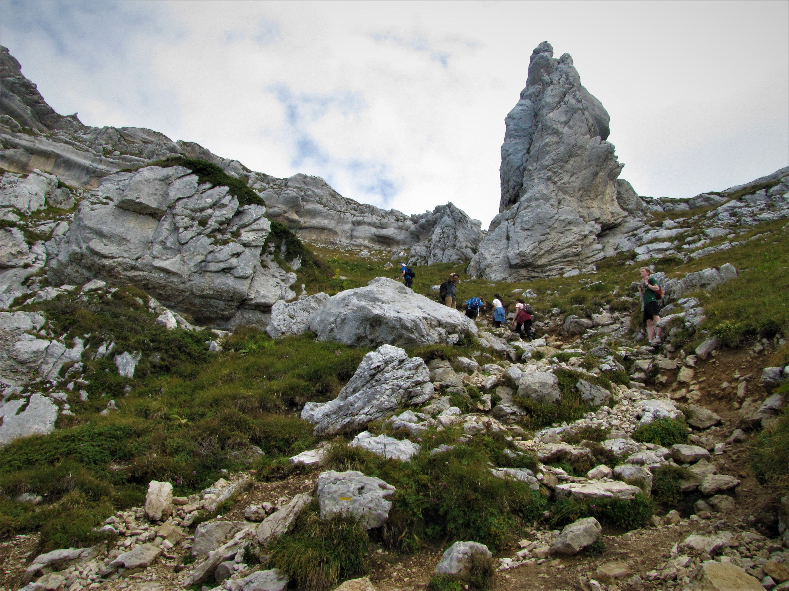

# 🥾 Hike: Le Dent de Crolles

💡 Read the full page by clicking on "Read more"/"Lire la suite"...💜

##  ⭐⭐ Updates ⭐⭐ 
> 📅 September 2 - 5pm: more cars = more seats. Seats: Tim (5), Paulo (5) = 10 hikers Max.

Feel free to join the waitlist until we get more drivers!

##  🗨️ EN/FR 🗨️ 
🦅/🐓 : we speak English/French in all our events. Don't worry if your English/French is not that good. Nos évènements sont en Anglais et Français. Ne soyez pas inquiets si votre niveau d'anglais n'est pas "suffisant".

##  🥾 Hike: Le Dent de Crolles 
Meet at 9:00am at parking "Esplanade du Souvenir Français" near Parc Paul Mistral:
- https://www.osm.org/way/69486256
- https://goo.gl/maps/BAbHQ153PcNgunPd6

We take cars for about 30m. Then park our car(s) near "L'estive du Haut, Dent de Crolles, Pravouta, Parking Col des Ayes":
- https://goo.gl/maps/jzuheHwEAtqQvbcK9

* Topo & GPX track: https://graphhopper.com/maps/?point=45.304671%2C5.838976&point=45.310131%2C5.842336&point=45.310493%2C5.845596&point=45.309228%2C5.854182&point=45.308212%2C5.855548&point=45.317279%2C5.851439&point=45.304658%2C5.839051&locale=en-GB&elevation=true&profile=hike&use_miles=false&selected_detail=Elevation&layer=OpenStreetMap

* ▶💡 Download GPX track on your phone.
* Distance: 8km
* Time: ~3/4h of hike + 1h lunch + 1h 🚗
* D+: 685m 😎

##  🚗 share 
Car share will cost 3€ per person (fuel + "compensation" to get more drivers).

##  💡 Rules 💡 
- Don't leave any litter 🚮 in nature even egg shell 🥚, fruit pelt 🍌, ... 🌳 ❤️ You
- Subscribe on the waiting list. Maybe more cars will be available 🚗
- Don't be (too) late 😇 We won't wait for you at morning, especially if you don't send any message.
- Since seats in car(s) are "rare", please do not subscribe if you are not sure to join the event
- If you finally can't join us, please unsubscribe from the event or at least write a message here to announce your cancellation. 💜 That way, we won't wait for you 💜
- If you are a driver and can't join, please send me a message through meetup ASAP, that way I can remove available seats 🚗
- 💟You are responsible of your own health and security
- 😷 Covid rules: https://www.gouvernement.fr/en/coronavirus-covid-19

##  ❔ What do you need ❔ 
- Hiking shoes 🥾 (or any good/non slippery shoes)
- Hiking pole (if you want)
- 🧃 Water + 🥕 food for lunch + 🍫 Some snack
- Clothes for wind/cold/rain ☔ (if any)
- Sun-cream 🌞
- Your smile 😁 / Happiness 😊
- Your mask as always 😷 (avoid contact and so on)
- 💵 Money for car share

- Please note it may rain a bit in the afternoon.

- ALSO there is some light climbing involved at a section but there is a cable to help you. It shouldn't be very difficult.

---
As the hike is "short" maybe we can hang out at le Dent for longer, or go back to Grenoble for a beer/pizza :D

Finally a hike where Albin isn't invited 😇

-----------------------
If you have any questions, please ask!

See you! Tim and Paul from GAC.

PS: for more activities (cinema, tennis table, concert, etc), you can join our WhatsApp group. Just ask me by message on meetup or IRL (in real life).

## Stats

- Start time: 2021-09-04 09:00
- End time: 2021-09-04 17:00
- Duration: 8:00:00
- Time to event: 2 days, 13:10:40
- Attendees: 11
- KM: 7.62
- D+: 684
- Top: 2062
- Type: Hike
- Comment: 

## Links

- [Trail short link](https://s.42l.fr/xc6LTRzQ)
- [Trail full link]()
- [Album](https://binnette.github.io/GacImg2021/2021-09-04-🥾-Hike-Le-Dent-de-Crolles.html)
- [Meetup event](https://www.meetup.com/grenoble-adventure-club-english-french/events/280491067/)
