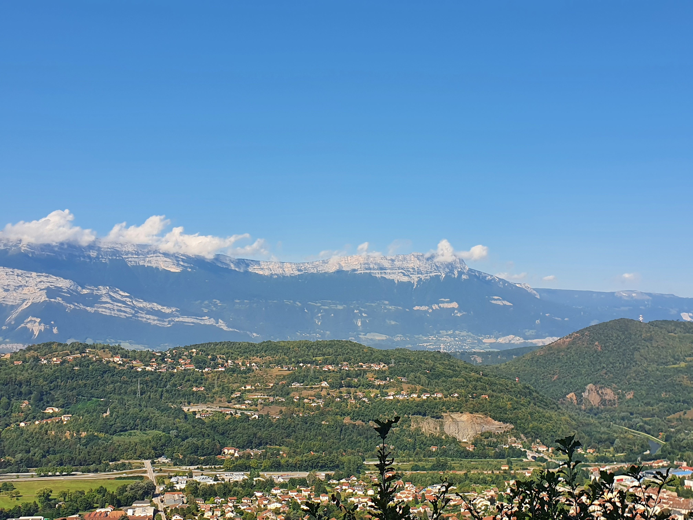

# Easy Hike: Le Belvédère de Vizille

Easy short hike up through the forest to a nice viewpoint.
If you have been thinking of joining the group for a hike come along this week.
We will pace the hike for all abilities, nobody will be left behind but some may go a bit faster to enjoy more of the view.

Details
💡 Read the full page by clicking on "Read more"/"Lire la suite"...💜

##  ⭐⭐ Updates ⭐⭐ 

Saturday@12:00; Cars ->Áine + Paulo + Tania + Tim + Anis + Louis + Francois + Samir = 39 hikers MAX

Cycling: Sayeh, Aryasheel, Carsten, aa.

Total=> 43 hikers Max

##  🗨️ EN/FR 🗨️ 
🦅/🐓 : we speak English/French at all our events. Don't worry if your English/French is not that good. Nos évènements sont en Anglais et Français. Ne soyez pas inquiets si votre niveau d'anglais n'est pas "suffisant".

##  🥾 Hike: Le Belvédére de Vizille 
Meet at 9:00 am at parking "Parking Public Clemenceau" near Parc Paul Mistral:
- https://www.osm.org/way/69486256
- https://goo.gl/maps/BAbHQ153PcNgunPd6

We will drive for about 30 m. Then park our car(s) near Château de Vizille at the La Locomotive convention center: https://goo.gl/maps/2cLM8LZfosxE8zxq8

* ▶💡 Download GPX track on your phone: https://www.alltrails.com/fr/trail/france/isere/belvedere-de-vizille
* Distance: 6 km
* Time: ~3.5 h of hike + 1 h lunch + 1 h 🚗
* D+: 362 m 😎

Before or after the hike we can stroll through the free gardens of Château de Vizille.

##  🚗 share 
Car share will cost 3€ per person (fuel + "compensation" to get more drivers).

If there are not enough drivers, the start of the hike is near a bus route from Grenoble. Details will be posted later if required/not enough cars.

##  💡 Rules 💡 
- Don't leave any litter 🚮 in nature even egg shells 🥚, fruit pelt 🍌, ... 🌳 ❤️ You
- Subscribe on the waiting list. Maybe more cars will be available 🚗
- Don't be (too) late 😇 We won't wait for you at morning, especially if you don't send any message.
- Since seats in car(s) are "rare", please do not subscribe if you are not sure to join the event
- If you finally can't join us, please unsubscribe from the event or at least write a message here to announce your cancellation. 💜 That way, we won't wait for you 💜
- If you are a driver and can't join, please send me a message through meetup ASAP, that way I can remove available seats 🚗
- 💟You are responsible of your own health and security
- 😷 Covid rules: https://www.gouvernement.fr/en/coronavirus-covid-19

##  ❔ What do you need ❔ 
- Hiking shoes 🥾 (or any good/non slippery shoes)
- Hiking pole (if you want)
- 🧃 Water + 🥕 food for lunch + 🍫 Some snack
- Clothes for wind/cold/rain ☔ (if any)
- Sun-cream 🌞
- Your smile 😁 / Happiness 😊
- Your mask as always 😷 (avoid contact and so on)
- 💵 Money for car share

- Please note there may be some showers so bring a waterproof jacket.

## Stats

- Start time: 2021-09-12 09:00
- End time: 2021-09-12 15:00
- Duration: 6:00:00
- Time to event: 3 days, 9:41:47
- Attendees: 35
- KM: 6.1
- D+: 292
- Top: 567
- Type: Hike
- Comment: 

## Links

- [Trail short link](https://s.42l.fr/4fAydvRz)
- [Trail full link]()
- [Album](https://binnette.github.io/GacImg2021/2021-09-12-Easy-Hike-Le-Belvedere-de-Vizille.html)
- [Meetup event](https://www.meetup.com/grenoble-adventure-club-english-french/events/280647897/)
