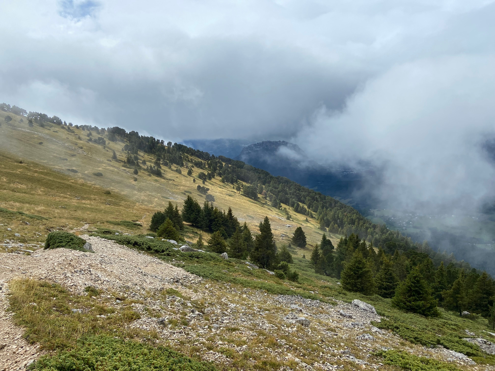

# Moderate Hike: Chamechaude (+Basic Technical Skills)

Moderate Hike with scrambling and use of a fixed chain. Good Fitness required.

Let's hike to the roof of the Chartreuse Massif.

If there is a shortage of cars, it is possible to take the bus to the start point. This would be an early start, leaving Notre Dame Musée at 8:10 (route 62). The next bus leaves too late at 10:00.

Trip may be limited in numbers for safety- leader:member ratio.

##  ⭐⭐ Updates ⭐⭐ 

Saturday@7:30

Cars: Áine(5) + Philippe(4) + Samir(5) + Francois(5) + Fad Ad(5) + Paulo(5) => 29 hikers Max

##  🗨️ EN/FR 🗨️ 
🦅/🐓 : we speak English/French at all our events. Don't worry if your English/French is not that good. Nos évènements sont en Anglais et Français. Ne soyez pas inquiets si votre niveau d'anglais n'est pas "suffisant".

##  🥾 Hike: Chamechaude
Meet at 9:00 am at parking "Parking Esplanade"
https://goo.gl/maps/cWVRDtf6E79aBZbP7

We will drive for about 30 m. Then park our car(s) near Col de Porte
https://goo.gl/maps/VjvnB2ogkERVC4Ws7

▶💡 Route: https://graphhopper.com/maps/?point=45.289728%2C5.767097&point=Cabane%20de%20Bachasson%2C%2038700%2C%20Le%20Sappey-en-Chartreuse%2C%20France&point=45.28227%2C5.778768&point=45.281818%2C5.778739&point=45.282958%2C5.78377&point=45.287702%2C5.788001&point=45.290265%2C5.767449&locale=en-IE&elevation=true&profile=hike&use_miles=false&selected_detail=Elevation&layer=TF%20Outdoors

* Distance: 7 km
* Time: ~3 h of hike + 1 h lunch and exploration + 1 h 🚗
* D+: 793 m 😎

##  🚗 share 
Car share will cost 3€ per person (fuel + "compensation" to get more drivers).

##  💡 Rules 💡 
- Don't leave any litter 🚮 in nature even egg shells 🥚, fruit pelt 🍌, ... 🌳 ❤️ You
- Subscribe on the waiting list. Maybe more cars will be available 🚗
- Don't be (too) late 😇 We won't wait for you at morning, especially if you don't send any message.
- Since seats in car(s) are "rare", please do not subscribe if you are not sure to join the event
- If you finally can't join us, please unsubscribe from the event or at least write a message here to announce your cancellation. 💜 That way, we won't wait for you 💜
- If you are a driver and can't join, please send me a message through meetup ASAP, that way I can remove available seats 🚗
- 💟You are responsible of your own health and security
- 😷 Covid rules: https://www.gouvernement.fr/en/coronavirus-covid-19

##  ❔ What do you need ❔ 
- Hiking shoes 🥾 (or any good/non slippery shoes)
- Hiking pole (if you want)
- 🧃 Water + 🥕 food for lunch + 🍫 Some snacks
- Clothes for wind/cold/rain ☔ (if any)
- Sun-cream 🌞
- Your smile 😁 / Happiness 😊
- Your mask as always 😷 (avoid contact and so on)
- 💵 Money for car share

## Stats

- Start time: 2021-09-19 09:00
- End time: 2021-09-19 17:00
- Duration: 8:00:00
- Time to event: 3 days, 10:07:52
- Attendees: 14
- KM: 7
- D+: 587
- Top: 2082
- Type: Hike
- Comment: 

## Links

- [Trail short link](https://s.42l.fr/z3dgYEs3)
- [Trail full link]()
- [Album](https://binnette.github.io/GacImg2021/2021-09-19-Moderate-Hike-Chamechaude-Basic-Technical-Skills.html)
- [Meetup event](https://www.meetup.com/grenoble-adventure-club-english-french/events/280799948/)
