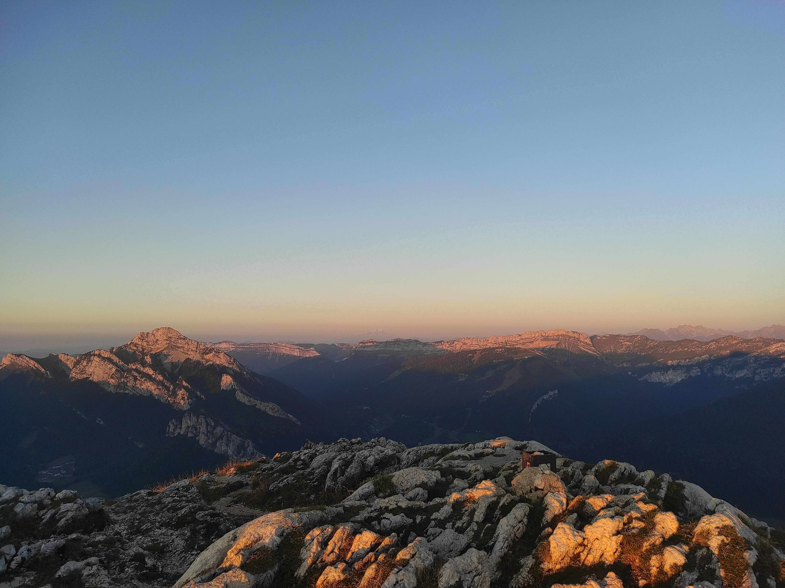

# Afterwork hike : Sunset at Charmant Som

Read the full page / Lisez jusqu’au bout

##  EN/FR 
We speak English/French in all our events. Don't be worry if your English/French is not that good. Nos évènements sont en Anglais et Français. Ne soyez pas inquiets si vous n’êtes pas bilingue.

##  Charmant Som : way up with sun, way down with headlight 
Topo : https://www.visorando.com/randonnee-le-charmant-som/
* Distance: 3km
* Time: 1h20 of hike + 1h dinner + 1h20 drive
Drop : 200m

##  Car share 
Meet at parking porte de France
Beginning of the hike at parking Restaurant Auberge du Charmant Som
Car share will cost 3€ per person

##  Rules 
- Don't be late
- Do not subscribe if you are not sure to join the event
- If you finally can't join us, please unsubscribe from the event or at least write a message here to announce your cancellation. That way, we won't wait for you
- If you are a driver and can't join, please send me a message through meetup ASAP, that way I can remove available seats
- Don't throw any dump in nature

##  What do you need 
- Hiking shoes (or any good sport shoes)
- Hiking pole (if you want)
- A headligth or any flashlight
- Water + food for dinner + Some snack
- Clothes for wind/cold
- Your mask as always (avoid contact and so on)
- Money for car share

##  Covid 
- Don't come if you feel sick, have fever, are contact case
- Wear your mask
- You are responsible to your own health, so respect barrier gestures, social distancing
- All rules : https://www.gouvernement.fr/en/coronavirus-covid-19

If you have any questions, please ask !

Le Charmant Som : montée au soleil, descente à la frontale
Topo : https://www.visorando.com/randonnee-le-charmant-som/
* Distance: 3km
Durée : 1h20 de rando + 1h de casse-croûte + 1h20 de route
* D+: 200m

Covoit’ :
RDV au parking porte de France
Départ de la rando au parking du Restaurant Auberge du Charmant Som
Tarif : 3€ par personne

Règles :
- Ne soyez pas en retard.
- Ne vous inscrivez pas si vous n'êtes pas sûr de participer à l'événement.
- Si vous ne pouvez finalement pas venir, veuillez vous désinscrire de l'événement ou au moins écrire un message ici pour annoncer votre annulation. Comme ça, on ne vous attendra pas.
- Si vous êtes un chauffeur et que vous ne pouvez pas venir, veuillez m'envoyer un message via meetup dès que possible, de cette façon je pourrai supprimer les sièges disponibles.
- Ne jetez aucun déchet dans la nature.

Ce dont vous avez besoin :
- Des chaussures de rando ou des bonnes baskets.
- Des bâtons (si vous avez besoin).
- Une frontale ou une torche.
- Eau + nourriture + en cas.
- Des vêtements chauds et coupe-vent.
- Le masque.
- De l’argent pour le covoit’.

Covid :
- Ne venez pas si vous vous sentez malade ou si vous êtes cas contact.
- Portez votre masque.
- Vous êtes responsable de votre propre santé, alors respectez les gestes barrières, la distanciation sociale.
- Les règles : https://www.gouvernement.fr/en/coronavirus-covid-19

N’hésitez pas si vous avez des questions !

## Stats

- Start time: 2021-09-24 17:45
- End time: 2021-09-24 21:00
- Duration: 3:15:00
- Time to event: 20:05:06
- Attendees: 9
- KM: 2.5
- D+: 175
- Top: 1867
- Type: Hike
- Comment: 

## Links

- [Trail short link](https://s.42l.fr/mTXVfMJE)
- [Trail full link]()
- [Album](https://binnette.github.io/GacImg2021/2021-09-24-Afterwork-hike-Sunset-at-Charmant-Som.html)
- [Meetup event](https://www.meetup.com/grenoble-adventure-club-english-french/events/280971141/)
