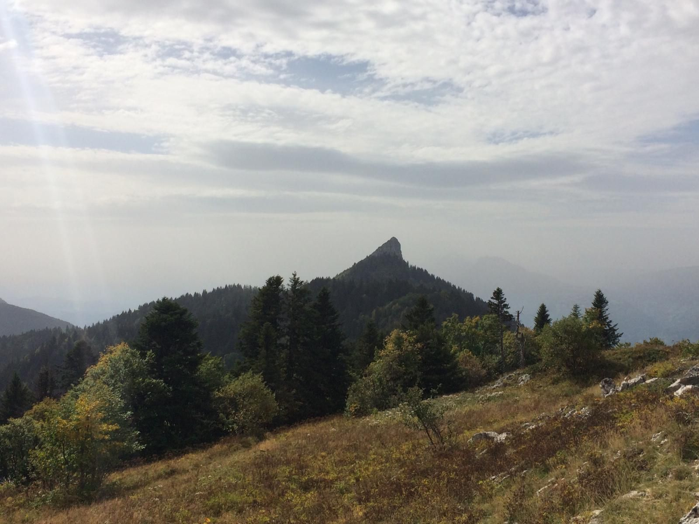

# 🥾 Hike: La Pinea and Charmant Som from Col de Port

💡 Read the full page by clicking on "Read more"/"Lire la suite"...💜

##  ⭐⭐ Updates ⭐⭐ 

> 📅 September 24: 1 car: Phillipe (3 seats)

> 📅 September 23: Bus it is. Musee Notre Dame, 07:50h meeting time so that you reach by 08:00h. The bus departs at 08:10h so please do not be late. In case someone with a car joins, people who subscribed earlier/who live farther/who-really-want-to-hike-but-not-take-bus will get the seats^^

> 📅 September 22: no cars: for the time being the plan is to take the bus. So essentially everyone on the waiting list motivated to hike is in. I hope we get some cars and then we can start from Park Paul Mistral car park as usual.

> Since "is it a difficult hike?" is a relative question, see the image to assess the difficulty for yourself ^^

Feel free to join the waitlist until we get more drivers!

## Too Long Didn't read
> Transportation: If no drivers, we will take bus 62 from Musee Notre Dame strictly at 08:10 h (the next bus would be at 10:00 h)
https://moovitapp.com/grenoble-3200/lines/62/494808/1830416?epochDay=18895&t=1

> Weather: Looks clear the whole afternoon (15-20 degrees), some shower at 18h.
> Difficulty: See the image and gauge for yourself. Overall the track is muddy at some points but the elevation gain is okay.
---------------

##  🗨️ EN/FR 🗨️ 
🦅/🐓 : we speak English/French in all our events. Don't worry if your English/French is not that good. Nos évènements sont en Anglais et Français. Ne soyez pas inquiets si votre niveau d'anglais n'est pas "suffisant".

##  🥾 Hike: Le Pinea and Charmant Som 

##  In case of bus: 
Meet at 07:50h at Notre-Dame - Musee
https://goo.gl/maps/BetPXLuG78NNCfWN9
!!NOTE!!
Bus departs at 08:10 am so no room for delays :(
The next bus would be in 2 hours so plan accordingly

Bus fare is 1.60 Euros.

The bus takes about 35 min
- https://goo.gl/maps/jzuheHwEAtqQvbcK9
Bus route: https://www.tag.fr/ftp/fiche_horaires/fiche_horaires_2014/PLAN_62.pdf

The last bus from Col de Porte is at 18:30.

* Topo & GPX track: https://www.google.com/maps/d/u/0/edit?mid=16nAltUQ6UT4h2xuFpb5G_af2roAK_uxL&usp=sharing

* ▶💡 Download GPX track on your phone.
* Distance: 8km
* Time: ~5/6h of hike + 1h lunch + 1h 🚗
* D+: 600m 😎

##  💡 Rules 💡 
- Don't leave any litter 🚮 in nature even egg shell 🥚, fruit pelt 🍌, ... 🌳 ❤️ You
- Subscribe on the waiting list. Maybe more cars will be available 🚗
- Don't be (too) late 😇 We won't wait for you at morning, especially if you don't send any message.
- Since seats in car(s) are "rare", please do not subscribe if you are not sure to join the event
- If you finally can't join us, please unsubscribe from the event or at least write a message here to announce your cancellation. 💜 That way, we won't wait for you 💜
- If you are a driver and can't join, please send me a message through meetup ASAP, that way I can remove available seats 🚗
- 💟You are responsible of your own health and security
- 😷 Covid rules: https://www.gouvernement.fr/en/coronavirus-covid-19

##  ❔ What do you need ❔ 
- Hiking shoes 🥾 (or any good/non slippery shoes)
- Hiking pole (if you want)
- 🧃 Water + 🥕 food for lunch + 🍫 Some snack
- Clothes for wind/cold/rain ☔ (if any)
- Sun-cream 🌞
- Your smile 😁 / Happiness 😊
- Your mask as always 😷 (avoid contact and so on)
- 💵 Money for car share

-----------------------
If you have any questions, please ask!

See you! Paul and Vaibhav from GAC.

PS: for more activities (cinema, tennis table, concert, etc), you can join our WhatsApp group. Just ask me by message on meetup or IRL (in real life).

## Stats

- Start time: 2021-09-25 08:00
- End time: 2021-09-25 19:00
- Duration: 11:00:00
- Time to event: 2 days, 9:55:30
- Attendees: 11
- KM: 15
- D+: 755
- Top: 1867
- Type: Hike
- Comment: 

## Links

- [Trail short link](https://s.42l.fr/l0NW-iGM)
- [Trail full link]()
- [Album](https://binnette.github.io/GacImg2021/2021-09-25-🥾-Hike-La-Pinea-and-Charmant-Som-from-Col-de-Port.html)
- [Meetup event](https://www.meetup.com/grenoble-adventure-club-english-french/events/280948002/)
