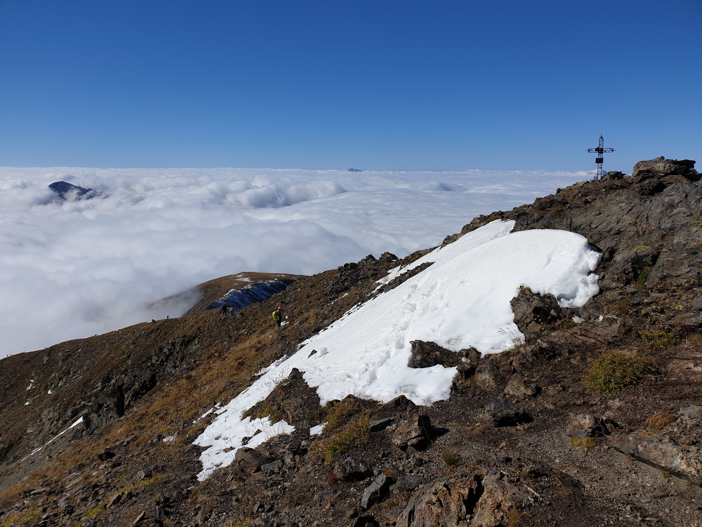

# 🥾 Hike: Le Taillefer 🗻🤯 + Lac du Brouffier 🥵🥶

💡 Read the full page by clicking on "Read more"/"Lire la suite"...💜

##  ⭐⭐ Updates ⭐⭐ 
> 📅 Oct 9 - 6pm: more cars = more seats. Seats: Albin (5), Matthieu D(5), Philippe (4), Josée (4) & Roman (5). 23 seats = 23 hikers MAX 🚶‍♂️
> 📅 Oct 7 - 2pm: ⛄we will have snow. So take good shoes & hiking poles⛄

##  🗨️ EN/FR 🗨️ 
🦅/🐓 : we speak English/French in all our events. Don't worry if your English/French is not that good. Nos évènements sont en Anglais et Français. Ne soyez pas inquiets si votre niveau d'anglais n'est pas "suffisant".

##  🥾 Hike: Le Taillefer 🗻🤯 + Lac du Brouffier 🥵🥶 
💥🟥 This is a HARD and long hike for 'pro' only 🟥💥
🥶🧊 It's gonna be damn cold on Taillefer about 0°c 🧊🥶
⛄We will have snow also. So take good shoes, hiking poles & why not snowshoes⛄

Meet at 8am at parking "Esplanade du Souvenir Français" near Parc Paul Mistral:
- https://www.osm.org/way/69486256
- https://goo.gl/maps/BAbHQ153PcNgunPd6

We take cars for about 1h. Then park our car(s) at "Parking Combe Oursière" (between La Morte & Poursolet)
- https://www.osm.org/way/832135775
- https://goo.gl/maps/vra6uPrV3mpsEwst9

* Topo & GPX track: https://s.42l.fr/6Ge5j1Qz
* ▶💡 Download GPX track on your phone.
* Distance: 14.4km
* Time: ~5/6h of hike + 1h lunch + 2h 🚗
* D+: 1310m 😭🥵🤯

##  🚗 share 
Car share will cost 4€ per person (fuel + "compensation" to get more drivers).

##  💡 Rules 💡 
- Don't throw any dump 🚮 in nature even egg shell 🥚, fruit pelt 🍌, ... 🌳 ❤️ You
- Subscribe on the waiting list. Maybe more cars will be available 🚗
- Don't be (too) late 😇 We won't wait for you at morning, especially if you don't send any message.
- Since seats in car(s) are "rare", please do not subscribe if you are not sure to join the event
- If you finally can't join us, please unsubscribe from the event or at least write a message here to announce your cancellation. 💜 That way, we won't wait for you 💜
- If you are a driver and can't join, please send me a message through meetup ASAP, that way I can remove available seats 🚗
- 💟You are responsible of your own health and security
- 😷Covid rules: https://www.gouvernement.fr/en/coronavirus-covid-19

##  ❔ What do you need ❔ 
- Hiking shoes 🥾
- Hiking pole (to walk in snow)
- Snowshoes (if you have. If you don't maybe you can not reach the top)
- 🧃 Water + 🥕 food for lunch + 🍫 Some snack
- Clothes for wind, rain (if any) & REALLY cold (about 0°C on Taillefer 🥶)
- Sun-cream 🌞
- Your smile 😁 / Happiness 😊
- Your mask as always 😷 (avoid contact and so on)
- 💵 Money for car share
- 🩳 Swimsuit & towel (if you are a kamikaze 🐱‍👤 and want to jump in the cold Lac du Brouffier)

-----------------------
If you have any questions, please ask!

See you! Albin from GAC.

PS: for more activities (cinema, tennis table, concert, etc), you can join our WhatsApp group. Just ask me by message on meetup or IRL (in real life).

## Stats

- Start time: 2021-10-10 08:00
- End time: 2021-10-10 20:00
- Duration: 12:00:00
- Time to event: 2 days, 22:48:27
- Attendees: 18
- KM: 14.4
- D+: 1310
- Top: 2857
- Type: Hike
- Comment: 

## Links

- [Trail short link](https://s.42l.fr/6Ge5j1Qz)
- [Trail full link]()
- [Album](https://binnette.github.io/GacImg2021/2021-10-10-🥾-Hike-Le-Taillefer-🗻-and-Lac-du-Brouffier-🥵🤯.html)
- [Meetup event](https://www.meetup.com/grenoble-adventure-club-english-french/events/281266733/)
