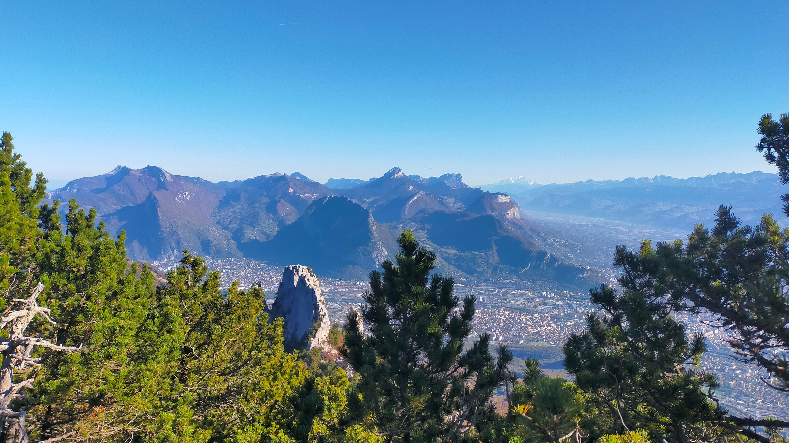

# Moderate Hike: Le Moucherotte

💡 Read the full page by clicking on "Read more" / Lire la page entière en cliquant sur "Lire la suite"...💜

🦅/🐓 : We speak English/French in all our events. Don't worry if your level of French is not that good. Nos évènements sont en Anglais et Français. Ne soyez pas inquiets si votre niveau d'anglais n'est pas "suffisant".

##  🗨️ EN 🗨️ 
##  🥾 Hike: Le Moucherotte 

🎯 Meeting point
Meet at Parking Public Clemenceau at 9h as usual:
https://www.openstreetmap.org/way/69486256
https://goo.gl/maps/jQYRKyrjwVWcbANv5

* ▶💡 Download GPX track on your phone.
* Topo & GPX track: https://s.42l.fr/le-moucherotte

* Distance: 9.1 km
* Time: 3h30 of hike + 1h30 lunch + 1h 🚗
* D+: 770m 😎

Car sharing:
Hike starts from parking near tourism office of St Nizier du Mocherotte:
https://www.openstreetmap.org/node/1548801023
https://goo.gl/maps/VVBA1xEAZU3Ct3ty7

The drive takes about half an hour.

Car share: €2 per person

##  💡 Rules 💡 
- Don't leave any litter 🚮 in nature even egg shell 🥚, fruit pelt 🍌, ... 🌳 ❤️ You
- Subscribe on the waiting list. Maybe more cars will be available 🚗
- Don't be (too) late 😇 We won't wait for you at morning, especially if you don't send any message.
- Since seats in car(s) are "rare", please do not subscribe if you are not sure to join the event
- 💟You are responsible of your own health and security
- 😷 Covid rules: https://www.gouvernement.fr/en/coronavirus-covid-19

##  ❔ What do you need ❔ 
- Hiking shoes 🥾 (or any good/non slippery shoes)
- Hiking pole (if you want)
- 🧃 Water + 🥕 food for lunch + 🍫 Some snack
- Clothes for wind/cold/rain ☔ (if any)
- Sun-cream 🌞
- Your smile 😁 / Happiness 😊
- Your mask as always 😷 (avoid contact and so on)
- Money for car share 💵

-----------------------
If you have any questions, please ask!

See you!

PS: for more activities (cinema, tennis table, concert, etc), you can join our WhatsApp group. Just ask me by message on meetup or IRL (in real life).

##  🗨️ FR 🗨️ 
##  🥾 Rando: Le Moucherotte 

🎯 Point de rencontre
RDV au parking désplanade á 9h comme d’hab :
https://www.openstreetmap.org/way/69486256
https://goo.gl/maps/jQYRKyrjwVWcbANv5

▶💡 Téléchargez la piste GPX sur votre portable
Topo : https://s.42l.fr/le-moucherotte

* Distance: 9.1 km
Durée : 3h30 de rando + 1h30 de dej. + 1h de route 🚗
* D+: 770m 😎

Covoit’:
Départ de la rando au office de tourisme St Nizier de Moucherotte:
https://www.openstreetmap.org/node/1548801023
https://goo.gl/maps/VVBA1xEAZU3Ct3ty7
On va rouler une demi-heure
Tarif : 2€ par personne

##  💡 Règles 💡 
- Ne pas laisser de détritus 🚮 dans la nature même coquille d'œuf 🥚, peau de fruit 🍌, .... 🌳 ❤️ Vous
- Inscrivez-vous sur la liste d'attente. Peut-être que d'autres voitures seront disponibles 🚗
- Ne soyez pas (trop) en retard 😇 Nous ne vous attendrons pas le matin, surtout si vous n'envoyez aucun message.
- Les places en voiture(s) étant "rares", merci de ne pas vous inscrire si vous n'êtes pas sûr de pouvoir participer à l'événement.
- 💟Vous êtes responsable de votre santé et de votre sécurité, restez en sécurité et ne venez pas si vous vous sentez malade ou si vous avez été en contact avec une personne malade.
- 😷 Règles du Covid : https://www.gouvernement.fr/en/coronavirus-covid-19

##  ❔ De quoi avez-vous besoin ❔ 
- Des chaussures de rando ou des bonnes baskets 🥾.
- Des bâtons (si vous avez besoin).
- 🧃 Eau + 🥕 Nourriture + 🍫 en cas.
- Des vêtements chauds/coupe-vent/ étanche ☔ (selon la météo)
- Le masque comme toujours 😷 (éviter les contacts)
- Crème solaire 🌞
- Votre sourire 😁
- Le masque comme toujours 😷 (éviter les contacts)
- De l’argent pour le covoit’ 💵.
------------------------------

N’hésitez pas si vous avez des questions !
A bientôt !

PS : Pour plus d'activités (cinéma, ping pong, concert, etc), tu peux rejoindre notre groupe WhatsApp.Il suffit de me demander par message sur meetup ou lorsque nous nous rencontrons sur la rando.

## Stats

- Start time: 2021-10-24 09:00
- End time: 2021-10-24 15:00
- Duration: 6:00:00
- Time to event: 2 days, 10:33:22
- Attendees: 20
- KM: 9.1
- D+: 770
- Top: 1901
- Type: Hike
- Comment: 

## Links

- [Trail short link](https://s.42l.fr/le-moucherotte)
- [Trail full link]()
- [Album](https://binnette.github.io/GacImg2021/2021-10-24-Moderate-Hike-Le-Moucherotte.html)
- [Meetup event](https://www.meetup.com/grenoble-adventure-club-english-french/events/281576827/)
