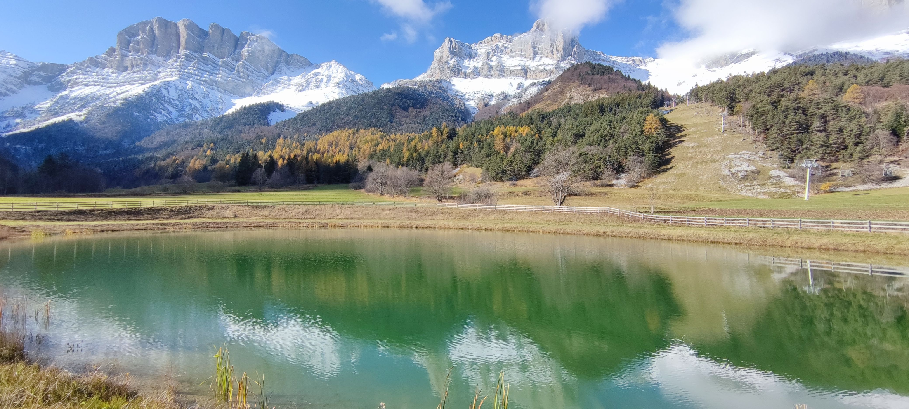

# Hike in snow : Le grand Veymont (highest top of Vercors)

Hard hike, not for beginners / Randonnée difficile, pas pour les débutants.

Read the full page / Lisez jusqu’au bout.

##  EN/FR 
We speak English/French in all our events. Don't be worry if your English/French is not that good. Nos évènements sont en Anglais et Français. Ne soyez pas inquiets si vous n’êtes pas bilingue.

##  Le grand Veymont / With cloud sea if we are lucky 
* Distance: 12km
* Time: 7h of hike + 1h lunch + 1h30 drive
Drop : 1100m

##  Car share 
Meet at mairie de Seyssinet - Pariset
Beginning of the hike at parking « domaine Skiable de Gresse-en-Vercors »
Car share will cost 3€ per person

##  Rules 
- Don't be late
- Do not subscribe if you are not sure to join the event
- If you finally can't join us, please unsubscribe from the event or at least write a message here to announce your cancellation. That way, we won't wait for you
- If you are a driver and can't join, please send me a message through meetup ASAP, that way I can remove available seats
- Don't throw any dump in nature

##  What do you need 
- Hiking waterproof boots
- Hiking poles (if you want)
- Hiking crampons (this kind : https://www.decathlon.fr/p/crampons-a-neige-sh900-adulte-s-a-xl/_/R-p-312581?mc=8574173)
- No need for snowshoes.
- Water + food for lunch + some snack
- Clothes for wind/cold
- Your mask as always (avoid contact and so on)
- Money for car share
- Snow cap, snow gloves
- Sunglasses
- Sunscreen

##  Covid 
- Don't come if you feel sick, have fever, are contact case
- Wear your mask
- You are responsible to your own health, so respect barrier gestures, social distancing
- All rules : https://www.gouvernement.fr/en/coronavirus-covid-19

If you have any questions, please ask !

## Stats

- Start time: 2021-11-06 09:30
- End time: 2021-11-06 19:00
- Duration: 9:30:00
- Time to event: 13:42:12
- Attendees: 4
- KM: 12.6
- D+: 1093
- Top: 2341
- Type: Hike
- Comment: 

## Links

- [Trail short link](https://s.42l.fr/00OiZIqn)
- [Trail full link]()
- [Album](https://binnette.github.io/GacImg2021/2021-11-06-Hike-in-snow-Le-grand-Veymont-highest-top-of-Vercors.html)
- [Meetup event](https://www.meetup.com/grenoble-adventure-club-english-french/events/281896978/)
