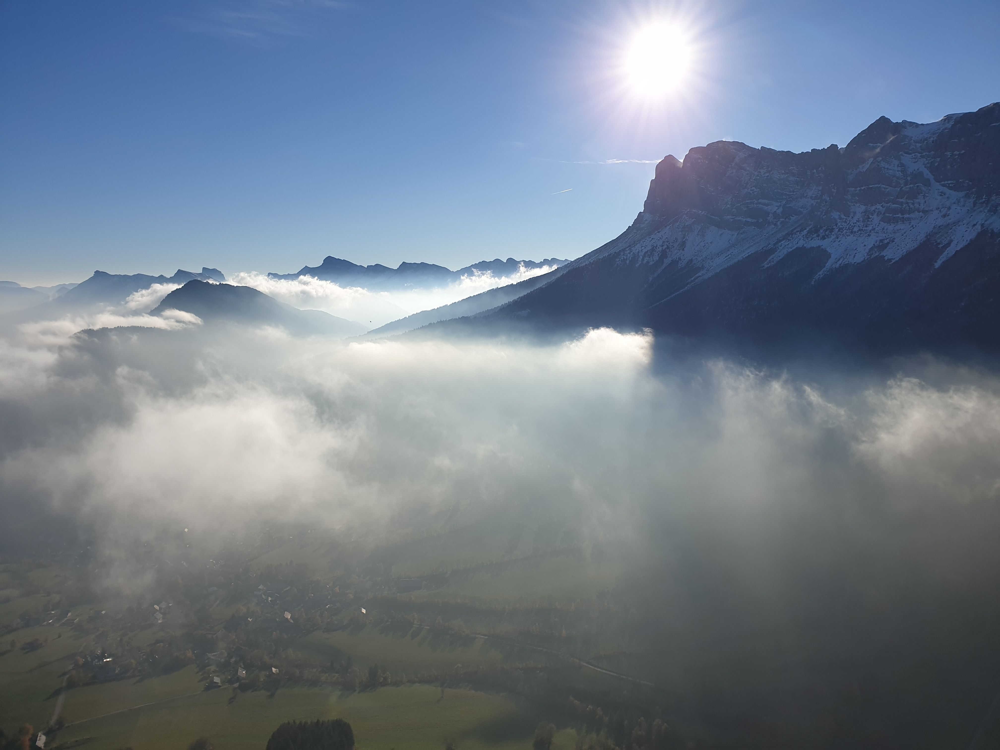

# 🥾 Hike: Rocher de l'Épérimont 😎🍁🍂

💡 Read the full page by clicking on "Read more"/"Lire la suite"...💜

##  ⭐⭐ Updates ⭐⭐ 
> 📅 Nov 07 - 11:30am: more cars = more seats. Seats: Aymen (💕) (5), Adam (💖)(5) & Albin (🌭)(5). 15 seats = 15 hikers MAX 🚶‍♂️

##  🗨️ EN/FR 🗨️ 
🦅/🐓 : we speak English/French in all our events. Don't worry if your English/French is not that good. Nos évènements sont en Anglais et Français. Ne soyez pas inquiets si votre niveau d'anglais n'est pas "suffisant".

##  🥾 Hike: Rocher de l'Épérimont 😎🍁🍂 
This hike is easy for good hikers and easy/medium for total noobs 😋

Meet at 1pm at parking "Esplanade du Souvenir Français" near Parc Paul Mistral:
- https://www.osm.org/way/69486256
- https://goo.gl/maps/BAbHQ153PcNgunPd6

We take cars for about 40m. Then park our car(s) at "Prélenfrey" (Village of Le Gua):
- https://www.osm.org/node/2378755124
- https://goo.gl/maps/C3npKxsLwbeB1MUq6

We hike together to "Rocher de l'Épérimont" (1441m), enjoy the view, go back to our car by another way. Finally go back to Grenoble 😎

* Topo & GPX track: https://s.42l.fr/HaAl
* ▶💡 Download GPX track on your phone.
* Distance: 6.5km
* Time: ~3/4h of hike + 1h 🚗
* D+: 455m 😁😎🦔🐓

##  🚗 share 
Car share will cost 3€ per person (fuel + "compensation" to get more drivers).

##  💡 Rules 💡 
- Don't throw any dump 🚮 in nature even egg shell 🥚, fruit pelt 🍌, ... 🌳 ❤️ You
- Subscribe on the waiting list. Maybe more cars will be available 🚗
- Don't be (too) late 😇 We won't wait for you at morning, especially if you don't send any message.
- Since seats in car(s) are "rare", please do not subscribe if you are not sure to join the event
- If you finally can't join us, please unsubscribe from the event or at least write a message here to announce your cancellation. 💜 That way, we won't wait for you 💜
- If you are a driver and can't join, please send me a message through meetup ASAP, that way I can remove available seats 🚗
- 💟You are responsible of your own health and security
- 😷 Covid rules: https://www.gouvernement.fr/en/coronavirus-covid-19

##  ❔ What do you need ❔ 
- Hiking shoes 🥾 (or any good/non slippery shoes)
- Hiking pole (if you want)
- 🧃 Water + 🍫 Some snack
- Clothes for wind, rain (if any)
- Sun-cream 🌞
- Your smile 😁 / Happiness 😊
- Your mask as always 😷 (avoid contact and so on)
- 💵 Money for car share

-----------------------
If you have any questions, please ask!

See you! Albin from GAC.

PS: for more activities (cinema, tennis table, concert, etc), you can join our WhatsApp group. Just ask me by message on meetup or IRL (in real life).

## Stats

- Start time: 2021-11-07 13:00
- End time: 2021-11-07 18:30
- Duration: 5:30:00
- Time to event: 1:59:23
- Attendees: 9
- KM: 6.5
- D+: 455
- Top: 1441
- Type: Hike
- Comment: 

## Links

- [Trail short link](https://s.42l.fr/HaAl)
- [Trail full link]()
- [Album](https://binnette.github.io/GacImg2021/2021-11-07-🥾-Hike-Rocher-de-lEperimont-😎🍁🍂.html)
- [Meetup event](https://www.meetup.com/grenoble-adventure-club-english-french/events/281924819/)
