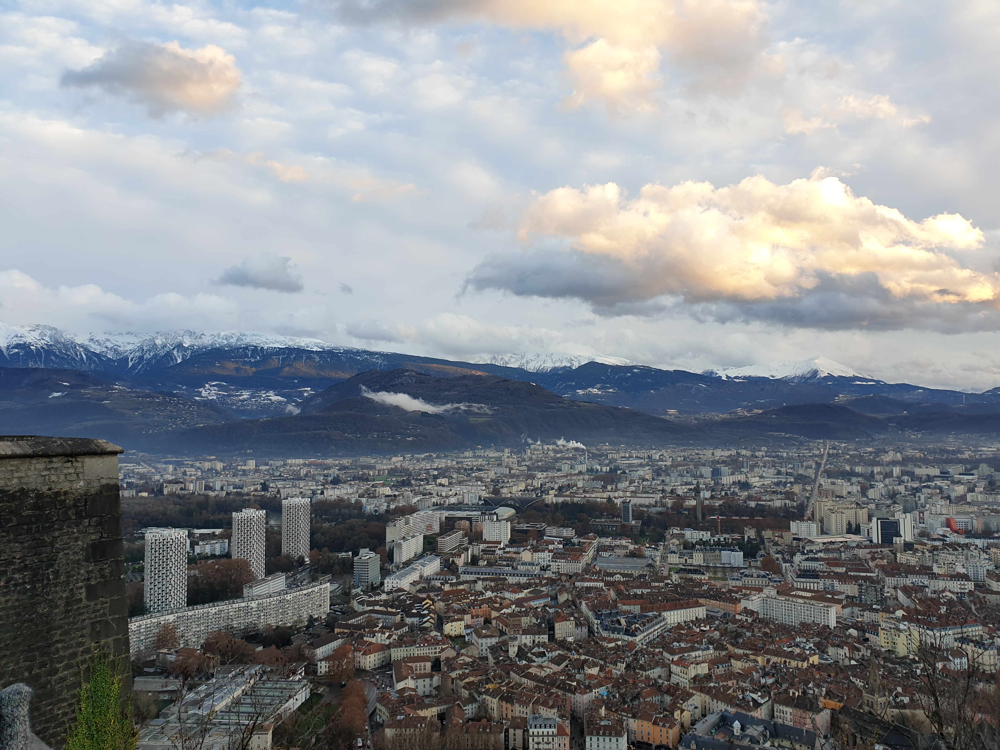

# 🥾 Hike: NUMBER 100!!! 🎉🎉 Mont Jalla: classic but 'must-do' 😊

💡 Read the full page by clicking on "Read more"/"Lire la suite"...💜
📕 By joining the event, you accept the rules (see below).

##  ⭐⭐ Updates ⭐⭐ 
> 📅 Dec 3 - 6pm: you can take some food/snacks to share on top 🤩 Also we can go grab a beer after the hike 😊
> 📅 Dec 3 - 6pm: no car needed

##  🗨️ EN/FR 🗨️ 
🦅/🐓 : we speak English/French in all our events. Don't worry if your English/French is not that good. Nos évènements sont en Anglais et Français. Ne soyez pas inquiets si votre niveau d'anglais n'est pas "suffisant".

##  🥾 Hike: NUMBER 100!!! 🎉🎉 Mont Jalla: classic but 'must-do' 😊 
THIS HIKE IS THE 100th EVENT IN THE GAC GROUP!!! 🎉✨

This hike is easy for good hikers and medium for noobs 😊

Meet at 1:30pm at "Fontaine du Lion":
- https://www.osm.org/node/1572935122
- https://goo.gl/maps/FesEC87AXJ7s1Zo29

* Topo & GPX track: https://s.42l.fr/BBnziuEy
* ▶💡 Download GPX track on your phone. Tuto here: https://github.com/Binnette/GAC
* Distance: ~8km
* Time: ~3h of 🥾
* D+: 520m 🐌

##  🚗 
No car needed.

##  💡 Rules 💡 
- 🚶‍♀️🚶‍♂️ The GAC group is about hiking 🥾 and why not making friends BUT NOT about flirting, speed dating or whatever ⛔. To do so, go on Meetic, Tinder, Grinder or whatever, but NOT in our group. Thanks 👍
- Don't throw any dump 🚮 in nature even egg shell 🥚, fruit pelt 🍌, ... 🌳 ❤️ You
- Don't be (too) late 😇 We won't wait for you, especially if you don't send any message.
- If you finally can't join us, please unsubscribe from the event or at least write a message here to announce your cancellation. 💜 That way, we won't wait for you 💜
- 💟 You are responsible of your own health and security
- 😷 Covid rules: https://www.gouvernement.fr/en/coronavirus-covid-19

##  ❔ What do you need ❔ 
- Hiking shoes 🥾 (or any good/non slippery shoes)
- Hiking pole (if you want)
- 🧃 Water + 🍫 Some snack
- Why not, food to share for our 100th event ✨
- Clothes for wind, rain (if any)
- Sun-cream 🌞
- Your smile 😁 / Happiness 😊
- Your mask as always 😷 (avoid contact and so on)
- Head lamp for if we are late 🔦

-----------------------
If you have any questions, please ask!

See you! Albin from GAC.

PS: for more activities (cinema, tennis table, concert, etc), you can join our WhatsApp group. Just ask me by message on meetup or IRL (in real life).

## Stats

- Start time: 2021-12-04 13:30
- End time: 2021-12-04 18:30
- Duration: 5:00:00
- Time to event: 18:51:45
- Attendees: 5
- KM: 8
- D+: 520
- Top: 625
- Type: Hike
- Comment: 

## Links

- [Trail short link](https://s.42l.fr/BBnziuEy)
- [Trail full link]()
- [Album](https://binnette.github.io/GacImg2021/2021-12-04-🥾-Hike-NUMBER-100-🎉🎉-Mont-Jalla-classic-but-must-do-😊.html)
- [Meetup event](https://www.meetup.com/grenoble-adventure-club-english-french/events/282472942/)
