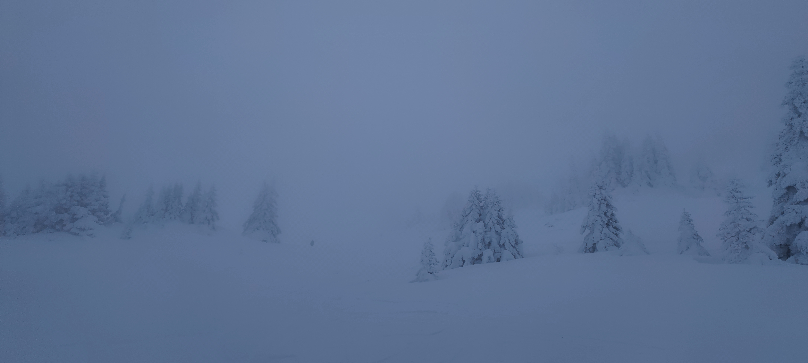

# Snowshoe hike to le Pic St Michel

Medium level hike

It's easy to walk with snowshoes but it's tiring.
So beginners are allowed but you must be in very good physical condition.

Read the full page / Lisez jusqu’au bout.

##  EN/FR 
We speak English/French in all our events. Don't be worry if your English/French is not that good. Nos évènements sont en Anglais et Français. Ne soyez pas inquiets si vous n’êtes pas bilingue.

##  Snowshoe hike in Vercors : Le Pic St Michel + Cloud inversion (if we are lucky) 
* Distance: 10km
* Time: 5h of hike + 1h of lunch + 1h15 drive
Drop : 650m

Note for hikers who do not have their own snowshoes : There is no possibility to rent it on site. You must therefore rent it in Grenoble on Friday and bring it back on Saturday evening.

##  Car share 
Meet at mairie de Seyssinet - Pariset
Beginning of the hike at parking « la Sierre » at Lans en Vercors
Car share will cost 3€ per person

Note for drivers : you must be equipped to drive on snow (snow tires or chains).

##  Rules 
- Don't be late
- Do not subscribe if you are not sure to join the event
- If you finally can't join us, please unsubscribe from the event or at least write a message here to announce your cancellation. That way, we won't wait for you
- If you are a driver and can't join, please send me a message through meetup ASAP, that way I can remove available seats
- Don't throw any dump in nature

##  What do you need 
- Hiking waterproof boots
- Hiking poles
- Snowshoes
- Food for lunch + water + some snack
- Clothes for wind/cold
- Your mask as always (avoid contact and so on)
- Money for car share
- Snow cap, snow gloves
- Sunglasses
- Sunscreen

##  Covid 
- Don't come if you feel sick, have fever, are contact case
- Wear your mask
- You are responsible to your own health, so respect barrier gestures, social distancing

If you have any questions, please ask !

## Stats

- Start time: 2021-12-11 09:00
- End time: 2021-12-11 16:30
- Duration: 7:30:00
- Time to event: 2 days, 8:25:45
- Attendees: 3
- KM: 10
- D+: 585
- Top: 1966
- Type: Hike
- Comment: 

## Links

- [Trail short link](https://s.42l.fr/JArFw8ah)
- [Trail full link]()
- [Album](https://binnette.github.io/GacImg2021/2021-12-11-Snowshoe-hike-to-le-Pic-St-Michel.html)
- [Meetup event](https://www.meetup.com/grenoble-adventure-club-english-french/events/282572785/)
