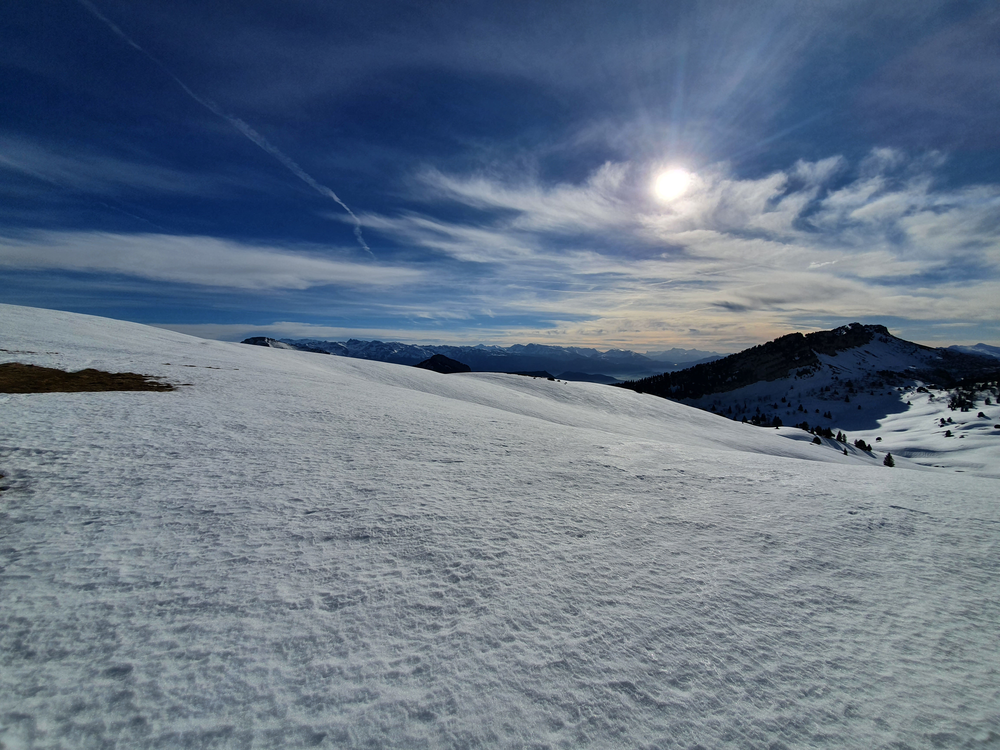

# 2 days snowshoes hike to La Grande Sure

Read the full page

Hard hike with heavy backpack / Not for beginners

For people who have got their own equipment (mattress, warm sleeping bag, big backpack …)

##  EN/FR 
We speak English/French in all our events. Don't be worry if your English/French is not that good. Nos évènements sont en Anglais et Français. Ne soyez pas inquiets si vous n’êtes pas bilingue.

##  La Grande Sure + a night in Hérétang hut (+ sunset and sunrise) 

Saturday :
Mont st Martin village => les Bannettes => col d’Hurtières => la Velouse => Hérétang hut for the night
It’s possible to go close to « le pas de la miséricorde » to see the sunset
Distance : 14km
Time : 4h30 of hike + 30min drive
Drop : 1000m ↗ / 500m ↘

Sunday :
Wake up at 6.00AM => col de la grande vache (with headlight to see the sunrise) => La Grande Sure => col d’Hurtières => les Bannettes or le Lorzier if there is not to much snow => Mont st Martin
Distance : 18km
Time : 6h of hike + 30min drive
Drop : 600m ↗ / 1100m ↘

There is no possibility to rent snowshoes on site. You must therefore rent it in Grenoble before.
There is a wood stove inside the hut and there is wood all around.
There is some mattress inside but they are old so it’s better to bring your own.

##  Car share 
Meet at « Palluel » (end of tram E)
Beginning of the hike at parking « Namière » in Mont St Martin
Car share will cost 2€ per person

##  Rules 
- Don't be late
- Do not subscribe if you are not sure to join the event
- If you finally can't join us, please unsubscribe from the event or at least write a message here to announce your cancellation. That way, we won't wait for you
- If you are a driver and can't join, please send me a message through meetup ASAP, that way I can remove available seats
- Don't throw any dump in nature

##  What do you need 
- Hiking waterproof boots
- Snowshoes
- Hiking poles
- Water + food for 2 days (lunch, dinner, breakfast) + some snack
- Clothes for wind/cold
- Your mask as always (avoid contact and so on)
- Money for car share
- Hat
- Sunglasses
- Sunscreen
- Big backpack
- Sleeping bag (comfort temperature = 5°C)
- A headlight or any flashlight
- Mattress

##  Covid 
- Don't come if you feel sick, have fever, are contact case
- Wear your mask
- You are responsible to your own health, so respect barrier gestures, social distancing
- All rules : https://www.gouvernement.fr/en/coronavirus-covid-19

If you have any questions, please ask !

## Stats

- Start time: 2022-01-01 13:30
- End time: 2022-01-02 16:00
- Duration: 1 day, 2:30:00
- Time to event: 1 day, 1:14:38
- Attendees: 4
- KM: 32
- D+: 1600
- Top: 1740
- Type: Hike
- Comment: 

## Links

- [Trail short link](https://s.42l.fr/Sure1)
- [Trail full link]()
- [Album](https://binnette.github.io/GacImg2022/2022-01-01-2-days-snowshoes-hike-to-La-Grande-Sure.html)
- [Meetup event](https://www.meetup.com/grenoble-adventure-club-english-french/events/282972158/)
