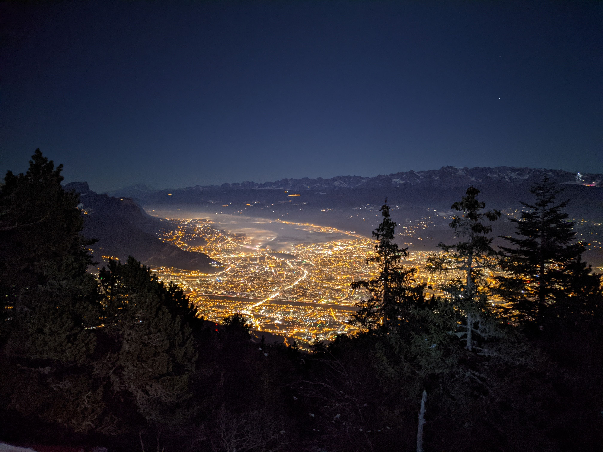

# Snowshoe hike to le Moucherotte : sunset and full moon

Medium level hike

##  Updates 
> Jan 16 - 9am: more cars = more seats. Seats: Guillaume (4), Guillaume roomate (4), Albin (4)

It's easy to walk with snowshoes but it's tiring.
So beginners are allowed but you must be in very good physical condition.
The snow will be compact so you can take snowshoes or crampons (spiky shoes).

Read the full page / Lisez jusqu’au bout.

##  EN/FR 
We speak English/French in all our events. Don't be worry if your English/French is not that good. Nos évènements sont en Anglais et Français. Ne soyez pas inquiets si vous n’êtes pas bilingue.

##  Snowshoe hike in Vercors : Le Moucherotte by night 
* Distance: 7km
* Time: 3h30 of hike + 45min of diner + 45min drive
Drop : 700m

Note for hikers who do not have their own snowshoes : There is no possibility to rent it on site. You must therefore rent it in Grenoble.

It’s possible to go down by walking or by sliding.
You can bring what you want (skis, sledge, plastic bag…)

##  Car share 
Meet at mairie de Seyssinet - Pariset
Beginning of the hike at parking du tremplin olympique (chemin de la roche)
Car share will cost 2€ per person

##  Rules 
- Don't be late
- Do not subscribe if you are not sure to join the event
- If you finally can't join us, please unsubscribe from the event or at least write a message here to announce your cancellation. That way, we won't wait for you
- If you are a driver and can't join, please send me a message through meetup ASAP, that way I can remove available seats
- Don't throw any dump in nature

##  What do you need 
- Hiking waterproof boots
- Hiking poles (if you want)
- Snowshoes or snow crampons
- Food for diner + water + some snack
- Clothes for wind/cold
- Your mask as always (avoid contact and so on)
- Money for car share
- Snow cap, snow gloves
- A headligth or any flashlight

##  Covid 
- Don't come if you feel sick, have fever, are contact case
- Wear your mask
- You are responsible to your own health, so respect barrier gestures, social distancing

If you have any questions, please ask !

## Stats

- Start time: 2022-01-16 14:30
- End time: 2022-01-16 21:00
- Duration: 6:30:00
- Time to event: 1 day, 13:37:47
- Attendees: 11
- KM: 9.4
- D+: 803
- Top: 1901
- Type: Hike
- Comment: 

## Links

- [Trail short link](https://s.42l.fr/le-moucherotte)
- [Trail full link]()
- [Album](https://binnette.github.io/GacImg2022/2022-01-16-Snowshoe-hike-to-le-Moucherotte-sunset-and-full-moon.html)
- [Meetup event](https://www.meetup.com/grenoble-adventure-club-english-french/events/283271550/)
