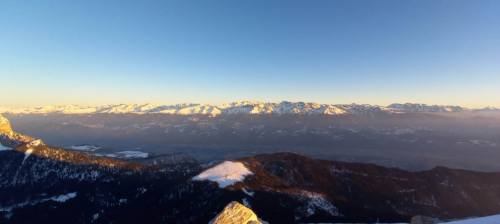

# Snowshoe hike : Sunset at Chamechaude

Hard hike, not for beginners / Randonnée difficile, pas pour les débutants.

Read the full page / Lisez jusqu’au bout

##  EN/FR 
We speak English/French in all our events. Don't be worry if your English/French is not that good. Nos évènements sont en Anglais et Français. Ne soyez pas inquiets si vous n’êtes pas bilingue.

##  Chamechaude : way up with sun, way down with headlight 
Topo : https://www.visorando.com/randonnee-chamechaude-depuis-le-col-de-porte/
* Distance: 8km
* Time: 4h of hike + 45min dinner + 45min drive
Drop : 750m

Note for hikers who do not have their own snowshoes : There is no possibility to rent it on site. You must therefore rent it in Grenoble.

It’s possible to make a part of the go down by sliding. So you can bring a sledge or plastic bag.

##  Car share 
Meet at parking porte de France
Beginning of the hike at col de porte
Car share will cost 2€ per person

##  Rules 
- Don't be late
- Do not subscribe if you are not sure to join the event
- If you finally can't join us, please unsubscribe from the event or at least write a message here to announce your cancellation. That way, we won't wait for you
- If you are a driver and can't join, please send me a message through meetup ASAP, that way I can remove available seats
- Don't throw any dump in nature

##  What do you need 
- Hiking waterproof boots
- Hiking poles (if you want)
- Snowshoes or snow crampons
- Food for diner + water + some snack
- Clothes for wind/cold
- Your mask as always (avoid contact and so on)
- Money for car share
- Snow cap, snow gloves
- A headligth or any flashlight
##  Covid 
- Don't come if you feel sick, have fever, are contact case
- Wear your mask
- You are responsible to your own health, so respect barrier gestures, social distancing

If you have any questions, please ask !

## Stats

- Start time: 2022-01-22 14:30
- End time: 2022-01-22 20:00
- Duration: 5:30:00
- Time to event: 14:09:33
- Attendees: 4
- KM: 7.1
- D+: 736
- Top: 2082
- Type: Hike
- Comment: 

## Links

- [Trail short link](https://s.42l.fr/0ljy-4jn)
- [Trail full link]()
- [Album](https://binnette.github.io/GacImg2022/2022-01-22-Snowshoe-hike-Sunset-at-Chamechaude.html)
- [Meetup event](https://www.meetup.com/grenoble-adventure-club-english-french/events/283411967/)
